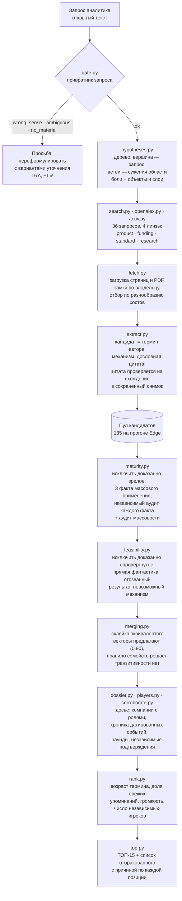
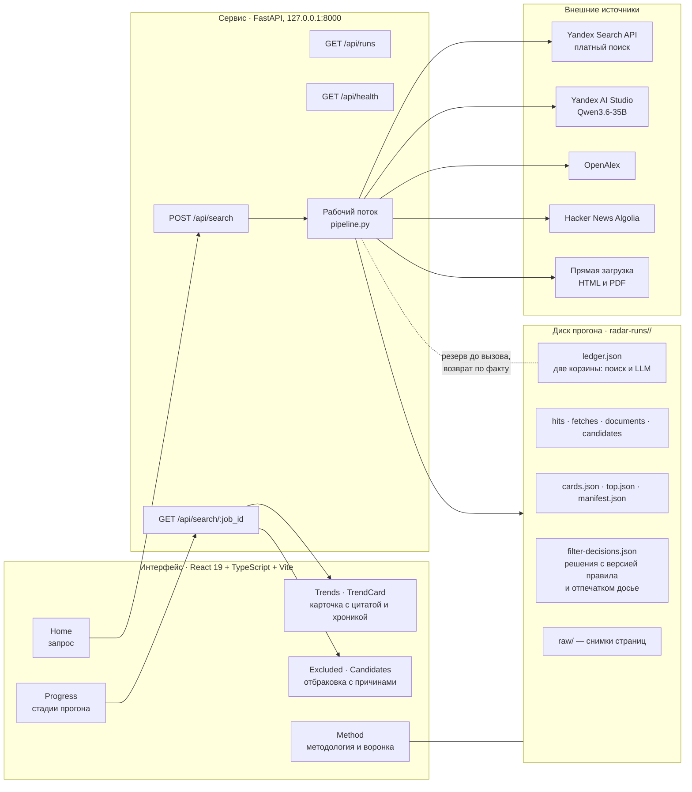
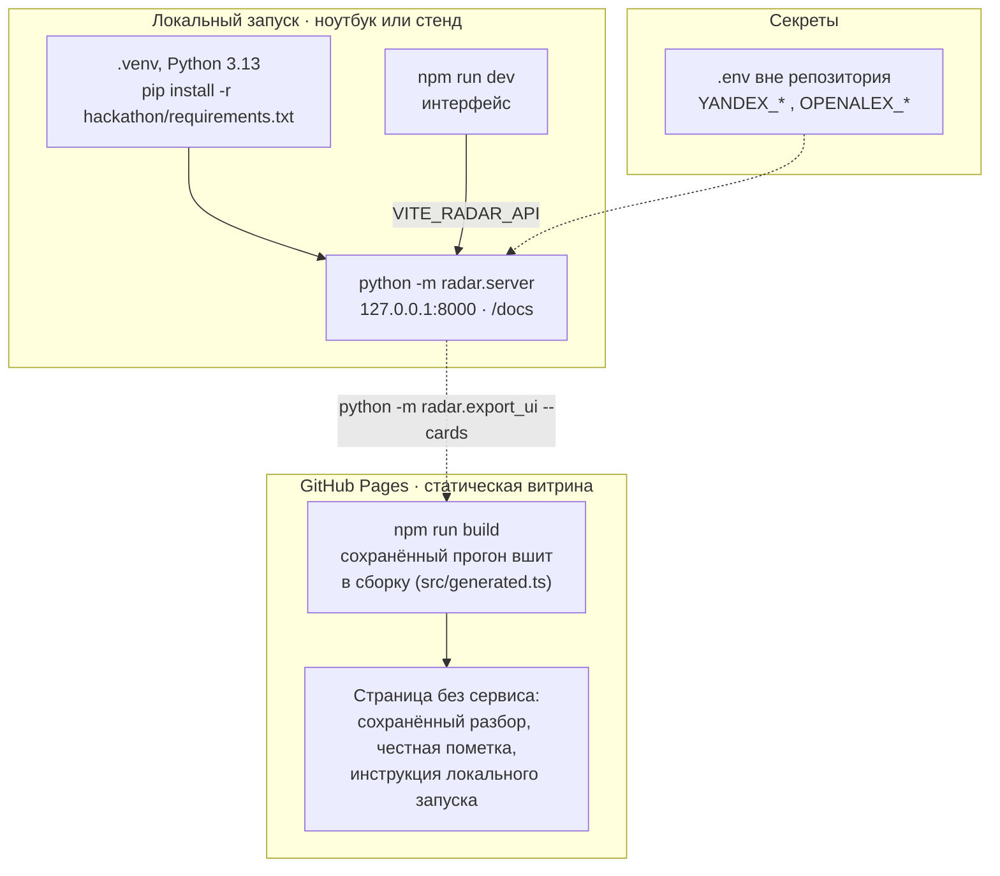
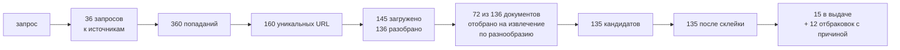

# Архитектура радара слабых сигналов

29.09.2026. Схемы к заявке: конвейер, состав сервисов, поток данных и развёртывание.
Названия на схемах совпадают с именами модулей в `hackathon/radar/`, чтобы схему можно
было читать вместе с кодом.

## 1. Конвейер: от запроса аналитика до ТОП-15

Порядок стадий зафиксирован: фильтры зрелости и опровержения стоят **до** объединения
эквивалентов, объединение — **до** отбора пятнадцати. Обратный порядок уже приводил к
регрессии: склейка после отбора оставляла пустые места в выдаче.

Неизвестность всегда остаётся в пуле: исключаем только доказанное. Поэтому выдача
называется «кандидаты», а не «подтверждённые сигналы» — фильтры здесь страховка от грубой
ошибки, а не механизм сокращения списка.

## 2. Состав сервисов

Кеш прогонов лежит на диске: повтор того же запроса отвечает за 1 с и 0 ₽, потому что
сохранённые решения привязаны к версии правила и отпечатку досье — при изменении правила
кеш не переиспользуется.

## 3. Развёртывание

Прототип и защита не требуют GPU: локальные векторы `intfloat/multilingual-e5-small`
считаются на процессоре, LLM вызывается по API.

Ключи только в `.env` или в окружении: в репозиторий попадает лишь `.env.example` с именами
переменных. Белый список в корневом `.gitignore` устроен так, что по умолчанию не
публикуется ничего, а разрешённое перечислено явно.

## 4. Поток данных одного прогона

Числа — фактический прогон `20260928-194236-edge`, выборка которого лежит в
`hackathon/samples/edge-20260928/`.

Стоимость прогона — 89,7 ₽: поиск и извлечение считаются из разных корзин, 13 вызовов
источников были бесплатными.
