# A4. База данных и воспроизводимость

Одна PostgreSQL с pgvector достаточна для хакатона. Схема содержит 28 таблиц; тяжёлые исходные файлы можно вынести в локальное объектное хранилище, сохраняя URI и SHA-256 в БД. DDL находится рядом: [review-schema.sql](review-schema.sql). Это миграция для новой базы PostgreSQL 14+ с установленным pgvector. Схема — `macromind`; соединения API и worker устанавливают `search_path=macromind,public`.

## Что фиксирует схема

`documents` хранит неизменяемые версии научных публикаций, патентов, отчётов и страниц компаний. `works` и `patents` добавляют специализированные поля. DOI не уникален: один документ может иметь несколько зафиксированных версий; внутри конкретного корпуса допускается одна версия одного внешнего ID. Межпровайдерные дубли DOI и версии препринт/статья удаляет сборщик до включения в корпус; правило дедупликации входит в manifest. В патентах число семейств считается по `family_id`, а не числу публикаций.

`published_at` — дата публикации, `available_at` — подтверждённая публичная доступность этой версии, `observed_at` — момент первого получения нашим сборщиком. Даты различаются: патент может иметь раннюю дату приоритета, но текст появляется позже. Приоритет не заменяет дату доступности. `availability_basis` объясняет, откуда взята дата; сегодняшние метаданные нельзя объявить наблюдавшимися в 2019 году.

`corpora` + `corpus_documents` фиксируют состав среза, направление, временной предел, режим оценки и хеш манифеста. Режим `strict` требует одновременно `available_at <= cutoff_at` и `observed_at <= cutoff_at`: для прошлого он возможен только с архивом фактических наблюдений. При `proxy` разрешается сегодняшняя выгрузка старых документов; ограничения и исключённые поля указываются в `definition`. Такая ретропроверка показывает переносимость на исторических публикациях, но не доказывает, что сервис реально предсказал будущее из доступного тогда корпуса. Внешний архив без нашего прежнего наблюдения сохраняем как `proxy` с документированным архивным доказательством; режим нельзя незаметно повысить до `strict`.

Годовой срез — отдельный корпус до конца года T; `annual_features` содержит одну строку «кандидат × корпус × год × версия признаков». `as_of_year` должен совпадать с годом `cutoff_at` (UTC) для годового эксперимента. Для текущего неполного года UI показывает дату среза и использует сопоставимые интервалы. Существование даты в SQL не доказывает отсутствие утечки: feature worker проверяет членство каждого использованного документа в корпусе и сохраняет SQL-хеш, версию кода и пропуски в lineage.

Метки вынесены в `labels`: поле `label_available_at` фиксирует момент, когда все данные для определения метки стали доступны; обучающий split исключает метки, ещё неизвестные на дату обучения.  origin_corpus содержит сведения на T, outcome_corpus — сведения на T + H. Будущий корпус разрешён только в расчёте целевой переменной. `NULL` означает незавершённый горизонт наблюдения; его нельзя превращать в «заглохло». `model_versions.training_manifest` содержит ID корпусов, наборов кандидатов, разбиение по времени, версии признаков/меток и хеш обучающей матрицы. Это практичный JSON-манифест для двух разработчиков; отдельный каталог ML-экспериментов не нужен.

Справочники `authors`, `institutions`, `venues` служат идентификации и отображению. Меняющиеся признаки берём из версии источника: тип организации и страна записаны в `work_authorships`, значение цитирований — в `works.cited_by_count_observed`. Текущие цитирования исключаются из `proxy`-ретропризнаков; для временных цитатных признаков нужна отдельная история цитирующих документов. Уровень издания и текущее название организации не становятся историческими признаками без соответствующего среза.

## ER-диаграмма

Типы Mermaid `vector`, `numeric`, `char`, `double_precision` сокращены для читаемости. Точные размерности, составные FK, CHECK и индексы определены в SQL. Показаны все поля и основные кардинальности; один `labels` ссылается на два корпуса через разные FK.

```mermaid
erDiagram
    raw_source_cache ||--o{ documents : preserves
    corpora ||--o{ corpus_documents : contains
    documents ||--o{ corpus_documents : included
    documents ||--o| works : publication
    documents ||--o| patents : patent
    venues o|--o{ works : publishes
    works ||--o{ work_authorships : has
    authors ||--o{ work_authorships : writes
    institutions o|--o{ work_authorships : affiliated
    documents ||--o{ passages : chunked
    corpora ||--o{ candidate_sets : derives
    candidate_sets ||--o{ candidates : contains
    candidates ||--o{ candidate_aliases : aliases
    candidates ||--o{ term_mentions : mentioned
    passages ||--o{ term_mentions : supports
    candidates ||--o{ annual_features : measured
    corpora ||--o{ annual_features : cutoff
    candidates ||--o{ labels : target
    corpora ||--o{ labels : origin_and_outcome
    corpora ||--o{ analyses : ranking_and_evidence
    candidate_sets ||--o{ analyses : fixes
    model_versions ||--o{ analyses : scores
    analyses ||--o{ trend_results : top15
    candidates ||--o{ trend_results : ranked
    candidate_sets ||--o{ trend_results : constrains
    trend_results ||--o{ cards : describes
    cards ||--o{ claims : states
    claims ||--o{ citations : substantiated
    passages ||--o{ citations : evidence
    trend_results ||--o{ feedback : reviewed
    shortlists ||--o{ shortlist_items : contains
    trend_results ||--o{ shortlist_items : saved
    benchmark_sets ||--o{ benchmark_items : includes
    candidates o|--o{ benchmark_items : optional_match
    passages o|--o{ benchmark_items : evidence
    raw_source_cache {
        bigint id PK
        text provider
        text request_key
        timestamptz fetched_at
        smallint http_status
        text response_sha256
        jsonb payload
        text object_uri
        text license
    }
    corpora {
        bigint id PK
        text version
        text direction
        timestamptz cutoff_at
        text snapshot_mode
        text manifest_sha256
        jsonb definition
        timestamptz created_at
        timestamptz sealed_at
    }
    documents {
        bigint id PK
        text provider
        text source_external_id
        text kind
        text title
        text canonical_url
        timestamptz published_at
        timestamptz available_at
        timestamptz observed_at
        text availability_basis
        text content_sha256
        bigint raw_cache_id FK
        jsonb metadata
    }
    corpus_documents {
        bigint corpus_id PK,FK
        bigint document_id PK,FK
    }
    venues {
        bigint id PK
        text provider
        text external_id
        text name
        text kind
    }
    authors {
        bigint id PK
        text provider
        text external_id
        text display_name
        text orcid
    }
    institutions {
        bigint id PK
        text provider
        text external_id
        text name
    }
    works {
        bigint document_id PK,FK
        text doi
        bigint venue_id FK
        text work_type
        text language
        text abstract
        integer cited_by_count_observed
        boolean is_preprint
    }
    work_authorships {
        bigint id PK
        bigint work_id FK
        bigint author_id FK
        bigint institution_id FK
        smallint author_position
        text institution_kind_at_source
        char country_at_source
    }
    patents {
        bigint document_id PK,FK
        text publication_number
        text family_id
        date priority_date
        date application_date
        jsonb applicants
        text cpc_codes
    }
    passages {
        bigint id PK
        bigint document_id FK
        integer passage_no
        text text_content
        jsonb locator
        vector embedding
        text embedding_model
    }
    candidate_sets {
        bigint id PK
        text version
        bigint corpus_id FK
        text extractor_version
        text normalizer_version
        jsonb parameters
        timestamptz created_at
    }
    candidates {
        bigint id PK
        bigint candidate_set_id FK
        text canonical_name
        smallint first_seen_year
        text status
        text filter_reason
    }
    candidate_aliases {
        bigint candidate_id PK,FK
        text alias PK
        text language PK
        text derivation
    }
    term_mentions {
        bigint candidate_id PK,FK
        bigint passage_id PK,FK
        integer start_offset PK
        integer end_offset
        text extractor_version
    }
    annual_features {
        bigint candidate_id PK,FK
        bigint corpus_id PK,FK
        smallint as_of_year PK
        text feature_version PK
        integer publication_count
        integer direction_count
        integer organization_count
        jsonb values_json
        jsonb missingness
        jsonb lineage
    }
    labels {
        bigint candidate_id PK,FK
        bigint origin_corpus_id PK,FK
        bigint outcome_corpus_id FK
        smallint origin_year PK
        smallint horizon_years PK
        text label_version PK
        timestamptz label_available_at
        smallint value
        integer outcome_count
        double_precision outcome_share
        jsonb rule
        text adjudication
    }
    model_versions {
        bigint id PK
        text version
        text kind
        text artifact_uri
        text artifact_sha256
        text feature_version
        jsonb training_manifest
        jsonb calibration
        jsonb metrics
        text code_sha
        timestamptz created_at
    }
    analyses {
        bigint id PK
        text owner_id
        text analysis_version
        text query
        bigint corpus_id FK
        bigint evidence_corpus_id FK
        bigint candidate_set_id FK
        bigint model_version_id FK
        text cache_key
        text idempotency_key
        text status
        timestamptz lease_expires_at
        timestamptz heartbeat_at
        smallint attempts
        smallint progress
        jsonb parameters
        jsonb error
        timestamptz created_at
        timestamptz finished_at
    }
    trend_results {
        bigint id PK
        bigint analysis_id FK
        bigint candidate_set_id FK
        bigint candidate_id FK
        smallint rank
        double_precision raw_score
        numeric display_score
        text score_semantics
        jsonb explanation
    }
    cards {
        bigint id PK
        bigint result_id FK
        text card_version
        text llm_revision
        text prompt_sha256
        text status
        timestamptz generated_at
    }
    claims {
        bigint id PK
        bigint card_id FK
        text section
        smallint ordinal
        text text_content
        text evidence_status
        jsonb verification
    }
    citations {
        bigint claim_id PK,FK
        bigint passage_id PK,FK
        text quote
        text support_kind
        timestamptz verified_at
        text verifier
    }
    feedback {
        bigint id PK
        bigint result_id FK
        text owner_id
        text verdict
        text comment
        timestamptz created_at
    }
    shortlists {
        bigint id PK
        text owner_id
        text title
        timestamptz created_at
    }
    shortlist_items {
        bigint shortlist_id PK,FK
        bigint result_id PK,FK
        text note
        timestamptz added_at
    }
    benchmark_sets {
        bigint id PK
        text version
        text direction
        text split
        jsonb protocol
        timestamptz frozen_at
    }
    benchmark_items {
        bigint id PK
        bigint benchmark_set_id FK
        text technology_name
        bigint candidate_id FK
        smallint origin_year
        smallint outcome_year
        text judgment
        bigint evidence_passage_id FK
        text rationale
        text reviewer
    }
```



## Ссылка от утверждения к источнику

Цепочка проверки: `analyses → trend_results → cards → claims → citations → passages → documents → raw_source_cache`. Цитата хранит точный фрагмент `quote`; passage — исходный текст и `locator` (страница, абзац или abstract). Документ хранит URL, версию, хеш и ссылку на сырое содержимое. Trigger проверяет, что цитата действительно является подстрокой passage и документ входит в `coalesce(analyses.evidence_corpus_id, analyses.corpus_id)`. Семантическое подтверждение проверяет отдельный валидатор и Олег: точная цитата сама по себе ещё не доказывает вывод.

Карточку собираем транзакционно: создаём `draft`, записываем claims, затем citations, затем переводим в `validated`. Для каждого `supported`-утверждения обязателен хотя бы один `direct`-источник; при отсутствии доказательства UI выводит «Источник не найден» и не представляет текст как установленный факт. `inference` показывается отдельно как аналитическая гипотеза. После валидации утверждения и цитаты неизменяемы; правка создаёт новую `card_version`. Числовое объяснение рейтинга хранится в `trend_results.explanation` со ссылками на ключи `annual_features` и версии формулы/модели, а не выдумывается LLM.

## Протокол запуска и два среза

При новом направлении `POST /analyze` в одной транзакции создаёт черновой `corpora` с `manifest_sha256=NULL`, заранее объявленный пустой `candidate_sets` с версиями алгоритмов и `analyses(status=queued)`. Worker пополняет корпус, считает manifest и выставляет sealed_at; затем заполняет кандидатов. До seal ранжирование запрещено на уровне worker. Если корпус уже готов, анализ ссылается на существующие версии. Уникальный `(owner_id,idempotency_key)` предотвращает дубликат задачи при повторном POST.

Worker захватывает `analyses` через `FOR UPDATE SKIP LOCKED`, выставляет `running`, `lease_expires_at`, `heartbeat_at` и увеличивает `attempts`. После падения протухшая аренда позволяет повторить задачу. Повторная стадия проверяет уже записанные версии и уникальные ключи, а не добавляет дубли. `completed` означает готовую выдачу, `partial` — полезную, но неполную; UI объясняет причину. Кэш допускает оба конечных состояния, с видимой отметкой partial; failed/running не становятся готовой выдачей.

`analyses.corpus_id` — срез для ранжирования (например, полный 2025 год). Необязательный `evidence_corpus_id` — отдельный свежий срез для карточек (например, 13.09.2026). Дата рейтинга и дата доказательств явно показаны рядом. В ретроэксперименте evidence_corpus_id совпадает с corpus_id либо NULL; иначе карточка раскрывала бы сведения из будущего. Feature worker никогда не читает свежий evidence_corpus для расчёта исторического рейтинга.

## Что читает и пишет каждая стадия A3

| Стадия | Читает | Пишет | Условие передачи дальше |
|---|---|---|---|
| Получение источников и кэш | `raw_source_cache` | `raw_source_cache` | HTTP-статус, лицензия, SHA-256 и время получения сохранены; секретов в request_key нет |
| Нормализация и дедупликация | `raw_source_cache` | `documents`, `works`, `authors`, `institutions`, `venues`, `work_authorships`, `patents` | DOI/внешние ID/семейства нормализованы; у каждой версии есть даты и происхождение |
| Сборка среза на T | `documents`, `works`, `patents` | `corpora`, `corpus_documents` | Состав проверен, manifest посчитан, корпус sealed |
| Разбиение и эмбеддинги | `corpus_documents`, `documents`, `works` | `passages` | Сохраняются locator, исходный текст и точная revision эмбеддера |
| Генерация и фильтрация кандидатов | `passages`, `corpus_documents`, `works` | `candidate_sets`, `candidates`, `candidate_aliases`, `term_mentions` | Извлечение только из своего среза, пороги и версии записаны |
| Годовые признаки | `candidate_sets`, `candidates`, `term_mentions`, `passages`, `corpus_documents`, `works`, `work_authorships`, `patents` | `annual_features` | Нет документов вне cutoff; пропуски, знаменатель направления и lineage сохранены |
| Эталон и ручная разметка | `passages`, `documents`, `candidates` | `benchmark_sets`, `benchmark_items` | Пропущенные кандидаты сохраняются с candidate_id=NULL; тест заморожен |
| Расчёт меток T + H | `candidates`, `corpora`, `corpus_documents`, `passages`, `works`, `benchmark_items` | `labels` | Правило и горизонт фиксированы; синонимы origin не расширяются знаниями outcome |
| Обучение и временная проверка | `annual_features`, `labels`, `benchmark_sets`, `benchmark_items` | `model_versions` | Формула и ML проверены на одном тесте; calibration обучен на отдельном прошлом holdout |
| Новый запрос / задача worker | `corpora`, `candidate_sets`, `model_versions` | `analyses` | Версии зафиксированы; отсутствующий корпус создаётся предыдущими стадиями |
| Ранжирование и TOP-15 | `analyses`, `annual_features`, `candidates`, `model_versions` | `trend_results` | До 15 подходящих кандидатов, уникальные rank; без дополнения выдуманными технологиями |
| RAG и валидация карточек | `trend_results`, `annual_features`, `passages`, `corpus_documents`, `documents` | `cards`, `claims`, `citations` | Поиск ограничен корпусом; claims проверены до статуса validated |
| Завершение / кэш / отображение | `analyses`, `trend_results`, `cards`, `claims`, `citations`, `documents` | `analyses` (статус), при кэш-попадании — без записи | Cache key включает все версии, параметры и область доступа; только completed/partial |
| Оценка аналитиком | `trend_results`, `cards` | `feedback` | Авторизованный owner; feedback не становится автоматически обучающей меткой |
| Шорт-лист и экспорт | `analyses`, `trend_results`, `cards`, `claims`, `citations`, `documents`, `shortlists`, `shortlist_items` | `shortlists`, `shortlist_items` | Экспорт содержит дату среза, score semantics и ссылки; бинарный файл генерируется по запросу |

### Соответствие идентификаторам стадий A3

| ID A3 | Читает | Пишет |
|---|---|---|
| O1 — ingest и временные срезы | `raw_source_cache`, `documents` | `raw_source_cache`, `documents`, `works`, `authors`, `institutions`, `venues`, `work_authorships`, `patents`, `corpora`, `corpus_documents`, `passages` |
| O2 — кандидаты | `corpus_documents`, `passages`, `works` | `candidate_sets`, `candidates`, `candidate_aliases`, `term_mentions` |
| O3 — признаки и метки | `candidates`, `term_mentions`, `passages`, `works`, `work_authorships`, `corpus_documents`, `benchmark_items` | `annual_features`, `labels` |
| O4 — train/dev | `annual_features`, `labels`, `benchmark_sets`, `benchmark_items` | `model_versions` (новая версия, manifest + dev metrics) |
| O5 — test | `model_versions`, `annual_features`, `labels`, `benchmark_sets`, `benchmark_items` | `model_versions` (новая зафиксированная версия с test metrics; предыдущая не меняется) |
| O6 — current precompute | Таблицы O1–O5 | `corpora`, `corpus_documents`, `candidate_sets`, `candidates`, `candidate_aliases`, `term_mentions`, `annual_features`, опционально готовые `analyses`/`trend_results`/карточки через N4–N6 |
| N1 — scope | `corpora`, `candidate_sets` | Пока без записи; параметры готовит API |
| N2 — cache/task | `analyses`, `corpora`, `candidate_sets`, `model_versions` | При miss — черновые `corpora`, `candidate_sets`, `analyses`; при hit — без записи |
| N3 — ingest | `analyses`, `raw_source_cache` и таблицы O1–O3 | Таблицы O1–O3 без `labels`; `analyses` progress/heartbeat |
| N4 — ranking | `analyses`, `annual_features`, `model_versions`, `candidates` | `trend_results` |
| N5 — cards | `trend_results`, `passages`, `corpus_documents`, `documents` | `cards(draft)`, `claims`, `citations` после проверки точного фрагмента |
| N6 — evidence | `cards`, `claims`, `citations`, `passages`, `documents` | `cards(validated/failed)`, `analyses(completed/partial/failed)`; исправление — новая версия карточки |
| N7 — display/export | `analyses`, `trend_results`, `cards`, `claims`, `citations`, `documents`, `shortlists`, `shortlist_items` | `feedback`, `shortlists`, `shortlist_items` по действиям аналитика |

## Запуск и границы контроля

```bash
psql -v ON_ERROR_STOP=1 -d macromind -f review-schema.sql
```

DDL выполняется одной транзакцией. HNSW можно строить после первой массовой загрузки; на небольшом корпусе точный cosine-поиск проще отладить. Размер `vector(1024)` соответствует выбранному bge-m3; смена размерности требует новой миграции, а смена модели — полного пересчёта passage-эмбеддингов и новой версии корпуса/индекса. Один индекс не должен смешивать разные embedding spaces.

SQL обеспечивает FK, диапазон 1–15 для rank, уникальность результата внутри анализа, согласованность candidate_set анализа и результата, временную границу включения документа, append-only для доказательств и основных версий. API/worker дополнительно проверяют права `owner_id` для истории, шорт-листов и обратной связи, соответствие типа document таблице works/patents, неизменность версий анализа после запуска, feature_version модели, год среза, полноту меток и семантику цитат. До передачи банку нужны интеграционные проверки этих правил; наличие FK не заменяет проверку прав.

`owner_id` берётся из серверной сессии/SSO, не из поля запроса пользователя. Для локального демо допустим один заданный владелец. В многопользовательском контуре SQL выдают только сервисному пользователю, а прямой доступ к таблицам закрывают; RLS можно добавить после выбора механизма SSO.

## Проверка готовности

13.09.2026 весь `review-schema.sql` выполнен на временной PostgreSQL 14 с установленным pgvector: расширение, 28 таблиц, HNSW, FK и триггеры созданы, транзакция завершилась `COMMIT`. Отдельная тестовая транзакция завершилась `ROLLBACK` после успешных проверок: strict отвергает позднее наблюдение; proxy допускает старую публикацию с новым наблюдением; cutoff нельзя менять после включения документа; sealed-корпус неизменяем; rank=16 отвергается; выдуманная цитата отвергается; supported-утверждение без direct-citation не проходит validation; после validation нельзя дописать claim или удалить citation. Это проверка DDL и существенных ограничений, не нагрузочный тест API.
