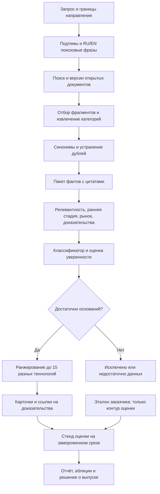

# Полная валидация методологии, моделей и серверов · ЛЦТ-2026 · Газпромбанк.Тех

Дата проверки: **17.09.2026**, подтверждена системными часами: 10:30 UTC / 13:30 МСК. Это аналитическая рекомендация, а не результат обучения или прогона прототипа. Цены, версии и доступность ниже проверены на эту дату. Материалы заказчика остаются локальными; отчёт не предназначен для публикации вместе с закрытыми приложениями.

## 0. Главное

Принятую 13.09 методологию нужно **заменить в части целевой переменной и оценки**: заказчик проверяет сегодняшние технологии в живой выдаче, а не рост числа публикаций через пять лет. Сохраняем поиск, доказательства, версии и интерпретируемые признаки. [1–4]
Главная цель: не менее **12 верных из 15** на каждом проверяемом направлении; внутренний ориентир — **13 из 15**, качественные источники и работа за **≤20 минут**. [2]
Основной стек: поиск → `Qwen/Qwen3.6-27B-FP8` для извлечения с цитатами → Qwen3 Embedding/Reranker 0.6B → компактный классификатор → проверяемые карточки. Для постоянного API-стенда — Qwen3.6-35B-A3B в Yandex; точные ID и резерв — в разделе 5.
Первым обучаем небольшой классификатор и калибратор на собственной проверенной разметке. Один эксперимент QLoRA для извлечения допускаем только после сильного baseline; эмбеддинги до 29.09 оставляем готовыми.
Арендовать сегодня: небольшой CPU-стенд и короткий проверочный сеанс GPU. Постоянную дорогую GPU-машину выбирать после измерения; обучение и массовую обработку оплачивать часами. Расчёт и условия — в разделе 7.
Три главных риска: неполное покрытие списка заказчика; подгонка и утечка в оценку; неподтверждённые факты и отказ поиска на живом запросе.
Три главных рычага: стабильные **13/15** при разных формулировках; доказательство каждого факта в один переход; убедительный новый запрос и измеренная замена модели.
За первое место отвечает качество всей выдачи после прохождения порога. Сам факт дообучения, размер LLM и число методов баллов автоматически не добавляют. [1,2]

## 1. Постановка задачи после QA-сессии

**Решаем задачу поиска, отбора и доказательного объяснения технологий, которые эксперты признают слабыми сигналами на дату запроса.** Единица ответа — отдельная технологическая категория в заданной области, с описанием, преимуществом, кейсом, источниками и объяснением. Документ, компания, патент или продукт могут подтверждать категорию, но сами по себе не заменяют её. [1, §2, §7; 2, вопросы о единице проверки и смысловом совпадении]

Одна запись наблюдения: `technology_family × query_scope × decision_at × corpus_version`. Дата решения теперь точная, а не только год. Одно семейство включает переводы и синонимы одной технологии. Разные области применения общей платформы объединяем только при совпадении технического механизма и границ категории; это особенно существенно для финтеха и защиты ИИ. Это проектное правило, выведенное из смысловой проверки заказчика. [2,3]

### Порог и две разные проверки

Пусть система вернула `k ≤ 15` различных технологий, `c` из них приняты. Рабочая интерпретация QA: `P@k = c/k`, принято при `c ≥ ceil(0,75k)`. При `k=15` нужно **12/15 = 80 %**: **11/15 = 73,33 %** не хватает. «Выше 80 %» при полной выдаче означает **13/15 = 86,67 %**. Проценты уверенности отдельных карточек в этот расчёт не входят. [2, ответы о первых 15 и пороге; арифметика автора]

| Режим | Что проверяют | Что измеряем до экспертизы |
|---|---|---|
| Шесть областей таблицы | Заказчик прямо ожидает технологии из своего списка и допускает смысловое совпадение. Раннее высказывание о том, что остальное является хайпом/шумом, позднее смягчается предложением разобрать частный пример. | Консервативно считаем совпадения с таблицей. Технологии вне неё отдельно размечаем как «вне эталона», не объявляем объективно ложными. |
| Новые направления | Несколько экспертов оценивают каждую позицию. Не описаны способ сведения голосов, число экспертов и правило разрешения споров. | Отдельная слепая оценка по рубрике слабого сигнала; она является оценкой команды, а не воспроизведённой оценкой жюри. |
| Менее 15 позиций | QA разрешает короткий список, но фраза о сравнении «первых семи» неоднозначна. Минимальное количество и влияние полноты на проход не установлены. | Показываем одновременно `P@k`, `k`, `c/15` и покрытие эталона. Не планируем победу за счёт ответа из одной позиции. |

Источник всей таблицы — QA [2]; выбранные консервативные правила являются нашим допущением до письменного ответа.

Для области с `m=16` технологиями 12 найденных означают **75 %** её списка, с `m=17` — **70,59 %**. Для внутренней цели 13 верных требуются соответственно **81,25 %** и **76,47 %**. Это минимальное покрытие именно итоговой выдачи. Поиск кандидатов должен давать запас: потерянные на этапе поиска технологии классификатор вернуть не сможет. Фактические размеры областей проверены по всем строкам таблицы; подробности — раздел 4. [3]

На новых направлениях нельзя честно посчитать полноту относительно всех существующих слабых сигналов: полного списка нет. Precision по размеченной выдаче и число убедительно подтверждённых разных технологий доступны; глобальный Recall — нет. На шести областях `Recall_list` относится только к предоставленному перечню. [2,3; определение метрики]

Порог — необходимое условие. Заказчик говорит, что после его прохождения сравнит источники, кейсы, параметры и полноту решения. Поэтому пустые названия из таблицы без настоящего поиска не удовлетворяют ни открытому сценарию ТЗ, ни конкурентной части оценки. [1, §3.1, §7.1–7.2; 2]

### Что подтверждено и где нужна осторожность

В расшифровке подтверждены: только положительный класс; возможность дополнять данные; выбор таргета командой; малая важность балла и стадии; открытые запросы; обязательная проверка шести областей и финтеха; смысловое соответствие; зарубежные источники; частичная выдача; ожидание до примерно 20 минут; объясняющие признаки; учёт противоречий; самостоятельный список доверенных источников; необязательность личного кабинета, истории и детального списка исключений; код и возможный запуск участниками; обязательный стенд для финала. [2]

Не принимаем ошибочные места распознавания за требования: «15 %» и «85 %» в отдельных репликах не отменяют многократно произнесённый порог **75 %**. Реплика о Timeweb не является достоверной классификацией провайдера по юрисдикции. Статус моделей и сервисов проверяем по документации самих поставщиков. Связь Gartner с количеством патентов отражает мнение представителя заказчика, но официальная публичная методология Gartner не задаёт патентный счётчик как универсальное определение Hype Cycle. [2,11]

### Расхождения PDF и QA

| Вопрос | PDF | Более позднее QA и наше решение |
|---|---|---|
| Закрытый датасет | §6.2, §7.1, §8.4 описывают скрытую разметку и валидационную выборку. | Отдельный скрытый набор не подтверждён; проверка открытым запросом. Стенд оценки строим вокруг живой выдачи. |
| Обучение | §2 и схема на печатной с.2 требуют разработать и обучить модель. | Можно использовать LLM по API либо свою модель. Обучаем полезный небольшой классификатор, но запрашиваем подтверждение допустимости полностью готовых моделей. |
| Метрика | Precision/Recall/F1 и разные формулировки 75–80 %, на схеме >80 %. | Основная операционная метрика — согласие с первыми 15, минимум 75 %. Для запаса целимся в 13/15; дополнительные метрики даём с точными знаменателями. |
| Размер выдачи | ТОП-15. | Меньшее число разрешено устно; правило сравнения короткой выдачи нужно уточнить. |
| Другие API | §3.1 требует согласовать модели вне списка и внешние маршрутизаторы. | QA разрешает другие модели при проверке заменяемости. До письменного ответа используем разрешённый API либо локальную HF-модель и логируем выбор. |
| Стек | Python, PostgreSQL, Docker, перечисленные UI/backend-фреймворки. | Другой стек допускается с понятной документацией. Практической причины менять выбранный Python-стек нет. |
| Интерфейс и стенд | §7.1 допускает простой технический вывод; §7.2 требует web-стенд. | Подтверждено: полноценный стенд обязателен в финале. Простой доступный стенд к 29.09 уменьшает риск проверки. |
| Реальное время | Живое формирование без ограничения стартовым списком. | Примерно 20 минут и частичный результат допустимы. Предрасчёт используем прозрачно, новый сбор остаётся рабочим. |
| Презентация и календарь | До 15 слайдов; оценивается в финале; даты сдачи в PDF отсутствуют. | QA называет 29.09. Требование приложить презентацию 29.09 и спор 23/26.10 пока известны из сообщения команды, приказ не приложен. Готовим комплект с презентацией. |

Письменные вопросы с готовыми формулировками собраны в разделе 11. До ответа этот отчёт использует QA как позднее разъяснение, сохраняя более строгие требования к доказательствам и запуску. [1,2]

## 2. Вердикты по Р01–Р17 и К01–К10

«Оставить» означает сохранить смысл решения, а не объявить его качество уже доказанным. Ни один вариант в этой проверке не запускался на действующем прототипе.

| № | Вердикт | Почему | Что сделать | Основание |
|---|---|---|---|---|
| Р01 | изменить | Прозрачность и ссылки необходимы. Утверждение, что LLM вообще не участвует в решении о классе, неоправданно ограничивает сильный baseline. | Разрешить LLM структурированную оценку по доказательствам; объяснение строить из извлечённых фактов, не из самооценки модели. | [1, §2–3; 2] |
| Р02 | изменить | Срез и версия нужны, но запрет LLM/эмбеддингов относится к строгой исторической реконструкции. Сегодняшний запрос требует смыслового извлечения. | Перейти к категории × области запроса × дате × корпусу; хранить семейства и синонимы. | [2,3,4] |
| Р03 | заменить | Рост публикаций через пять лет не совпадает с экспертным классом «слабый сигнал сейчас». Пороги 50 работ и 0,1 % — прежние допущения команды. | Цель: вероятность принятия кандидата по рубрике. Отдельно хранить совпадение с таблицей и самостоятельную экспертную оценку. | [1,2,4] |
| Р04 | заменить | Walk-forward проверяет другую цель и потребует исторического корпуса. Современная LLM не делает такой тест строгим. | Главный тест — перенос между областями с удалением пересечений семейств и слепые новые направления; ретроэксперимент только после прохода. | [2,3,4] |
| Р05 | заменить | Формула поощряет большой объём и разнообразие организаций, тогда как QA называет массовость компаний причиной исключения. Перцентиль нельзя показывать как вероятность. | Разделить релевантность, зрелость рынка, техническую состоятельность, наблюдаемую динамику и качество доказательств; веса сравнить с простым baseline. | [2,3,4] |
| Р06 | изменить | Правило «сложная модель только при выигрыше» верно. LightGBM и SHAP не обязательны, 100 положительных недостаточно для гибкой модели. | Сначала регуляризованная логистическая регрессия, затем один маленький LightGBM; объяснять исходными фактами. | [1,2; разделы 5–6] |
| Р07 | изменить | Каталог полезен для выбора признаков. Его набор «до 29.09» перегружен, а перцентили и частотные пороги не доказывают зрелость. | Оставить рамку возникновения технологии, рыночные события, доказательства и один простой показатель динамики. ES, BERTrend и индекс хайпа — отдельные отложенные абляции. | [3,9,11–16] |
| Р08 | изменить | Научный корпус помогает подтверждению, но не покрывает рыночные категории и текущие пилоты таблицы. Lens требует отдельного доступа. | Поиск свежих первоисточников, разработчиков, препринтов и отраслевых публикаций; OpenAlex как дополнительный канал; патенты точечно. | [2,3; раздел 8] |
| Р09 | оставить | Карточка по переданным фрагментам согласуется с запретом выдачи из знаний LLM. | Проверять точное происхождение цитат и чисел, различать факт/заявление разработчика/гипотезу применения; пропуски сохранять. | [1, §3.1, §7.2; 2] |
| Р10 | изменить | Официальные Qwen3.6-27B-FP8 и Qwen3.6-35B-A3B-FP8 существуют на дату проверки. Выбор между ними без замера нагрузки преждевременен. | Сравнить их на одинаковых 100 пакетах источников; малую Qwen3-8B взять как student/резерв. Один условный эксперимент QLoRA. | [17–19,37,38] |
| Р11 | изменить | bge-m3 остаётся разумным baseline. SPECTER2 специализирована на научных документах, таблица шире научных статей. | Сравнить BAAI/bge-m3 с Qwen/Qwen3-Embedding-0.6B и добавить Qwen/Qwen3-Reranker-0.6B; выбрать по извлечению релевантных доказательств и русским запросам. | [22–26] |
| Р12 | заменить | Непрерывная L40S за свой счёт до финала дорогая; 32 ГБ RAM создают мало запаса. Потребность в GPU определяется токенами и очередью, а не желанием обучить 30B после конкурса. | Постоянный CPU-стенд/API + GPU по часам. Если L40S уже оплачена, использовать оставшиеся дни и не продлевать автоматически. | [5; раздел 7] |
| Р13 | изменить | API, worker, PostgreSQL и простой UI подходят. Полный библиометрический граф из 28 таблиц увеличивает объём без прямого выигрыша в новой проверке. | Сохранить доказательства и версии; упростить специализированные таблицы. Redis/Celery и отдельная векторная БД не нужны. | [1,2,6,7] |
| Р14 | изменить | Ноутбук может быть клиентом сервера/API; тяжёлая модель целиком на обычном ноутбуке не обещана. | Docker-профили API и GPU, локальный интерфейс, честный автономный просмотр сохранённого анализа; отдельно проверить живой режим. | [1, §3.1; 2] |
| Р15 | изменить | Роль аналитика верна. Семь обязательных экранов и 30 минут не соответствуют уточнённым приоритетам. | Запрос → прогресс → список → карточка → отчёт. ≤20 минут нового запроса, кэш с датой; без обязательной авторизации. | [2,8] |
| Р16 | изменить | Трёхминутная история полезна. Подготовленные направления и ретрооценка не заменяют запрос жюри. | В питче показать доказательство, исключённую зрелую тему, короткий отчёт и заменяемость; живой запрос запускать заранее и показывать по готовности. | [1, §4; 2,8] |
| Р17 | заменить | Даты 13–17.09 прошли, фактический прогресс неизвестен; прежний план на одно-два направления недостаточен. | Перепланировать 18–29.09: оценка первой, шесть областей и новые направления, ранний сквозной запуск, жёсткие условия остановки обучения. | [2,8] |
| К01 | оставить | Библиометрическая метка и исторический тест не являются главным объектом QA. | Сохранить их как отдельную исследовательскую опцию после работающего поиска. | [2,4] |
| К02 | изменить | Шесть областей и новые направления нужны. Повторная настройка на всех шести результатах и межобластные дубли нарушают независимость теста. | Purged leave-one-domain-out для диагностики, закрытый пакет новых направлений и один финальный запуск; таблицу использовать только по объявленному протоколу. | [2,3; раздел 10] |
| К03 | изменить | Свежие новости и первоисточники нужны. Утверждение о единой задержке OpenAlex без замера слишком сильное: он обновляется, а задержка зависит от документа. | Измерить покрытие конкретных технологий; не делать OpenAlex единственным источником. | [3,40,41] |
| К04 | изменить | Точная гранулярность необходима, но сама таблица неоднородна и содержит близкие категории. | Зафиксировать правила области применения, механизма и семейства; спорные совпадения проверять человеком. | [3] |
| К05 | изменить | Собственные отрицательные примеры необходимы. Большой раунд одной компании не равен зрелости всей технологии. | Собирать зрелое, хайп и нерелевантное из реального поиска; неопределённое оставлять отдельным. | [2,3] |
| К06 | изменить | Приоритет точности оправдан. Сокращение списка уменьшает полезность и не даёт доказанного обхода проходного порога. | Порог отказа выбирать на dev; показывать P@k и полноту; в шести областях добиваться полной убедительной выдачи. | [2; раздел 10] |
| К07 | изменить | Предрасчёт сокращает задержку. Замена свободного поиска статической выдачей нарушит ТЗ. | Кэшировать документы и проверенные результаты с датой, поддерживать обновление и произвольные новые запросы тем же кодом. | [1, §7.1–7.2; 2] |
| К08 | оставить | Заказчик прямо упоминает замену LLM и иностранных поисковых сервисов. | Адаптеры и тест отключения провайдера; логировать обе стороны сравнения. | [1, §3.1; 2] |
| К09 | изменить | Русские названия, доверие и противоречия нужны. Один рейтинг доменов не отражает достоверность конкретного факта. | Разделить репутацию источника, независимость и поддержку утверждения; наличие противоречия сохранять отдельно. | [1, §2; 2] |
| К10 | изменить | Приоритеты полезны, но калиброванную вероятность нельзя обещать до проверки на независимых данных. | Внедрить компактную модель, рубрику зрелости и проверку доказательств; проценты выводить как оценку с указанной областью применимости. | [1–3,10,36] |

## 3. Целевая методология

**Слабый сигнал операционализируем как релевантную технологическую категорию с проверяемыми ранними проявлениями и потенциальной пользой, для которой массовое внедрение и устойчивый зрелый рынок ещё не подтверждены.** Низкая известность без технического содержания недостаточна. Отсутствие найденных данных о рынке не доказывает его отсутствие. Это рабочая рубрика команды, согласованная с определением ТЗ и проверяемая по таблице и независимой разметке. [1–3]

На каждую категорию собираем ответы на пять вопросов: существует ли описанный технический механизм; что нового произошло; где и в какой среде он проверен; насколько широко применяется именно эта категория; какими источниками подтверждаются выводы. Потенциальную пользу и остающуюся неопределённость объясняем отдельно. Пять атрибутов Rotolo дают понятийную рамку, но не готовые числовые пороги для банковского конкурса. [12]



**Поиск категорий и поиск доказательств — два прохода.** Первый разворачивает открытую тему в ограниченный корпус и предлагает ≈40–80 кандидатов. Второй ищет первичные подтверждения для ≈20–30 лучших, проверяет массовость и противоречия. Числа — начальный бюджет, а не установленная полнота: корректируем его по `CandidateRecall` и времени. Поиск доказательств только для первых 15 создаёт риск закрепить ошибки раннего отбора.

Класс целесообразно разложить на оси. Релевантность запросу — отдельная проверка. Рыночная зрелость — `early / emerging / mature / unknown`. Сила технического подтверждения — `supported / claim_only / contradictory / unknown`. Хайп — недостаточное подтверждение сильного обещания и/или неподтверждённая волна перепечаток. Шум — нерелевантность, отсутствие содержательной технологии либо дубликат. Для отчёта эти оси сводим к четырём классам, сохраняя причину и `unknown`; они могут пересекаться, поэтому не размечаем их автоматически одним признаком.

Нужны два самостоятельных baseline: **готовая сильная LLM по фиксированной рубрике и тем же источникам** и **простые прозрачные правила по извлечённым фактам**. Обученный классификатор сравниваем с обоими. Если сильная готовая модель выигрывает, выпускаем её; наличие обучения демонстрируем честным экспериментом, а не ухудшением продукта ради формального слова «обучили». [2]

Большое число компаний, упоминаний и инвестиций — свидетельства, названные заказчиком, но без универсальных численных границ. В таблице встречаются большие раунды и крупные компании. Поэтому запрет вида «раунд >X долларов → зрелое» либо «есть NVIDIA → исключить» заведомо опасен. Различаем инвестиции компании и технологии, общую платформу и узкую задачу, пилот и массовое внедрение. [2,3]

Использование эталона допускается и прямо предложено заказчиком. При этом выбранный продуктовый путь — **единый открытый поиск без подмешивания готового ответа из Excel**. Учебный эталон формирует рубрику, проверки и разрешённую обучающую часть. Если команда решит использовать список как базу знаний, это должно стать отдельным явно названным экспериментом с отдельной оценкой: его результат нельзя называть качеством обнаружения неизвестных технологий. [1,2]

### Судьба методов из каталога

Gartner оставляем языком обсуждения зрелости и внедрения. Патенты — один вид доказательств, а не универсальная ось кривой. TRL используем только для конкретной системы и среды испытаний; в отсутствие прямой оценки пишем «прототип в лаборатории» или «пилот», не генерируем точный уровень готовности. [11,16]

Yoon оставляем возможной иллюстрацией редкого растущего термина. Полный оригинал в этой сессии не подтверждён, поэтому коэффициенты и разрезы из каталога не переносим как установленные авторские значения. Собственную карту «доля документов × изменение доли» можно реализовать без атрибуции чужой формулы, с явно выбранными окнами. Она не измеряет рыночную зрелость. [9,13]

Emergence Score и BERTrend не включаем в обязательный фильтр до 29.09. Требование длинной устойчивой истории способно выкинуть категории, появившиеся в 2025–2026 годах. Популярность темы и её место в распределении корпуса не равны массовому внедрению. Их полезность надо проверять как отдельный слой на тех же запросах; установленного выигрыша над нашей рубрикой нет. [3,9,14,15]

Расхождение динамики медиа, науки и патентов можно показывать как диагностику. Формула «рост новостей минус рост науки» не получила в этой проверке подтверждения как валидированный универсальный индекс хайпа. Нельзя делать отрицательную метку только по такому индексу. [9,10; непроверенность формулы]

### Историческая ретропроверка

До 29.09 убираем старый пятилетний walk-forward из критического пути и трёхминутного демо. Он требует иной метки, датированных версий и защиты от современных знаний модели, а проходной порог измеряет другое. [2,4]

После прохождения текущего теста допускается небольшой исследовательский кейс: фиксированная дата, опубликованные к ней документы, заранее выбранные успешные и неуспешные темы, оценка тех же ранних признаков. Современную LLM и современные эмбеддинги явно называем реконструкцией. Без исторического архива и модели с подходящим временным срезом не заявляем, что система действительно «предсказала из прошлого». Предпочтительнее до финала накопить **проспективный журнал**: что найдено в сентябре, на каких основаниях и что изменилось к октябрю. За несколько недель нельзя доказать долгосрочный успех технологии.

## 4. Признаки

**Главный вывод из 100 строк: распознавать надо ограниченность конкретного применения и характер доказанного продвижения. Универсальные пороги размера раунда, возраста и количества известных компаний таблицу не воспроизводят.** Все приведённые ниже номера — значения столбца B, Excel-строка равна № + 2; название в C, область в D, компании в E, объяснение в F, стадия в G, динамика в H, балл в I, ссылки в J. [3]

### Что действительно содержится в таблице

| Область, точное название | Строк | Покрытие списка для 12 верных | Для 13 верных | Максимум Recall списка при 15 ответах |
|---|---:|---:|---:|---:|
| Индустриальный ИИ | 17 | 70,59 % | 76,47 % | 88,24 % |
| Инфраструктура ИИ | 17 | 70,59 % | 76,47 % | 88,24 % |
| Роботы | 17 | 70,59 % | 76,47 % | 88,24 % |
| Финтех | 17 | 70,59 % | 76,47 % | 88,24 % |
| Edge | 16 | 75,00 % | 81,25 % | 93,75 % |
| Защита ИИ | 16 | 75,00 % | 81,25 % | 93,75 % |

Проверены все **100 строк**, заполнены все **900 ячеек B:J**, формул нет. Точных повторов названий нет. В J найдено **285 URL-вхождений**, **283 разных адреса** и **206 значений hostname** без специальной нормализации. По 3 ссылки имеют 86 строк, по 2 — 13 строк, одну — 1 строка. Число адресов не является числом независимых доказательств. [3, B3:J102]

В **95 строках** диапазона C:I явно встречается 2025 или 2026 год. Подсчёт подстрок только по F:H даёт: «раунд» — **45 вхождений в 34 строках**, seed — **34 в 23**, Series — **37 в 27**, «препринт» — **16 в 12**, «патент» — **3 в одной**. Это частоты текста, не количество подтверждённых сделок или патентов. Все буквальные упоминания патентов в содержательных столбцах относятся к №95; прямых ссылок на патентные карточки нет. [3]

По маршрутам URL выделены **34 ссылки научного характера**, включая 19 arXiv/ar5iv. Это классификация адресов, не аудит 34 полных статей. Остальные ссылки нельзя автоматически назвать новостями или низкокачественными: среди них разработчики, инвесторы, платформы и организации. Все 285 адресов на доступность и поддержку фактов в этой сессии не проверялись. [3]

Балл распределён как 7/6/5/4/3 у **15/28/28/22/7** строк; среднее **5,22 балла**. Таблица отсортирована по баллу. Номер строки, балл и авторское объяснение «почему это слабый сигнал» нельзя незаметно включать в признаки: они несут готовое решение. Одинаковый экстрактор должен получать факты из первоисточников для положительных и отрицательных объектов. [3]

Прежние «97 % восстановления балла» без исходного правила не воспроизведены. Явная лексическая нормализация даёт **98/100**: стадия 4 при `ранн.{0,5} внедр`, иначе 3 при «пилот», иначе 2 при «прототип»/PoC, иначе 1; динамика 3 при «быстро», иначе 2 при «растёт», иначе 1. Ошибки — №66 и №93, по 2 балла. Смешанные стадии и «ранняя серия» допускают другие правила. Это проверка восстановления текстового балла, не качества бинарного детектора. [3, G3:I102]

### Рабочий набор признаков

Часы в последнем столбце — **≈ суммарное время настройки и проверки**, после появления общего экстрактора. Это проектные оценки, не стоимость независимых модулей: большая часть полей извлекается одним проходом. Обязательный набор вместе укладываем примерно в **8–12 ч Марины и 8–10 ч Олега**, уже включённые в план.

| Признак | Как считать | Данные | Что отделяет или находит | Подтверждение | Цена до 29.09 |
|---|---|---|---|---|---|
| Релевантность и границы | Механизм/практика, функция и применение; 0/1/unknown по рубрике | Запрос, содержательные фрагменты | Шум, слишком широкие категории | QA о смысловом совпадении; №78 PLC, №79 P&ID | P0, ≈2–3 ч |
| Подтверждённая стадия | Исследование, прототип, пилот, ограниченные продажи, масштаб; среда испытаний | Статья, испытание, продуктовая документация, клиент | Ранний сигнал и зрелое | 48 разных формулировок стадий; QA не требует точного балла | P0, ≈2 ч |
| Реальные внедрения | Число названных независимых пользователей именно этой категории; граница наблюдения | Кейсы клиентов, исследования, поставки | Массовое внедрение | QA; №27 и №39 показывают, что простой ненулевой счётчик не veto | P0, ≈2 ч |
| Сформированность рынка | Отдельные поля: повторяемые закупки, массовость, стандартизация требований, устойчивые поставщики | Клиенты, регуляторы, отраслевые отчёты | Зрелое | PDF §2, §7.2; одного лидера недостаточно, №32 | P0, ≈2–3 ч |
| Финансирование | Сумма, валюта, дата, стадия, получатель и связь денег с категорией; unknown при пропуске | Разработчик, инвестор, реестр, подтверждающее медиа | Стадия и рыночный контекст | В таблице есть заявленные раунды $570 млн у №1 и $475 млн у №8 | P0, ≈1–2 ч |
| Роли организаций | Разработчик, пользователь, инвестор, автор, участник консорциума; уникальные сущности по каждой роли | Те же документы | Зрелость и независимость | №43 содержит банки/партнёров; E нельзя разделить по запятым в «число компаний» | P0, ≈1–2 ч |
| Новое событие или применение | Датированное отличие от предыдущего подхода; old mechanism/new use допустимо | Предыдущая и текущая версии, статьи, релизы | Сигнал | №8, №19, №90 относятся к давно существующим семействам | P0, ≈1–2 ч |
| Техническое подтверждение | Доступный прототип, измерение, эксперимент, воспроизводимый релиз; связь результата с обещанием | Научный текст, независимый тест, код, API | Хайп и шум | ТЗ требует кейс и источник; одной рекламной формулировки недостаточно | P0, ≈2–3 ч |
| Относительная видимость | Доля уникальных документов категории в фиксированном сопоставимом канале | Собственный сохранённый корпус | Поддерживает сигнал/массовость | QA о числе упоминаний; таблица даёт текстовые оценки, не ряды | P1, ≈3–5 ч при готовом корпусе |
| Динамика видимости | Изменение доли на равных окнах с одинаковым сбором; отдельно missing/малый знаменатель | Тот же канал и политика выборки | Находит новые проявления | Быстрый рост есть у всех 15 строк с баллом 7 | P1 вместе с видимостью |
| Независимость свидетельств | Группы общего события, пресс-релиза и первоисточника; число групп, не доменов | Цитирования, даты, почти одинаковый текст | Перепечатки, хайп | 283 URL не означают 283 независимых источника | P0, ≈2–3 ч |
| Противоречие | Пары несовместимых утверждений об одном объекте, периоде и величине, с обеими цитатами | Пакет источников | Снижает уверенность при неразрешённом конфликте | QA прямо требует учитывать | P0, ≈2–3 ч |
| Патенты | Подтверждённая опубликованная заявка/семейство, дата публикации; отсутствие = unknown | Официальная база или проверенный документ | Дополнительное доказательство механизма | Патенты почти не представлены в Excel | P1 точечно ≈1–2 ч; полный ряд отложить |
| Вакансии, stars, downloads | Только дополнительный наблюдаемый факт с датой и источником | Разрешённые страницы компаний, GitHub/HF | Контекст инженерной активности | Не проверены как разделяющий признак на таблице | P2, 0 ч обязательного объёма |

Для динамики предлагаем свою простую формулу: `s_t = unique_docs(technology,t)/unique_docs(scope,t)`; `g = log((s_recent+ε)/(s_previous+ε))`, `ε = 1/max(N_recent,N_previous,1)`. Окна сначала **90 дней + предыдущие 90 дней**, параметр фиксируется на dev. Это инженерное сглаживание, не оригинальная формула Yoon. При `N=0` ставим missing. Если сбор представляет top-N поисковой выдачи с меняющимся ранжированием, доли не интерпретируем как рыночную популярность: остаются лишь показатели нашей выборки.

### Проверка границ и фактов

Категории неоднородны: рядом с узкими MCP-сканерами и генерацией P&ID встречаются более широкие компиляторы инференса, сертификация физического ИИ, страхование роботов и материалы приводов. Поэтому уточняем единицу до **«технологический механизм или практика × конкретное применение/контекст × дата»**. Жёсткое требование, чтобы каждый ответ был только рыночной категорией продукта, потеряет часть эталона. [3, №4,13,33,62,78,79,97,98]

| Наблюдение аудита | Следствие для системы |
|---|---|
| №44/84 имеют общий URL и семейство analog in-memory; №47/60 — фотонный инференс и общий URL; №18/59 — орбитальные вычисления | Удалять связанные обучающие семейства и документы при удержании области. Не склеивать автоматически разные контексты в gold. |
| №60 связывает раунд OLIX $312 млн с февралем, официальный релиз — **03.08.2026** | Исправлять дату в фактах, сохранять положительную метку заказчика. [70] |
| №35 ссылается на Google Summit **16–17.11.2026** | Сохранять «анонс будущего события»; не считать проведённым мероприятием или доказанным внедрением. [71] |
| №93 неверно описывает начало Base-этапа JPMD: официальный пилот объявлен **24.06.2025**, доступность после PoC — **12.11.2025** | Разделять даты события и статьи, проверять историю по первоисточникам. [72] |
| Источники Neurophos/OLIX для №47 описывают дата-центры и стойки | Узкое edge-применение этими фрагментами не подтверждается; не выводить его из состава инвесторов. [70,73] |
| №73 смешивает Qualcomm и LSI/Exynos, в препринте это разные платформы | Извлекать роли и связи из текста, не копировать столбец компаний как ground truth фактов. [74] |

Это целевая проверка нескольких спорных случаев, **не случайная выборка для оценки процента ошибок таблицы**. Наличие поправимых фактических ошибок не делает весь список непригодным. В модели должны существовать раздельно `customer_label`, `verified_fact`, `match_status` и `evidence_quality`.

## 5. Модели

**Берём сильную готовую Qwen3.6 как baseline, готовые небольшие эмбеддинги/реранкер и обучаемый компактный классификатор.** Единственный дополнительный LLM-опыт до 29.09 — QLoRA `Qwen/Qwen3-8B` для категорий и фактов, если стенд показывает повторяемые ошибки или неприемлемую стоимость сильного экстрактора. Публикуемых результатов, доказывающих прирост именно на этой задаче, нет; ниже заданы условия экспериментов, а не обещанный выигрыш.

### Точные версии и места исполнения

| Назначение | Подтверждённый идентификатор | Решение |
|---|---|---|
| Сильный локальный экстрактор и учитель | `Qwen/Qwen3.6-27B-FP8` | Начальный локальный baseline. Плотная языковая часть 27B, гибридная архитектура. [17] |
| Сильный локальный challenger | `Qwen/Qwen3.6-35B-A3B-FP8` | Официальный checkpoint, 35B всего / 3B активных. Сравнить с 27B на одном тесте, не выбирать по active params. [18] |
| Основной API для малой машины | `gpt://<folder_id>/qwen3.6-35b-a3b` | Yandex AI Studio, разрешённое ТЗ семейство; доступ и квота аккаунта требуют smoke-test. [27] |
| Другая модель для проверки замены | `gpt://<folder_id>/yandexgpt-5.1` | YandexGPT Pro 5.1, отдельный запуск с теми же источниками и схемами. [27] |
| Student и компактный резерв | `Qwen/Qwen3-8B` | Фактически 8,2B параметров, `enable_thinking=false` для короткого структурированного вывода; отдельная версия квантования. [19] |
| Промежуточный challenger | `Qwen/Qwen3-14B` | 14,8B. Пробовать, только если 8B проигрывает на повторяемом типе фактов, а 27B слишком дорог. [20] |
| Эмбеддинг | `Qwen/Qwen3-Embedding-0.6B` | Основной старт, вектор 1024; CPU либо пакетный GPU. [22] |
| Реранкер | `Qwen/Qwen3-Reranker-0.6B` | Переранжирование ограниченного пула фрагментов, CPU/GPU после измерения. [24] |
| Эмбеддинг baseline / более крупный challenger | `BAAI/bge-m3` / `Qwen/Qwen3-Embedding-4B` | bge-m3 сохранить для честного сравнения; 4B — только при заметном выигрыше retrieval. [23,25] |
| Научный encoder | `allenai/specter2_base` + `allenai/specter2` | Подтверждены база и адаптер. Не брать основным для смешанного корпуса новостей, компаний и статей. [26] |
| Классификатор | `sklearn.linear_model.LogisticRegression` | HF checkpoint отсутствует: обучается локально на CPU; точный класс из официальной библиотеки. Малый `lightgbm.LGBMClassifier` — один challenger. [39] |

У Qwen3.6 в официальных карточках рекомендован `vllm>=0.19.0`; для текста предусмотрен `--language-model-only`. В реализации фиксировать конкретный image digest, версию vLLM, revision модели, tokenizer, chat template, квантование и флаг thinking. JSON Schema проверяет форму, но не истинность содержания. [17,18,37]

В документации Yandex также подтверждены `gpt://<folder_id>/yandexgpt-5-pro`, `gpt://<folder_id>/yandexgpt-5-lite`. `gpt://<folder_id>/qwen3-235b-a22b-fp8` заявлена **до 30.09.2026**, поэтому единственной моделью октябрьского стенда её не выбираем. Точные GigaChat ID: `GigaChat-2`, `GigaChat-2-Pro`, `GigaChat-2-Max`; название Lite не превращаем в несуществующий `GigaChat-2-Lite`. С 01.09 новые платные клиенты GigaChat направляются через cloud.ru. [27,29,30]

`gpt-4.1-2025-04-14` подтверждён и входит в семейство из ТЗ. Прямой API не является основой российской демонстрации: РФ отсутствует в официальном списке поддерживаемых стран, наличие законного доступа команды не установлено. `gpt-5.6-luna` присутствует в ТЗ, но его отдельный публичный API-каталог и тариф в этой проверке не подтверждены; не назначаем его зависимостью только по названию в приложении. Подписку ассистента не считаем оплаченным API продукта. [1,31,32]

### Восемь компонентов

Объёмы — **≈ планируемые**, зависят от разнообразия документов. «Порог решения» — внутреннее условие выпуска, не норматив из статьи. `Δ` сравнивается на одних групповых разбиениях и одинаковом бюджете поиска. Любое локальное улучшение дополнительно должно проходить сквозной тест раздела 10.

| Компонент | Без обучения | С обучением | Модели с точными ID | Данные и объём | Метрика и порог решения | Где | Решение до 29.09 |
|---|---|---|---|---|---|---|---|
| 1. Запрос → подтемы и RU/EN поиск | Ограниченная схема 5–8 подтем, 12–24 фраз, проверка сохранения границ | SFT на ≈200–400 независимых запросах и проверенных расширениях | `Qwen/Qwen3.6-27B-FP8`, резерв `Qwen/Qwen3-8B`; API из таблицы выше | Запросы людей и реальные ошибки поиска; парафразы одной темы остаются одной группой | CandidateRecall до ранжирования; изменение должно добавить найденные gold без роста доли нерелевантных документов >5 п.п. и без ухудшения худшей области | GPU/API; правила CPU | **Не обучать отдельно**. Исправлять расширение по dev |
| 2. Поиск и отбор | Лексический поиск + embedding, затем top-50/100 rerank | Reranker на ≈1000–3000 парах/триплетах ≥200 разных запросов; embedding требует ещё более разнообразных пар | `Qwen/Qwen3-Embedding-0.6B`, `BAAI/bge-m3`, `Qwen/Qwen3-Reranker-0.6B`; challenger `Qwen/Qwen3-Embedding-4B` | Пары «запрос — документ/фрагмент» из реально собранных результатов, hard negatives и пропущенные доказательства | Recall доказательств@100, nDCG@20; challenger принимается при ≈+5 п.п. Recall или ≥1 исправленной позиции top-15 в нескольких dev-запросах и сохранении времени | CPU/пакетный GPU | **Готовые веса**. Дообучение только после дедлайна |
| 3. Категории, синонимы, перевод | Извлечённый механизм/практика + контекст + цитата; предварительная склейка embedding, подтверждение LLM | Общий QLoRA-адаптер извлечения | Учитель `Qwen/Qwen3.6-27B-FP8` или `Qwen/Qwen3.6-35B-A3B-FP8`; student `Qwen/Qwen3-8B` | ≈800–1500 документов / ≈1500–2500 чанков; часть без подходящей технологии; отдельные ручные категории | Candidate precision/recall, полнота пула, false-merge ≤2 % на ручных парах; минимум ≈+5 п.п. F1 против той же 8B без адаптера | Обучение GPU; инференс GPU/API | **Один условный опыт вместе с п. 4** |
| 4. Факты и противоречия | Nullable JSON: объект, атрибут, значение, единица, дата события, цитата, отрицание, источник | Тот же адаптер, без отдельного обучения на каждый факт | Те же Qwen; сильный API только для сравнительного inference | Тот же корпус + ≈150–250 трудных примеров сумм/дат/планов/конфликтов; gold ≈120 документов | F1 нормализованных фактов; поддержанность ≥95 %, валидность привязки цитат 100 % после фильтра; отсутствие регресса сквозного P@15 | GPU/API, детерминированные проверки CPU | **Условно обучать**; адаптер заменяет сильную модель лишь после проверки |
| 5. Сопоставление с эталоном и дубли | Embedding предлагает пары; фиксированный grader и человек применяют рубрику механизма/функции/контекста | Небольшой pair classifier либо reranker на ≈300–600 размеченных трудных парах | `Qwen/Qwen3-Embedding-0.6B`, `Qwen/Qwen3-Reranker-0.6B`, grader `gpt://<folder_id>/yandexgpt-5.1` | Эквивалентные, более широкие, близкие и разные пары; company overlap не метка | Цель precision автомэтча ≥98 % на ≥100 принятых парах, missed-match отдельно; до накопления выборки все засчитываемые пары подтверждает человек | CPU/API | **Grader не дообучать одновременно с системой**. Производственные дубли оцениваются отдельно |
| 6. Сигнал / зрелое / хайп / шум | Фиксированная доказательная рубрика сильной Qwen + прозрачная балльная baseline | Binary accept/reject logistic, причины отдельными тегами; затем небольшой LightGBM и калибровка | `Qwen/Qwen3.6-27B-FP8`; `sklearn.linear_model.LogisticRegression`, `lightgbm.LGBMClassifier` | 100 customer positives + ≈240 собственных отрицательных/пограничных; признаки заново из источников; калибровка на естественном потоке | P@15, минимальная точность области, P@k/coverage; принимаем при устойчивом улучшении, например ≥1 верной позиции в ≥3 из 6 областей без падения ниже 12/15. Brier/log-loss отдельно | CPU, LLM-оценка GPU/API | **Первое обучение**. Нет выигрыша — оставить сильный baseline |
| 7. Карточка и русское резюме | Шаблон обязательных полей + переформулирование проверенных фактов | ≈300–600 пар «факты → карточка» как дополнительная задача адаптера | `Qwen/Qwen3.6-27B-FP8` либо прошедшая тест `Qwen/Qwen3-8B` | Только разрешённые фрагменты и собственные редакторские карточки | Все обязательные поля есть или явно unknown; ≥95 % смысловой поддержки на ручном аудите, 0 вымышленных критических дат/сумм в выпускном наборе | GPU/API; шаблон CPU | **Не обучать отдельно**: прямой прирост попаданий не обоснован |
| 8. Доверие источнику | Реестр типов, ролей и ограничений + независимость событий + поддержка конкретного утверждения | Logistic на ≈500–1000 парах «источник — утверждение», held-out publishers | `Qwen/Qwen3-8B` только для извлечения атрибутов; `sklearn.linear_model.LogisticRegression` как возможный learner | Собственная разметка, новые издатели, спорные заявления; не просто метка домена | Agreement и precision определения первичности/независимости; калибровка на новых издателях; отсутствие роста ложных подтверждений | CPU; извлечение GPU/API | **Правила, не отдельное обучение** |

Источники свойств моделей — [17–30,39]; технический отчёт семейства Qwen3 Embedding — [69], проверенный здесь по аннотации. Выбор задач, объёмов и порогов — проектное решение по [1–3]. Условие ≥98 % на 100 парах — небольшой аудит, а не статистическая гарантия той же точности в мире.

### Ожидаемый эффект и риски обучения

**Достоверного численного прогноза прироста сейчас нет.** В бюджет качества закладываем **0 п.п. гарантированного прироста**. Полезная проверяемая гипотеза: адаптер уменьшит ошибки гранулярности/дат у 8B, классификатор переставит подтверждённый ранний кандидат выше зрелого. Исправление одной позиции даёт **6,67 п.п. P@15 одного запроса**; это арифметика, не ожидаемый результат исследования.

| Опыт | Откуда может появиться выигрыш | Что способно обнулить выигрыш | Условие продолжения |
|---|---|---|---|
| Обучение классификатора | Совместный учёт стадии, охвата и силы доказательств вместо отдельных veto | Малый набор, искусственные отрицательные, тексты таблицы раскрывают метку | Исправления в нескольких группах, прозрачные ошибки и калибровка |
| QLoRA извлечения | Повторяемый формат, различение анонса/события, точные цитаты и границы | Student усваивает ошибки учителя или запоминает названия | Выигрыш против собственной базы и приемлемое сравнение с сильной Qwen |
| Обучение поиска | Лучшее различение близких механизмов и применений | Пары «область — её 17 названий» учат узнавать список, а не находить документы | Нужны независимые пары доказательств и прирост сквозного покрытия |
| Обучение карточек/доверия | Меньше редактирования и стабильнее рубрика | Красивый текст маскирует неподтверждённый факт; репутация сайта подменяет факт | Отложить до обнаружения конкретной ошибки, которую правила не решают |

Даже если адаптер не превосходит сильную Qwen по P@15, он может быть полезен при **не худшем качестве в заданном допуске** и измеренном сокращении стоимости или задержки, например ≥30 %. Это инженерный выигрыш. До замера он не доказан. Если сильный вариант лучше и его стоимость приемлема, выпускаем сильный вариант.

### Что можно обучить на 100 положительных и собственных отрицательных

Можно учить ≈8–15 содержательных признаков и индикаторы пропусков, правила границ категории, небольшой pair classifier и проверять coverage. Нельзя получить четырёхклассовую модель, specificity или честную вероятность из одних положительных. На первом шаге используем бинарную цель принятия и отдельные многозначные причины отказа; полноценную классификацию mature/hype/noise оцениваем только там, где есть ручные метки каждого класса.

Собственные ≈240 кандидатов берём из результатов того же поиска: примерно по 40 на область, включая зрелое, неподтверждённые обещания, нерелевантное и спорное раннее. Предварительная квота классов помогает разнообразию обучения, но **не задаёт реальную долю сигналов**. `Unknown` не превращаем в negative. Слова «слабый сигнал», столбец объяснений заказчика, его балл, номер и URL как идентификатор класса не передаём classifier. Перефразы одной технологии остаются одним независимым примером.

PU-learning формально допускает positive + unlabeled. Однако выбранные экспертами 100 технологий не являются подтверждённо случайной выборкой всех positives: представлены шесть областей, почти одинаковые размеры списков и специально подобранные события. SCAR здесь не обосновано; механизм SAR и class prior тоже неизвестны. nnPU не устраняет этот отбор автоматически. До 29.09 ручные трудные negatives полезнее отдельного PU-проекта. PU оставляем исследовательским challenger после появления естественного кандидатного потока и оценки доли positives. [35]

### Дистилляция сильной модели

Учитель получает **фрагмент источника и схему**, student учится извлекать структуру и отказываться от неподтверждённых значений. Запоминать правильный ТОП-15 не обучаем. Для стартового опыта достаточно подготовить ≈1500 чанков, но достаточность определяется кривой обучения 300 → 800 → 1500, а не магическим числом. Проверяем случайные и трудные примеры отдельно; два одинаковых ответа одной модели не являются независимой разметкой. [33,34; выбранный эксперимент]

Для корпуса используем локальную Qwen3.6 с Apache 2.0 и документы с допустимыми правами. Условия API могут ограничивать обучение по output. В частности, актуальное OpenAI Services Agreement §3.3(e) содержит ограничение обучения конкурирующих моделей и условные исключения. Разрешение бизнеса использовать GPT-4.1 не заменяет договор с API-поставщиком. Поэтому GPT-4.1 не назначаем безусловным учителем публикуемого Qwen-адаптера; применимость договора к конкретному узкому экстрактору отдельно не установлена. [17,18,32]

### Эмбеддинги, реранкер и утечка знаний

Пары «финтех — технология из таблицы» слишком малы и однородны для полезного обучения retrieval. Нам нужны пары «поисковый запрос — релевантный документ/фрагмент» и близкие отрицательные примеры. Все производные одной технологии, события, статьи, компании-кейса и синонимического семейства наследуют группу разбиения. Обучать одновременно matcher, который выставляет итоговую оценку, и систему, которую он оценивает, запрещаем: можно незаметно расширить правило совпадения ради метрики.

Утверждение «модели обучены до сентября 2026» недостаточно определённо. У GPT-4.1 официальный cutoff — **01.06.2024**; у Qwen3.6 в прочитанных карточках точная граница обучающих данных не установлена. Дата выхода модели не является датой последнего обучающего документа. Современная модель могла знать само семейство технологии задолго до события из таблицы. [17,18,31]

В текущем поиске эти знания можно использовать как гипотезы запросов, но итоговый кандидат должен иметь документ, полученный инструментом поиска, и проверенные фрагменты. Тест «отключить retrieval»: система должна завершиться статусом недостатка доказательств либо открыть явно помеченный сохранённый анализ; создавать новые подтверждённые факты запрещено. В историческом тесте ограничение дат документов не удаляет будущие знания из весов LLM — поэтому строгого исторического обещания не делаем.

### Уверенность и счётчик >75 %

Событие для вероятности: **независимый оценщик принимает эту категорию по текущей рубрике и предоставленным доказательствам**. Это не вероятность коммерческого успеха, не cosine similarity и не показатель уверенности LLM в собственном тексте. Для шести областей отдельно показываем долю соответствия эталону. [1,2,36]

Начальная модель: `p = sigmoid(a·score+b)`; `a,b` подбираем на out-of-sample оценках из отдельной размеченной выборки реального потока. Если logistic уже хорошо откалибрована, дополнительный calibrator не обязателен. Калибровочный набор не используется для выбора признаков, обучения основной модели или порога по тесту. Искусственный баланс классов и class weights нельзя принимать за естественную вероятность. [36]

Показываем Brier `mean((p−y)²)`, log-loss, reliability-диаграмму с численностью групп и фактическую точность среди `p>0,75`. На малом наборе ограничиваем число интервалов; низкий Brier сам по себе не доказывает калибровку. Неразрешённый конфликт и нехватка источников входят в признаки **до калибровки**. Если затем вручную вычесть из p «штраф 20 %», прежняя калибровка перестаёт относиться к отображаемому числу. [36]

Счётчик равен `count(distinct displayed_technology where p > 0.75)`, со строгим `>` и подписью, какой набор он считает. Рядом указываем версию и ограниченность проверки. Если модель на новой области не калибрована или выборки недостаточно, показываем «оценка предварительная»; при отсутствии валидной вероятности — относительный балл без знака процента и счётчик «не рассчитан». Это честнее фиктивных 87 %. Счётчик в ТЗ является плюсом, а не условием прохождения. [1, печатная с.5]

### Заменяемость

Сравниваем как минимум три режима: локальную `Qwen/Qwen3.6-27B-FP8`, API Qwen3.6-35B и **другое семейство** YandexGPT Pro 5.1. Student 8B — отдельная проверка экономии. Одна замена checkpoint того же семейства не исчерпывает вопрос заказчика о независимости от поставщика. [2,27]

Первый тест фиксирует найденные документы и меняет только LLM, второй прогоняет весь живой путь. Внутренний допустимый спад резервной модели — **не более одной принятой позиции на запрос** и сохранение ≥12/15 на всех шести областях, без новых критических выдумок и нарушения 20 минут. Это наш допуск, заказчик его не утверждал. Если основной результат 12/15, потеря даже одной позиции уже недопустима. Логируем model ID, provider, request ID, время, токены, prompt hash, schema version и причину fallback.

## 6. План обучения

**Порядок: стенд → сильный baseline → проверенные признаки → маленький классификатор → один опыт QLoRA.** Покупка GPU и генерация тысяч примеров до появления измеряемой ошибки не ускорят выбор полезной модели. Объёмы и часы ниже — ≈ план при старте без готового кода.

### Наборы и разметка

| Набор | Объём | Как получить и проверить | Разбиение и использование |
|---|---:|---|---|
| Customer reference | 100 технологий | Локальная исходная таблица, неизменяемый hash; отдельно карта семейств и журнал поправок фактов | Шесть областей; purge пересекающихся семейств. Исходную таблицу публично не выкладываем |
| Classifier development | ≈240 собственных кандидатов, по ≈40 на область, сверх 100 customer positives | Реальный поиск; учитель предлагает метку/основания, Олег проверяет. Включить зрелое, хайп, шум, раннее вне списка и ≈40–60 спорных; unknown не включать в binary train | Сначала назначить группы, затем разметка/перефразы. По fold использовать только допустимые train-группы |
| Natural calibration | ≈120 кандидатов | Случайная выборка из реального пула **до порога отбора**, с фиксированным seed и вероятностью включения; ручная метка | Отдельные документы/семейства от train; для каждой внешней области калибратор видит только разрешённые внутренние группы. Малый объём явно ограничивает точность |
| Extraction gold | ≈120 документов, ориентир ≈500–800 атомарных фактов | Люди фиксируют категории, границы, суммы/даты, отрицания, планы, цитаты и отсутствие фактов. ≈30 документов размечаются обоими | ≈60 dev и ≈60 закрытых для решения об адаптере; разные семейства/события, не части одной статьи |
| Extraction silver | ≈1500 чанков из ≈800–1500 документов | Локальная сильная Qwen, автоматическая проверка схемы/цитат/дат/единиц; минимум ≈120 ручных проверок: 60 случайных +60 трудных. Все найденные систематические ошибки исправить или удалить соответствующий шаблон | Разделение по документам/семействам **до** teacher-разметки; held-out gold не участвует. Начать с 300 и 800, затем увеличить |
| Matching audit | ≈300 пар, из них ≥100 предполагаемых совпадений | Эквивалентные/шире/уже/связанные/разные; Олег проверяет все засчитываемые совпадения, Марина спорные | Группировка по технологии, отдельные пары для выбора порога и контроля grader |
| External directions | 4 направления ×≈20 кандидатов =≈80 позиций | Слепая рубрика Олега и сильной другой модели, разбор расхождений Мариной | Для первичной настройки 2 направления, для окончательной оценки 2 закрытых. Полные 4 направления показываем раздельно по статусу |

Это не ≈2500 ручных независимых примеров. Silver составляется автоматически, люди проверяют ограниченный срез. Документы и пакеты доказательств можно повторно использовать **для разных диагностик**, но не переносить test-разметку в обучение или калибровку. Таблица customer не заменяет ручной gold извлечения: в ней есть ошибки фактов и отсутствуют точные spans.

Оценка ручного труда: 240 классификаций ×≈2,5 мин =≈10 ч; 120 calibration ×≈2,5 мин =≈5 ч; 120 extraction gold ×≈4 мин =≈8 ч; 120 silver-аудитов ×≈2 мин =≈4 ч; 300 пар ×≈0,5 мин =≈2,5 ч; 80 внешних позиций ×≈4 мин =≈5,3 ч. С разбором споров и картой семейств получаем **≈40 ч Олега**. Эти скорости предполагают заранее собранный краткий пакет доказательств. Если ручной поиск увеличивает время вдвое, сначала отменяем QLoRA и его разметку, сохраняя оценку выдачи.

### Последовательность экспериментов

| Этап | Действие | Условие завершения / остановки | Вычисления |
|---|---|---|---|
| E0, 18.09 | Зафиксировать rubric, группы, grader, запросы, output schema и формулы метрик | Один ручной пример проходит весь evaluator; тест ловит дубль и слишком широкий матч | CPU, ≈1–2 ч выполнения и проверки |
| E1, 19–20.09 | Сильный готовый pipeline: 27B FP8 / API 35B, готовый embedding/reranker, без supervised fit | Получены отчёты потерь поиск → категории → ранжирование → карточка. Если в пуле <12 gold области, работать над coverage | ≈4–8 GPU-ч или API по токенам |
| E2, 21–22.09 | Logistic: 8–15 признаков + missing flags; до 3 значений регуляризации. Один LightGBM с ограниченной сложностью | Сравнение с рубрикой LLM и правилами. Нет стабильного выигрыша — не включать обученный ранжировщик в выпуск | <1 CPU-ч собственно обучения; ≈3–5 ч анализа |
| E3, 22–23.09 | Калибровка выбранного score и порога отказа, на разрешённых dev/calibration | Достаточно данных в зоне p>0,75; иначе маркировать предварительность и не рисовать точную уверенность | CPU, минуты обучения; ≈2–3 ч аудита |
| E4, решение 23.09 | Сравнить 8B/14B без адаптера с сильной Qwen. Начать QLoRA только при повторяемой полезной ошибке | Нет сквозного прохода, плохая teacher-разметка или нет времени до 25.09 — опыт отменить | ≈2–4 GPU-ч сравнений |
| E5, 23–24.09 | QLoRA 8B, одна конфигурация, 1–2 эпохи, checkpoints на каждой эпохе | Невалидные факты растут или dev plateau — остановить. Максимум один короткий повтор после диагностики в пределах остатка часов | ≈8–20 GPU-ч, включая проверку/повтор |
| E6, 25.09 | Полная абляция адаптера на фиксированном корпусе и ограниченные живые проверки | Принимается по разделу 5. Нет выигрыша — убрать адаптер, сохранить отчёт отрицательного результата | ≈4–8 GPU-ч/API |
| E7, 26–28.09 | 26–27.09 заморозить модели/промпты и проверить запуск/замену; 28.09 провести финальный закрытый прогон | Ошибка порога означает сокращение функций и исправление причины, не смену меток теста; после исправлений прежний test уже считается просмотренным | Бюджет в общей смете GPU/API |

Внешние folds предназначены для оценки заранее определённой процедуры выбора по внутренним данным. Если по внешним результатам меняем метод, следующий результат помечаем как повторную исследовательскую проверку. Независимое качество после многократных итераций подтверждает только удержанный пакет новых запросов. После оценки допустимо переобучить выпускную модель на всех разрешённых данных, но качество по повторно показанным train-строкам не заявляем.

### Конфигурации

Для logistic стандартизация выполняется внутри train-fold; категориальные признаки кодируются без данных test, пропуски сохраняются отдельными флагами. Начальный список регуляризации `C ∈ {0.1, 1, 10}` — наше ограничение поиска. Рекомендуется binary accept/reject, без свободного текста названия в признаках. Для LightGBM один консервативный диапазон `num_leaves=4–8`, `max_depth=2–3`, `min_child_samples≈20–40`, ранняя остановка по внутреннему dev; не требуется перебор десятков вариантов. [39]

Для QLoRA: `Qwen/Qwen3-8B`, NF4 4-bit base, BF16 compute, double quantization, rank 16, alpha 32, dropout 0,05, microbatch 1, gradient accumulation 16, контекст сначала 2048 токенов, gradient checkpointing, 1–2 эпохи, стартовый learning rate ≈1e−4. Base и embeddings заморожены; loss по структурированному ответу. Целевые линейные слои `q,k,v,o,gate,up,down`. Это стартовая конфигурация команды; LoRA/QLoRA описывают способ обучения, а не оптимальность этих значений. [19,33,34,38]

Перед большим запуском: 50–100 примеров → один короткий train → сохранить adapter → выгрузить процесс → загрузить base+adapter → получить идентичную структуру ответа и контрольную метрику. Сначала проверяем совместимость trainer и serving. Обучаем адаптер на исходной BF16-модели с NF4-загрузкой, не считаем официальный FP8 inference checkpoint автоматически подходящей NF4 training-базой.

Вход/выход длиннее 2048 токенов режем по смысловым границам с сохранением ссылок, а не обрезаем хвост gold JSON. Для 4096 токенов отдельно измеряем память и полезность: длинный контекст увеличивает цену. Учитель также не должен получать целиком PDF, когда достаточен фрагмент с контекстом.

### GPU-часы обучения

Формула: `H = N_examples × mean_processed_tokens × epochs / (training_tokens_per_second × 3600)`. Считать реальные обработанные токены, включая padding и повторённый вход, а не только длину ответа. [34; арифметическая модель нагрузки]

При **1500 × 1200 токенов × 2 эпохи = 3,6 млн токенов** и **условных 80–300 токенов/с** чистое обучение занимает **≈3,3–12,5 GPU-ч**. На загрузку, оценку и сохранение резервируем ещё ≈2–4 часа; полный лимит одного опыта — **16–20 GPU-ч**, внутри общего планового диапазона ≈8–20 часов. Повтор допустим только короткий либо при достаточном остатке: два полных запуска на нижней скорости уже требуют 25 часов до оценки и в лимит не входят. Диапазон throughput здесь не измерен: первые 10–15 минут на выбранной GPU должны заменить его реальным числом. В бюджет не включаем одновременное обучение 8B, 14B, 27B, 32B и реранкера.

Для 30–35B QLoRA после хакатона потребуется отдельный профиль данных, памяти и скорости; такой запуск не является необходимым для текущего прохода. Полное дообучение всех весов в бюджет команды до 29.09 не входит.

## 7. Серверы

**Рекомендация на сегодня: постоянный CPU-стенд 4 vCPU / 16 ГБ RAM / 200 ГБ SSD и двухчасовая проверка RTX 6000 Pro 96 ГБ в Selectel.** Далее покупать GPU-сеансы по измеренной задаче: ориентир **64 GPU-ч до 29.09**, всего **96 GPU-ч до 30.10**. Ожидаемый полный бюджет выбранного сценария — **≈31 тыс. ₽ / ≈58 тыс. ₽** соответственно. Постоянную L40S имеет смысл сохранить, если она уже оплачена; аренда ради будущей Qwen ≈30B для MacroMind не является приоритетом конкурса.

### Память: формулы и допущения

Различаем **GB =10⁹ байт**, **GiB =2³⁰ байт**. Провайдеры пишут «ГБ»; реально доступную память сверяем в `nvidia-smi`. Ни одна оценка ниже не является выполненным замером на арендованной машине.

`W_ideal_GiB = parameters × bits /8 /2^30`.

`M_inference = W_loaded + KV_or_state + runtime_buffers + other_models`.

Для обычного attention: `KV_GiB = B × S × L ×2 ×H_KV ×d_head ×bytes_KV /2^30`, где B — активные последовательности, S — вход **вместе с ответом**, 2 — K и V. В таблице кэш BF16, 2 байта. Четырёхбитные веса сами по себе не делают KV четырёхбитным. [19–21,57]

| Классическая Qwen3 | Параметры | Слои / KV-heads / head_dim | Идеальные веса BF16 /8-bit /4-bit | KV при 5×8192 /5×16384 токенов |
|---|---:|---|---|---|
| `Qwen/Qwen3-8B` | 8,2 млрд | 36 /8 /128 | ≈15,27 /7,64 /3,82 GiB | ≈5,625 /11,25 GiB |
| `Qwen/Qwen3-14B` | 14,8 млрд | 40 /8 /128 | ≈27,57 /13,78 /6,89 GiB | ≈6,25 /12,50 GiB |
| `Qwen/Qwen3-30B-A3B` | 30,5 млрд всего | 48 /4 /128 | ≈56,81 /28,41 /14,20 GiB | ≈3,75 /7,50 GiB |
| `Qwen/Qwen3-32B` | 32,8 млрд | 64 /8 /128 | ≈61,09 /30,55 /15,27 GiB | ≈10,00 /20,00 GiB |

Идеальные веса не включают scales, неквантованные тензоры и буферы загрузки. Для 8B в 4-bit планируем ≈5–6 GiB загруженных весов и ≈3–5 GiB runtime; с 5×8k это **≈13,6–16,6 GiB**. Для 32B в 4-bit — ≈18–21 GiB весов и ≈4–7 GiB runtime: **≈32–38 GiB при 5×8k**, **≈42–48 GiB при 5×16k**. Последний режим на 48 ГБ находится у границы и может не запуститься. Диапазоны — наши резервы, не свойства конкретного квантованного checkpoint. [57–59]

У Qwen3.6-27B и 35B-A3B гибрид full attention и Gated DeltaNet. Считаем KV только для full-attention слоёв, затем прибавляем recurrent state и convolution state линейных слоёв: `M_state ≈ B×L_linear×state_elements×bytes_state /2^30`. Размеры состояний и их dtype зависят от backend, поэтому окончательный расчёт — по config и профилю сервинга. Нельзя использовать полное число гибридных слоёв как число обычных KV-слоёв. [17,18,57]

| Основной FP8-вариант, 5×8k | Идеальные веса | План загруженных весов | KV + linear state, оценка | Runtime, допущение | План всего |
|---|---:|---:|---:|---:|---:|
| Qwen3.6-27B-FP8 | ≈25,15 GiB | ≈27–29 GiB | ≈3,2 GiB | ≈4–7 GiB | ≈34–39 GiB |
| Qwen3.6-35B-A3B-FP8 | ≈32,60 GiB | ≈34–36 GiB | ≈1,1 GiB | ≈4–7 GiB | ≈39–44 GiB |

Это объясняет реалистичность одной 48 ГБ карты для короткого текста, но не гарантирует произвольный контекст и совместное размещение всех моделей. Начальный режим — **8k и 1–3 активных последовательности**, затем измеряем B=4/5. Карта 96 ГБ для коротких оплачиваемых экспериментов даёт запас на обучение и уменьшает отладку OOM. Активные 3B у MoE характеризуют вычисления, а не объём всех весов.

Для embedding 0.6B BF16-веса ≈1,12 GiB, с активациями на коротких чанках план ≈2–4 GiB; для 4B ≈7,45 GiB весов и ≈10–14 GiB всего. Реранкер 0.6B закладываем отдельным кратким этапом с похожим резервом, но измеряем отдельно. Не держим embedding 4B одновременно с 35B FP8 на 48 ГБ без проверки. [22–24; наши оценки]

### Память обучения и задел под 30B

`P_adapter = Σ rank ×(d_in+d_out)` по всем адаптируемым матрицам.

`M_QLoRA ≈ W_4bit + k×P_adapter/2^30 + activations + training_runtime`.

Для BF16 LoRA вместо `W_4bit` используем `W_BF16`. `k≈16–18 байт` — консервативный план для весов/градиентов адаптера, master-копии и Adam-состояний; optimizer может хранить иначе. База заморожена и не получает Adam на все параметры. [33,34,38,57]

Для 8B при rank 16 на q/k/v/o/gate/up/down получается **43,65 млн обучаемых параметров**, их состояния ≈0,65–0,73 GiB. Нижняя плановая сумма с базой и активациями ≈10–15 GiB, но для аренды принимаем **15–24 GiB** с дополнительным запасом trainer; для 14B — **20–32 GiB**. Это резерв на microbatch 1, 2048 токенов и checkpointing. Accumulation 16 увеличивает эффективный batch без одновременного хранения 16 примеров. [19,20,38,57]

Для 32B QLoRA rank 16 ≈134,22 млн адаптерных параметров, состояния ≈2–2,25 GiB; план ≈28–40 GiB на коротком контексте, безопасный эксперимент — 48–96 ГБ. У 30B-A3B адаптация всех 128 экспертов в 48 слоях даёт ≈830,47 млн параметров только expert-адаптеров: `48×128×3×16×(2048+768)`. С attention получается ≈843,84 млн, то есть ≈12,6–14,2 GiB состояний адаптера. Такая конфигурация требует существенно больше памяти, чем LoRA только attention. Это расчёт независимых матриц; fused-expert реализацию проверять по фактическому числу trainable parameters. [21,38,57]

Полное обучение 32,8B с Adam требует ориентировочно **16–18 × 32,8 млрд байт = ≈489–550 GiB** статических состояний до активаций. Оно не входит в хакатонный план. Один 80–96 ГБ сервер для QLoRA — разумный будущий эксперимент, но не обоснование непрерывной аренды на 44 дня. [57,58]

### Нагрузка по сценариям

Формулы часов: `H_infer ≈(input_tokens/r_prefill +output_tokens/r_decode)/3600`; `H_train =tokens_processed/r_train/3600`; для нескольких GPU умножаем wall-clock hours на число карт. Скорости ниже — **≈ допущения для сметы**. Батчинг изменяет эффективные суммарные токены/с; не умножаем ускорение на B повторно.

| Нагрузка | Объём и расчёт | VRAM / RAM / диск | GPU-часы или wall time |
|---|---|---|---|
| Разработка и baseline | Схемы, unit/integration, ≈100 одинаковых пакетов для сравнения моделей; 2 ч запуска + несколько коротких серий | CPU: 0 / 16 ГБ / 200 ГБ; временный GPU: 48–96 ГБ / 64–120 ГБ / 500 ГБ | ≈8–12 GPU-ч в общем бюджете |
| Индексация | ≈50000 чанков ×768 токенов =38,4 млн; embedding 0.6B при условных 3000–8000 токенов/с | ≈2–4 GiB / 16–32 ГБ / 10–30 ГБ рабочих данных | ≈1,3–3,6 GPU-ч, плюс ввод/вывод |
| Массовое извлечение | ≈6000 отобранных чанков ×(1800 вход+180 выход) =10,8 млн+1,08 млн; prefill 500–1500, decode 30–100 токенов/с | LLM ≈34–44 GiB / 64–120 ГБ / 100–200 ГБ рабочий срез и веса | ≈5–16 GPU-ч чисто; с 25 % запасом ≈6–20 ч |
| QLoRA 8B | 1500×1200×2 =3,6 млн processed tokens, 80–300 токенов/с | ≈15–24 GiB / 32–64 ГБ / ≈80–120 ГБ base, adapter, checkpoints | ≈8–20 GPU-ч с проверкой и ограниченным повтором |
| Один новый запрос | ≈24 поисковых фразы, до ≈60 первичных чанков, до ≈40 пакетов проверки; общий лимит ≈200 тыс. входных и 25 тыс. выходных токенов | API: 0 VRAM / 16 ГБ / до ≈1 ГБ нового сырья; local ≈34–44 GiB / 64 ГБ | При prefill 1000/decode 80: ≈8,5 мин чистой генерации; с поиском/CPU/резервом ≈17 мин |
| Стенд жюри 17.09–30.10 | Постоянно API/БД/UI, очередь с 1 активным анализом; остальные видят позицию ожидания | 0 VRAM / 16 ГБ / 200 ГБ; embedding CPU только после замера | 1056 CPU-machine-hours; GPU только отдельные сеансы |
| Ноутбук | Браузер к стенду/API-профиль Docker; небольшой резервный набор документов | 0 дискретной VRAM / целевой 16 ГБ RAM / ≈10–20 ГБ резерва | 0 GPU-ч на ноутбуке; локальная 8B опциональна и без обещания 20 мин |

Проверка 17 мин для живого запроса: `200000/1000 +25000/80 +300с поиска +60с CPU +150с резерва ≈1023с`. Это **≈17,1 мин**, при допускаемом перекрытии операций запас может улучшиться. При prefill 400/decode 30 результат уже ≈30,7 мин: тогда нужны меньшие пакеты, меньше токенов, student или API. Ускорение нельзя обещать без замера. Общее ожидание в очереди тоже входит в пользовательское время; для демонстрации резервируем один активный слот и исключаем фоновые обучения.

Оценка диска постоянной машины: ≈20000 сырых документов ×0,5 МБ =10 ГБ; ≈50000 чанков ×4 КБ ≈0,2 ГБ текста; 50000×1024×4 байта ≈0,205 ГБ сырых векторов. Индексы, JSON, WAL и версии увеличат объём, поэтому закладываем ≈30–50 ГБ на БД/сырьё, ≈20–40 ГБ на образы/логи и резервные копии. В 200 ГБ не храним одновременно все BF16-базы. Адаптеры и manifests малы относительно весов; большие модели загружаем на временную 500 ГБ машину. Это арифметическая оценка по выбранному объёму, не измеренный размер БД.

### Проверенные российские предложения

Проверка **17.09.2026**. Ни одна машина не создана и не забронирована этим отчётом. Публичная карточка тарифа и фактическая свободная карта в аккаунте — разные сведения.

| Провайдер | Конфигурация | Тариф и состав | Срок, оплата, наличие | Вердикт |
|---|---|---|---|---|
| **Selectel** | Москва ru-7a, RTX 6000 Pro 96 ГБ, 16 vCPU, 120 ГБ RAM, 500 ГБ сетевой «Базовый SSD», 1 IP | **296,96 ₽/ч с НДС 22 %**: GPU 215,70 + CPU 21,31 + RAM 52,78 + диск 6,91 + IP 0,26 | Почасовой расчёт, физлица, пополнение от 100 ₽ по странице. У A100/H100/4090 в выбранной зоне стоит «Нет»; отсутствие такой пометки у 96 ГБ не подтверждает выдачу аккаунту | Основные короткие GPU-сеансы. [50,51] |
| **FirstVDS, Р12** | 1 выделенная L40S 48 ГБ, 16 CPU, 32 ГБ RAM, 500 ГБ NVMe при выбранном положении слайдера | **2550 ₽/сутки**. Увеличение до 1000 ГБ возможно, его цена отдельно не установлена. Налоговый состав прочитанной цены не установлен | Минимум 1 сутки, бесплатного теста нет, физлица: карта/СБП/перевод; возможна очередь карты | Если уже оплачена — использовать. Для постоянного GPU заметно дешевле почасовой 96 ГБ, но RAM меньше. [52,56] |
| **YouGPU** | A100 80 ГБ, полный состав CPU/RAM/диска и регион не подтверждены | **от 201,00 ₽/ч**, карточка ≈201,05 ₽/ч; это не полная подтверждённая корзина | Поминутное списание, карта, пополнение от 100 ₽. Каталог пишет «в наличии». Российский контрагент агрегирует площадки по всему миру | Только резерв после проверки региона, полного заказа и доступа; не называем гарантированно российской площадкой. [53,54] |

Дополнительная проверенная конфигурация **Selectel CPU**: Москва ru-7a, 4 vCPU, 16 ГБ RAM, 200 ГБ сетевой SSD, 1 IP — **12,91 ₽/ч с НДС 22 %**: CPU 4,03 + RAM 5,86 + диск 2,76 + IP 0,26. Это основа полной сметы; возможный более дешёвый VDS не включён без проверенной корзины. [50]

У Selectel простое выключение не прекращает тарификацию GPU. Заморозка сервера с сетевым boot-диском освобождает CPU/RAM/GPU, но оставляет диск/IP: в выбранной GPU-корзине **7,17 ₽/ч**. Разморозка зависит от свободной ёмкости. У YouGPU `Stopped` также продолжает оплачивать GPU; остановка списаний требует удаления инстанса, хранилище считается отдельно. В сметах ниже предполагается сохранение нужных результатов и удаление временных GPU-дисков. [51,54,55]

### Бюджет

Считаем консервативно полные дни **17–29.09 включительно: 13 суток/312 ч**, **17.09–30.10 включительно: 44 суток/1056 ч**. Начавшийся первый день не вычитаем. Период до 30.10 включает сентябрь, это не дополнительная сумма.

| Постоянный ресурс | До 29.09 | До 30.10 |
|---|---:|---:|
| CPU 12,91 ₽/ч | 4027,92 ₽ | 13632,96 ₽ |
| Р12 L40S 2550 ₽/сутки | 33150 ₽ | 112200 ₽ |
| Selectel 96 ГБ 296,96 ₽/ч | 92651,52 ₽ | 313589,76 ₽ |

Для API без скидки кэша: Qwen3.6 в Yandex **200 ₽/1 млн входных +300 ₽/1 млн выходных токенов**, YandexGPT 5.1 **800 ₽/1 млн входных и выходных**. НДС включён. Пример ≈10 млн входных+2 млн выходных: **2600 ₽** Qwen либо **9600 ₽** YandexGPT. Общая опубликованная квота — 10 одновременных синхронных генераций, фактическая квота команды неизвестна. Таймаут 20 мин не является SLA полного поиска. [27,28]

Поиск Yandex API: **488 ₽/1000 дневных синхронных запросов**, **366 ₽/1000 ночных**, **30,5 ₽/1000 дневных отложенных**, НДС включён. В живом пути считаем дневной синхронный тариф; не подменяем его дешёвым отложенным без проверки задержки. ≈2000 поисковых запросов стоят **976 ₽**. [44]

| Сценарий | До 29.09 | Всего до 30.10 | Что помещается |
|---|---:|---:|---|
| Минимальный | 4027,92 CPU +3563,52 за 12 GPU-ч +3000 API/поиск +1000 резерв = **≈11591 ₽** | 13632,96 CPU +7127,04 за 24 GPU-ч +6000 API/поиск +2000 резерв = **≈28760 ₽** | Сильный API baseline, небольшой CPU classifier, без обязательной QLoRA |
| **Рекомендуемый** | 4027,92 CPU +19005,44 за 64 GPU-ч +6000 API/поиск +2000 резерв = **≈31033 ₽** | 13632,96 CPU +28508,16 за 96 GPU-ч +12000 API/поиск +4000 резерв = **≈58141 ₽** | Сравнение моделей, пакетное извлечение, один полезный QLoRA-опыт и резерв демонстрации |
| Усиленный | 4027,92 CPU +33150 за 13 суток L40S +3563,52 за 12 GPU-ч 96 ГБ +6000 API/поиск +2000 резерв = **≈48741 ₽** | 13632,96 CPU +33150 за те же 13 суток L40S +14254,08 за 48 GPU-ч 96 ГБ +12000 API/поиск +4000 резерв = **≈77037 ₽** | Локальная обработка весь сентябрь, 96 ГБ для обучения; после 29.09 CPU/API |

API-строки — лимиты расходов, не пакеты поставщика. Например, сентябрьские 6000 ₽ покрывают ≈10 млн/2 млн токенов Qwen (2600 ₽), ≈2 млн/0,3 млн YandexGPT для сравнений (1840 ₽), 2000 поисковых запросов (976 ₽), остаток 584 ₽. Любые built-in tools тарифицируются отдельно и здесь не используются. При удвоении токенов смету пересчитываем. [28,44]

Один полный новый анализ с 200 тыс. входных / 25 тыс. выходных токенов Qwen и 24 дневными поисковыми запросами стоит **≈59,21 ₽**: `40 + 7,50 + 24 × 0,488`. Запаса 10 млн входных токенов хватит примерно на **50 таких анализов**, 2 млн входных токенов YandexGPT — примерно на **10 резервных сравнений**. Остальные абляции и replay идут на GPU или сокращённых пакетах; перечень экспериментов не означает неограниченное число полных API-прогонов. [28,44; расчёт автора]

64 GPU-ч — общий портфель, а не сумма всех максимальных сценариев: ≈8 ч запуск/сравнение, ≈20 ч извлечение и индекс, ≈16 ч обучение, ≈12 ч оценка, ≈8 ч резерв. Октябрьские дополнительные 32 ч можно разделить на ≈8 ч проверок и 24 ч заранее выделенного окна GPU-демо. Если нужен ещё один большой train, его оплачиваем сокращением другого опыта либо расширением явного лимита. Сохранение 500 ГБ GPU-диска между всеми сеансами добавляет `7,17×idle_hours` ₽; оно не спрятано в тариф CPU.

### Решение по аренде и демонстрации

**Если Р12 ещё не заказан:** CPU на 13 суток, GPU 96 сначала на 2 ч (**≈593,92 ₽**) с загрузкой pinned checkpoint, peak VRAM, токенами/с, коротким train/save/reload. Затем подтверждаем часы. Продление CPU до 30.10 — после сдачи; оплата GPU по мере работ, ориентир 64 ч и верхний управленческий лимит 80 ч до 29.09 только при доказанной пользе.

Расширение сентября до 80 GPU-ч при сохранении октябрьских 32 часов означает **112 часов всего** и ещё **4751,36 ₽**: рекомендуемая смета становится **≈35 785 ₽ до 29.09 / ≈62 892 ₽ до 30.10**. Чтобы остаться в исходных 96 часах, придётся сократить октябрь до 16 часов. Это отдельное решение по бюджету, а не незаметное увеличение пакета.

**Если Р12 уже оплачен:** использовать остаток на корпус, baseline и 8B QLoRA. При 32 ГБ RAM не совмещать загрузку большой BF16 базы, индексирование и БД. Переносить работающий стенд ради небольшой экономии до конца оплаты не требуется. GPU 96 докупить только под опыт, который не помещается или заметно ускоряет цикл. Сумму уже понесённых затрат команда добавляет отдельно: она неизвестна.

**После 29.09:** CPU/API остаётся доступным во время экспертизы. На финал тяжёлая локальная модель запускается на заранее доступном GPU, ноутбук открывает web-приложение. API-профиль Docker можно запустить на обычном ноутбуке при доступной сети. Резервный offline-профиль открывает сохранённый анализ с датой; он не выдаётся за новый поиск. Полностью автономный живой поиск без сети невозможен по самой постановке открытых источников.

**После конкурса:** для MacroMind сначала отдельный измеренный QLoRA 30–35B-опыт на 80–96 ГБ. Весовые файлы, лицензии и исходный код хакатона отделяются от принадлежащего ООО кода. Будущий приз в доступный бюджет не включён. Долгая аренда или покупка GPU оправдывается фактической загрузкой, а не пожеланием запаса.

## 8. Архитектура и данные

**Оставляем FastAPI, один worker, PostgreSQL + pgvector, Streamlit и Docker Compose.** Источники, извлечение, оценка и интерфейс имеют отдельные контракты. В постоянном API-профиле работают `api`, `worker`, `postgres`, `ui`; `vllm` подключается GPU-профилем. Очередь в PostgreSQL с lease/heartbeat и идемпотентностью уже соответствует масштабу одного активного анализа; отдельный Redis/Celery до 29.09 не нужен. [1,2,6]

Каждое задание хранит запрос, нормализованные границы, версии корпуса/кандидатов/промпта/моделей, бюджет времени и токенов, состояние этапов, ошибки источников и частичный результат. После перезапуска worker продолжает работу без двойных карточек. Просроченный worker не должен перезаписать результат нового владельца lease. Кэш зависит от всех содержательных версий, а не только строки запроса.

### Что сделать с 28 таблицами

DDL действительно содержит **28 CREATE TABLE**. Если схема ещё не внедрена, достаточно ≈14 основных таблиц ниже; специализированные сущности временно храним структурированно в metadata/JSONB и файловых manifests. Если все 28 уже реализованы и проверены, сокращение SQL ради числа таблиц не нужно: выключаем лишние функции, не ломая рабочий код. [7]

| Существующие таблицы | Решение |
|---|---|
| `raw_source_cache`, `corpora`, `documents`, `corpus_documents`, `passages` | Сохранить 5: сырьё, неизменяемые версии, membership среза и фрагменты — основа доказательств |
| `candidates`, `candidate_aliases` | Сохранить 2; добавить механизм/практику, функцию, контекст, family_id и дату оценки |
| `labels` | Сохранить 1; заменить смысл исторического исхода на customer label, ручной класс, unknown, reviewer, rubric_version. Независимые типы меток различать |
| `model_versions`, `analyses`, `trend_results`, `cards`, `claims`, `citations` | Сохранить 6; запись каждого вызова провайдера можно вести структурированным журналом со ссылкой из analysis |
| `candidate_sets`, `term_mentions`, `annual_features` | Версию набора временно перенести в analysis/corpus manifest; упоминания и текущие признаки — в связи с passages и JSONB. Годовые ряды не обязательны |
| `venues`, `authors`, `institutions`, `works`, `work_authorships`, `patents` | Библиометрический граф отложить; поля конкретной статьи/патента сохранить в metadata документа без потери идентификаторов |
| `benchmark_sets`, `benchmark_items` | Эталон и разбиения хранить отдельно от production в версионированных файлах; исторические grown/stalled заменить действующей рубрикой |
| `feedback`, `shortlists`, `shortlist_items` | До 29.09 — простой экспорт и заметки без отдельных рабочих мест. Полную обратную связь/шорт-листы — после прохода |

Существующий DDL нужно содержательно поправить в будущей реализации: `documents.kind` сейчас не включает news; `published_at NOT NULL` вынуждает придумывать дату недатированной страницы; `benchmark_items` требует будущего `outcome_year` и классов grown/stalled/uncertain. Для текущей задачи это неверные ограничения. `published_at` допускает NULL, а `fetched_at/observed_at` обязателен; дата события отдельная и может быть будущей для анонса. [7]

`claims` должны существовать уже на этапе фактов, до генерации карточки, либо быть доступны через структурированный fact-пакет. Для связи источника с утверждением нужны `supports / contradicts / context`, версия проверяющей модели и решение человека. Сейчас `citations.support_kind` содержит только direct/context; это недостаточно для явного противоречия. Список исключённых хранить у кандидатов с причиной, поскольку `trend_results.rank≤15` предназначен только для итоговой выдачи. [7]

### Свежие данные и условия доступа

В обязательном пути достаточно **трёх каналов**: обычный web-поиск с переходом к первичным страницам, arXiv и OpenAlex. Источники компаний/университетов/инвесторов находятся тем же поиском. Это сбор смешанного корпуса, а не попытка получить полный интернет или платную венчурную базу. Доступ из российской сети и конкретных аккаунтов проверяется отдельно от чтения документации.

| Источник | Что берём и свежесть | Проверенные условия на 17.09.2026 | Для обучения / решение |
|---|---|---|---|
| **Yandex Search API** | RU/EN фразы, URL и первичные страницы; поддерживает мировой поиск | Дневной sync — 488 ₽/1000; опубликованы 10 запросов/с и 10000/ч, ≤250 результатов, ≤400 символов/40 слов; deferred — минимум 5 мин [44,45] | Основной российский канал. Лицензию найденной страницы проверяем отдельно; поисковый сниппет не становится автоматически обучающим текстом |
| **arXiv** | Даты версий, заголовки/аннотации, разрешённые полные тексты | Legacy API/RSS/OAI-PMH: одно соединение и не чаще 1 запроса/3 с **суммарно по всем нашим машинам**. Метаданные — CC0, лицензия статьи индивидуальна [42,43] | P0. Для открытого обучающего набора отбирать подходящие лицензии, например CC BY, и сохранять атрибуцию; не распространять все PDF |
| **OpenAlex** | Метаданные, DOI, аннотации при наличии, ссылки; дополнительный научный канал | С ключом — $1 бесплатного API-бюджета/день, без ключа — $0,10; максимум 100 результатов/страницу, 100 запросов/с. Filter — $0,10/1000 calls, search — $1/1000, singleton — бесплатно [40,41] | P0 — дополнение. Метаданные — CC0; права полного текста — отдельно. Единую задержку индексации не обещаем: измеряем покрытие известных событий [68] |
| **Разработчики, клиенты, инвесторы, университеты** | Продуктовая документация, пилоты, релизы, исследования, раунды | Единого API/лимита/лицензии нет. robots, условия, умеренный rate limit и корректный User-Agent проверять для выбранных доменов | P0 — первичные свидетельства. Корпоративный релиз заинтересован, не независим. Обучать на разрешённых текстах/метаданных и собственных факт-аннотациях |
| **Профессиональные медиа** | Обнаружение события и независимая проверка контекста | Доступность статьи не равна разрешению копировать корпус или обучать модель; paywall не обходить | P0 — поиск/подтверждение; обучение только при подходящих правах, первоисточник хранить отдельно |
| **Lens** | Опубликованные патенты и семьи | Актуальные API terms v2026.06.01: сервис API доступен через **институциональную подписку**, нужен одобренный доступ и токен; квоты в headers [46,47] | Ранее предложенный trial не считать доступным. Убрать из обязательного бесплатного конвейера |
| **Роспатент** | Точечное подтверждение опубликованного патента | Официально объявлен API, но текущий токен, численные квоты и права массового использования нами не подтверждены [64] | Ручная/ограниченная проверка P1; не планировать полный API-корпус |
| **GitHub** | Лицензия, версия релиза, воспроизводимый артефакт | 60 запросов/ч без авторизации, обычно 5000/ч с user-token; search/secondary лимиты — отдельно [60] | P1. Публичный репозиторий не разрешает автоматически любую перепубликацию; stars не доказывают внедрение |
| **CORDIS** | Данные исследовательских проектов, гранты, участники | Datalab даёт LOD/SPARQL и выгрузки; API/DET — для зарегистрированных, актуальная численная квота не установлена [63] | P1 для внешних направлений; небольшая подходящая выгрузка, не обязательный live API |
| **eLibrary** | Проверяемая научная ссылка, российский контекст | Доверие подтверждено на QA; разрешение автоматического массового сбора/обучения в этой сессии не установлено, прямое открытие вернуло блокировку IP [2,65] | Проверка вручную/обычные ссылки. Доверие не заменяет право выгрузки |
| **Crunchbase** | Контекст финансирования при имеющемся доступе | Полный API требует Enterprise/Application License; разрешение QA не заменяет лицензию сервиса [2,66] | Не критическая зависимость. События подтверждать разработчиком/инвестором/реестром |
| **hh.ru** | В обязательном корпусе — ничего | П. 4.5 ограничивает цель контактом работодателя и соискателя для трудоустройства; п. 4.6 ограничивает передачу данных сторонним сервисам [48] | Исключить форсайт-коннектор и teacher-разметку по этим данным |
| **Adzuna** | В обязательном корпусе — ничего | Ongoing work/research с агрегированными vacancy counts без письменного согласия не разрешены; trial — 14 дней для проверки качества; лимиты 25/мин, 250/день, 1000/неделю, 2500/месяц [49] | Не использовать как постоянный бесплатный источник |
| **HN Who is hiring / Greenhouse** | Точечные публичные объявления конкретных компаний | HN Search API доступен как страница, численные условия здесь не прочитаны; Greenhouse GET Job Board — без авторизации, права переиспользования текстов — отдельно [61,62] | P2 после порога. Вакансии — контекст спроса, не универсальный ранний индикатор |

В условиях Yandex Search API п. 3.2 запрещено менять порядок **результатов поиска**, а п. 3.5 запрещает иные автоматические обращения к поисковой системе без согласия. Поэтому сырой SERP сохраняем в исходном порядке; продукт показывает свой анализ технологических категорий по самостоятельно полученным документам, а не пересортированную копию SERP. Применимость ограничения к конкретному дизайну аналитического продукта следует уточнить у поставщика, если планируется отображать именно его результаты как собственную выдачу. Автоматический парсинг обычной поисковой страницы резервом не считаем. [67]

Отечественный основной поисковый API уже уменьшает зависимость от зарубежного поиска. Резерв — прямые разрешённые каналы arXiv/OpenAlex, известные сайты источников и локальный индекс. У него может быть меньше рыночных новостей, поэтому показываем измеренное падение coverage, а не обещаем полную эквивалентность. Для полностью нового направления при отказе всех сетевых каналов корректен partial/failed с объяснением, а не синтез списка из знаний LLM.

### Доказательства и противоречия

Каждый документ: canonical URL, заголовок, тип, язык, автор/организация, даты публикации/события/получения, license/allowed_use, hash контента и сохранённая версия. Каждый фрагмент: document_id, offsets, текст, метка автоматического перевода. Каждый факт: субъект, предикат, значение/единицы, область применения, период, отрицание/модальность, поддерживающие и противоречащие фрагменты.

Противоречием считаем несовместимые значения **одного факта в одном контексте и периоде**. Раунд Series A в 2025 и Series B в 2026 сами по себе не конфликт. «Компания обещает 1 мс» и «независимый тест получил 10 мс» сопоставляются лишь при совпадающей задаче и условиях. Неразрешённый конфликт снижает уверенность через признаки калиброванной модели; разрешённый хранится как часть истории.

Доверие показываем словами: тип и роль источника, наличие независимой проверки, степень поддержки конкретного утверждения. Например, официальный релиз надёжен для факта «компания объявила продукт», но сам не доказывает заявленное превосходство. Три перепечатки одного релиза — одна группа происхождения. Источники очень важны по ТЗ, но конкретное число 2 или 3 не установлено; не вводим такого veto, которое исключает редкий обоснованный сигнал. [1,2]

Исходные приложения заказчика, сырые тексты с неясными правами и API-ключи не попадают в открытый репозиторий. Для воспроизводимости публикуются код, схемы, правила, hashes, разрешённые примеры, synthetic fixtures и инструкция загрузки эталона. Данные от заказчика используются локально согласно инструкции команды; реальную ссылку на репозиторий и опубликованный стенд этот отчёт не создаёт.

## 9. План и делегирование

**18 сентября первым появляется стенд оценки, а 19 сентября — сквозной открытый запрос с настоящими источниками.** План начинается с допущения, что готового кода нет. Если часть уже работает, сэкономленное время отдаём проверке, а не добавлению новых моделей. Сроки и обязательные шесть областей важнее прежней последовательности Марина-01…09. [2,8]

Рабочая ёмкость до 29.09: ≈12 дней × 6 ч = **72 ч Марины**, ≈12 × 5 ч = **60 ч Олега**. Из них оставляем ≈12/10 ч на срывы, исправления и сдачу. Агенты пишут код и предлагают разметку, люди задают рубрику, принимают архитектурные решения и проверяют качество. Рабочие часы агентов не считаем взаимозаменяемыми с человеческой экспертизой. Это плановая нагрузка, фактическая доступность команды неизвестна.

### По дням до 29.09

| День | Марина | Олег | Ассистенты и проверяемый результат |
|---|---|---|---|
| **18.09** | Утвердить контракты, разбиения и запреты утечки; CPU/API и GPU-тест на 2 ч | Проверить смысловую рубрику на 20 парах, составить семейства; отправить вопросы из раздела 11 самостоятельно | A01 evaluator, A02 reference audit, A03 каркас. Получен воспроизводимый отчёт по ручной выдаче с дублем и ошибкой |
| **19.09** | Собрать сквозной путь поиска → фрагменты → кандидаты → API-ответ | Разметить первую партию ≈40 кандидатов и ≈20 документов | A04 коннекторы, A05 baseline. Один новый запрос работает; частичные результаты сохраняются |
| **20.09** | Проверить все 6 областей и 2 внешних dev-направления; определить потери coverage | Ещё ≈60 кандидатов, проверка смысловых совпадений и 20 gold-документов | A06 нормализация. В каждом отчёте раздельны потери поиска, извлечения и ранжирования |
| **21.09** | Исправить главный источник пропусков, собрать одинаковые признаки для всех классов | Ещё ≈70 кандидатов, ≈20 gold-документов, спорные семьи | A07 факты/признаки. Полный протокол извлечения, пропуски и противоречия видны |
| **22.09** | Logistic/малый LightGBM, внутренние folds; сравнение сильных LLM | Завершить ≈240 кандидатов, часть calibration и ≈20 gold-документов | A08 — обучение classifier, A09 — calibration. Есть baseline и challenger с отчётом, независимо от результата |
| **23.09** | Решение о QLoRA; при недостаточной полноте продолжать поиск, не обучение | Завершить 120 calibration, gold-разметку и случайный аудит silver при запуске опыта | A10 только при прохождении gate. В противном случае A05/A07 исправляют известные ошибки |
| **24.09** | Один ограниченный QLoRA-run либо улучшение baseline; проверить UI/API | Карточки и русский текст, кейсы, спорная teacher-разметка | A10 save/reload, A11 интерфейс. Все обязательные поля доступны, источники открываются |
| **25.09** | Принять/отклонить adapter; прогнать абляции и замену LLM | Слепая оценка внешнего dev, независимости источников и исключённых | A12 — сравнительный отчёт. Нет скрытой смены grader/корпуса; готова release-candidate |
| **26.09** | Freeze моделей, промптов, схем и корпуса; исправления только с регрессией | Презентация ≤15 слайдов, 3-минутный сценарий, README глазами аналитика | A13 — документация и упаковка. Установочные профили API и GPU зафиксированы |
| **27.09** | Чистый Docker-запуск, отказ сети/LLM, очередь, лимит 20 мин | Проверка полей и источников 15 карточек финтеха, репетиция | A14 — выпускная проверка. Любой блокер имеет лог и воспроизводимый тест |
| **28.09** | Один финальный прогон закрытых новых запросов, пересчёт сметы; не менять метки | Слепая оценка 80 внешних позиций суммарно, сверка комплекта сдачи | A12 — финальный отчёт, A13 — манифест. После просмотра test не заявляем его независимым при дальнейшей настройке |
| **29.09** | Финальные исправления блокеров, проверка доступа и фиксированного тега | Сдать репозиторий, отчёт, презентацию и инструкции заранее; проверить ссылки из чужого браузера | Ассистенты проверяют комплект. Внутренний срок — минимум за 4 ч до официального дедлайна |

Внутренний план не требует написать все модули последовательно одному человеку. Одновременно можно делегировать до 3 независимых задач с закреплёнными путями; общий контракт и метки меняются только после человеческого review. Нельзя параллельно менять output schema в одном агенте и evaluator в другом без согласованной версии.

### Соответствие прежним задачам

Марина-01 сохраняется как проверка доступа и краткий GPU-профиль. Марина-02/03 объединяются в каркас и сквозной поиск 19.09. Марина-04 теряет исторический запрет современных моделей. Марина-05/06 заменяются признаками текущей зрелости, классификатором и оценкой. Марина-07 расширяется со второго направления на шесть обязательных и внешний тест. Марина-08 переносится в начало вместе с evidence schema. Марина-09 сохраняется как устойчивость и сдача. [8]

Олег-01 остаётся за регламентом и письменными ответами. Олег-02 сокращается до простого сценария. Олег-03 становится главным владельцем ручной разметки и слепого теста. Олег-04 — проверка доказательств и отчёта. Олег-05 — питч, живой запрос и комплект сдачи. Без выделенных часов Олега на разметку дополнительные ML-эксперименты не получат надёжной проверки. [8]

### Задачи, которые можно отдать ассистентам

Ниже — спецификации **будущих** задач, файлы/команды ещё не созданы этим отчётом. Общая инструкция для каждой: работать только в разрешённых путях задачи; не менять gold/test, рубрику и формулы ради прохождения; сохранять результат каждые ≈30–45 мин; в конце дать diff, команду проверки, фактический результат и список ограничений. Автоматическая проверка проверяет структуру и численные условия, смысл принимает указанный человек.

| ID / цель | Входы | Выходы | Автоматический критерий приёмки | Кто принимает / ориентир |
|---|---|---|---|---|
| **A01. Реализуй evaluator выдачи** | Раздел 10, output schema, ручные fixtures эквивалентности/дублей/пустого списка | Расчёт P@15/P@k/Recall_list, coverage, времени и табличный JSON/MD-отчёт | `pytest tests/eval` проверяет 12/15=0.8, 11/15<0.75, однозначный match; дубли не увеличивают TP, k=0 не даёт 100%; повтор из того же manifest даёт тот же результат | Марина; ≈1 рабочая сессия, до 4 ч агентного времени |
| **A02. Подготовь reference manifest без изменения Excel** | Локальная таблица, схема family_id, рубрика | Локальный gold.jsonl, cardinality report, группы областей/семейств/событий, hash оригинала | 100 уникальных ID; 17/17/17/17/16/16; все aliases наследуют family; пересечения train/test=0 после purge; исходный hash не изменён | Олег с Мариной; ≈2–3 ч плюс review |
| **A03. Собери каркас API/worker/БД** | Контракты раздела 8, новая схема, mock LLM/search | Docker Compose, миграция, health, enqueue/status/result | Чистый `docker compose up`; задание переживает kill worker; повторный idempotency_key не создаёт второе задание; устаревший lease не перезаписывает результат | Марина; ≈3–5 ч |
| **A04. Реализуй выбранные коннекторы** | Официальные API, лимиты/лицензии, примеры ответов | Yandex Search, arXiv, OpenAlex adapters, manifest и raw cache | Mock 429/timeout перезапускаются с backoff; лимит arXiv суммарный; нет ключей в логах; offset/URL/date/hash сохраняются; live-smoke отмечает фактический HTTP-статус | Марина; ≈2 сессии по 3 ч |
| **A05. Создай сильный baseline без обучения** | Только query scope, разрешённые документы, фиксированные prompt/schema | Поисковые расширения, кандидаты, первый top 15, журнал tokens/cost | Запуск через одну CLI-команду производит отчёт, соответствующий схеме; без retrieval нет новых supported facts; test gold недоступен модулю во время генерации | Марина; ≈3–4 ч |
| **A06. Нормализуй категории и дубли** | Документы, часть пар train/dev, фиксированная рубрика | Механизм/функция/контекст, aliases, производственные merge-decisions | На frozen pair-dev false-merge≤2%; все gold-соответствия считаются отдельным grader; повтор одной категории в выдаче не улучшает метрику | Олег принимает споры, Марина — код; ≈2–3 ч |
| **A07. Извлеки факты и признаки** | Документы/train/dev, JSON schema, словарь единиц, правила missing | Факты с цитатами, признаки, конфликты, source groups | 100% принятых цитат имеют проверенные offsets; тесты отличают дату объявления от события, план от факта, 0 от NULL, Series A от Series B; на gold-dev factual precision≥95% либо явный fail | Марина плюс Олег по gold; ≈2 сессии по 3 ч |
| **A08. Обучи компактный classifier** | Только разрешённые folds, признаки, baseline predictions | Pinned model, OOF predictions, hyperparams, отчёт сравнения | Fit не читает test-путей; preprocessing fit — только train; автоматический отчёт проверяет gate раздела 5; при проигрыше модель получает статус rejected, baseline сохраняется | Марина; ≈2–3 ч, CPU-обучение короткое |
| **A09. Проверь уверенность и отказ** | Natural calibration, независимые scores, разрешённые inner folds | Sigmoid calibrator или отказ от него, reliability, Brier/logloss, threshold policy | Нет пересечения train/calibration/test семейств; count(p>0.75) равен UI; post-hoc штрафы отсутствуют; метрики строятся и для малого k | Марина, Олег проверяет подписи; ≈2 ч |
| **A10. Проведи один QLoRA-опыт** | Только после gate: student 8B, разрешённый silver, закрытый от train gold, конфигурация раздела 6 | Adapter, trainable-count, VRAM/tokens/sec, checkpoints, base vs adapter vs strong report | Save/reload успешен; реальные trainable params согласуются с конфигом; нет пересечений семейств; автоматический gate качества/стоимости; неуспех не вызывает смену gold | Марина; ≈2–4 ч сопровождения, 8–20 GPU-ч |
| **A11. Сделай простой интерфейс карточек** | API-ответ, поля ТЗ, fixtures полного/partial/failed/unknown | Запрос, прогресс, до 15 карточек, источники, печатный отчёт | UI-тесты проверяют обязательные поля, русские подписи, метки перевода, ссылки, счётчик; unknown не отображается нулём; кэш показывает дату | Олег; ≈3–4 ч |
| **A12. Запусти абляции и заменяемость** | Замороженные модели, общий corpus manifest, перечень абляций раздела 10 | Матрица результатов, ошибки по областям, latency/cost, release gate | Hash корпуса/grader одинаков для парных сравнений; состав строк полный; все дельты считаются из predictions; gate не пропускает область <12/15 | Марина принимает, Олег — adjudication; ≈2–3 ч сопровождения |
| **A13. Подготовь воспроизводимую сдачу** | Release candidate, лицензии, список доставки | README, Docker-команды, env.example, техописание, модельные лицензии, комплект manifest | Clean install smoke; в репозитории нет секретов/конфиденциальных вложений; все команды README исполнимы; ссылки файлов существуют; презентация ≤15 слайдов | Марина — запуск, Олег — комплект; ≈2–3 ч |
| **A14. Проверь отказы и сроки** | Чистый стенд, фиксированные запросы, сценарии отключений | Chaos/smoke report, логи timeout, recovery, partial | Сбой каждого коннектора и LLM обрабатывается без выдуманных данных; warm/cold таймеры раздельны; при 20 мин фиксируется результат/partial; дубликаты джобов — 0 | Марина; ≈2–3 ч |

Пороги A06/A07 не заменяют экспертную проверку: они рассчитываются по утверждённому людьми dev-gold. Ассистенту запрещено создавать новые эталонные ответы из собственного результата и затем проверять на них себя. Само по себе прохождение схемы JSON, наличие URL или отсутствие исключения Python не доказывают качество сигнала.

### Организация будущего репозитория

```text
AGENTS.md                   # контракты, запреты утечки, команды приёмки
docs/methodology.md          # рубрика и смысл уверенности
docs/sources.md              # правила доступа, лицензии, доверие
data/reference.local/        # исключено из git: материалы заказчика
data/manifests/              # hashes, даты, группы, правила сборки
eval/queries/                # dev и закрытые запросы с разным доступом
eval/splits/                 # неизменяемые групповые разбиения
eval/rubric/                 # версии matching и экспертной рубрики
eval/fixtures/               # маленькие разрешённые/синтетические случаи
eval/reports/                # predictions + измеренные метрики
src/connectors/ src/extract/ src/rank/ src/api/
prompts/                    # версии и hashes
experiments/                # config, результаты, принято/отклонено
tests/eval/ tests/contracts/ tests/integration/
tasks/                      # короткие задания и checkpoint статуса
ui/ infra/                  # простой UI и профили Docker
```

В `AGENTS.md` записать: test-gold не читать при разработке; нельзя менять denominator/matching/cutoff без новой версии; нельзя подсеивать названия/URL тестовой области в поиск; нельзя переносить код MacroMind; каждый факт должен иметь evidence; новые источники требуют записи условий; смена модели обязана пройти evaluator. Разработчик получает только train/dev; итоговый оценщик запускается отдельно человеком. Знакомство всей команды с таблицей уже произошло, поэтому «полностью слепой шестой домен» не заявляем. [3,75]

Журнал эксперимента: цель и ошибка baseline, commit, data/model/prompt hashes, split, ограничения, метрики по каждой области, стоимость/время, решение и принимающий человек. На каждое изменение есть вывод «принято» либо «не улучшает». За счёт этого агент оптимизирует объявленную цель, а не впечатление от одной удачной карточки.

Чтобы обрыв не терял работу, задача должна заканчиваться небольшим проверяемым артефактом за ≈1–3 ч, а долгий train — checkpoint и resume-конфигурацией. Через ≈30–45 мин сохранять изменения и `tasks/<id>/status.md`: сделано, последняя команда/результат, следующий шаг, блокеры. Проверенный код коммитить небольшими порциями при принятом командой workflow; не держать весь результат в несохранённом чате. Для долгих процессов сохранять логи/manifest вне контекстного окна ассистента.

### Контрольные точки и сокращение объёма

**20.09:** если нет сквозного поиска, убрать всё обучение LLM, дополнительные коннекторы и декоративный UI. **22.09:** если пул области содержит <12 gold, исправлять запросы, источники и категории. **23.09:** без законченного gold и повторяемой ошибки QLoRA не начинать. **25.09:** challenger не улучшил сквозной тест — выпускать baseline. **27.09:** нет надёжного API fallback — приоритет отказоустойчивости, не нового ML.

Порядок сокращения: исторический backtest → обучение embedding/reranker/30B → отдельная модель доверия → лишние патентные/вакансионные коннекторы → QLoRA без выигрыша → личный кабинет/история/сложный экспорт. **Не сокращаем шесть областей, финтех, настоящий открытый поиск, доказательства, простой UI, разбиения и воспроизводимый запуск.** Если нет прохода, «сузить задачу до одной области» не является полноценным решением заказчика.

### Экспертиза и финал

С 30.09 по 15.10 сохраняем работающий CPU/API-стенд, журналы доступности и freeze сданной версии. Ответы на запросы экспертов и исправления оформляем отдельными версиями, сверяя правила допуска изменений. Поддержку не обязательно осуществлять непрерывно вручную, но API-бюджет и ошибки должны быть видны команде.

| Дата | Результат для финала | Люди / ассистенты |
|---|---|---|
| 16.10 | Разобрать обратную связь, зафиксировать до 3 главных ошибок | Олег сортирует по ценности, Марина — по причинам; ассистент группирует логи |
| 17.10 | Собрать и вручную проверить трудные примеры | Олег — gold; ассистенты — поиск и пакеты источников |
| 18.10 | Добавить поправленные тесты и новый закрытый набор | Марина — контракты; ассистент — evaluator; Олег — рубрика |
| 19.10 | Исправить поиск и границы категорий | Марина — ревью; ассистент — один bounded fix |
| 20.10 | Пересчитать ранжирование/калибровку; обучение только при доказанной ошибке | Марина — go/no-go; ассистент — CPU-эксперимент |
| 21.10 | Проверить модели, fallback и время | Ассистент — A12/A14; Марина принимает |
| 22.10 | Заморозить кандидат на питч, проверить GPU/сеть и локальный резерв | Марина — стенд; Олег — сценарий |
| 23.10 | Быть готовыми к возможной ранней дате питча; никаких обязательных новых функций | Олег — выступление/репетиция; Марина — дежурство |
| 24.10 | Отрепетировать новый запрос и защиту спорного сигнала | Люди — вслепую; ассистент фиксирует ошибки |
| 25.10 | Финальная проверка источников, слайдов и доступности | Олег — карточки; Марина — релиз |
| 26.10 | Питч, если подтверждена эта дата; стабильная версия | Люди демонстрируют; агенты — только для диагностики сбоев |
| 27.10 | Устранить допустимые критические дефекты, оформить журнал изменений | Марина разрешает; ассистент фиксирует регрессию |
| 28.10 | Чистая установка и сверка финального комплекта | Ассистент — A13; Олег проверяет ссылки |
| 29.10 | Финальная сдача в подтверждённом формате и сроке | Олег отправляет; Марина фиксирует версию/стенд |

Поскольку даты 23/26.10 противоречат друг другу в материалах команды, рабочая готовность назначена на 22.10. Приказ организатора не прочитан, точная дата требует подтверждения. Презентация 29.09 готовится в любом случае по инструкции команды, даже если её оценка происходит позже.

Трёхминутный питч: ≈20 с — задача аналитика, ≈40 с — готовая выдача с датой, ≈50 с — карточка и оригинальный фрагмент, ≈30 с — пример исключённой зрелой технологии, ≈25 с — метрика/замена модели, ≈15 с — выгрузка и следующий шаг аналитика. Запрос жюри запускаем при первой возможности, показываем частичный прогресс и окончательный результат в разрешённое окно. Трёхминутная презентация и 20-минутный поиск — два разных таймера; один не обещаем вместить в другой.

## 10. Стенд оценки

**Главный артефакт стенда — сохранённая выдача с доказательствами и человеческими решениями о совпадениях, из которой автоматически пересчитываются метрики.** Модель оценивается целиком: хороший ранжировщик на готовом списке не доказывает способность самостоятельно найти список. Требования к времени и источникам проверяются рядом с точностью. [1,2]

### Запросы и режимы

Для каждой области фиксируем три формулировки, не перечисляющие технологии эталона. Формулировки одной области — проверки устойчивости, а не три независимых набора из 17 технологий.

| Область | Основной запрос | Две дополнительные формулировки |
|---|---|---|
| Индустриальный ИИ | «Слабые сигналы в индустриальном ИИ» | «Какие зарождающиеся технологии ИИ для промышленности стоит изучить?»; «Ранние технологические направления в промышленном искусственном интеллекте» |
| Инфраструктура ИИ | «Слабые сигналы в инфраструктуре ИИ» | «Какие новые технологии инфраструктуры искусственного интеллекта ещё не стали массовыми?»; «Зарождающиеся направления вычислительной инфраструктуры ИИ» |
| Роботы | «Слабые сигналы в робототехнике» | «Какие ранние технологии роботов стоит исследовать?»; «Зарождающиеся технологические направления в роботах» |
| Финтех | «Слабые сигналы в финтехе» | «Перспективные ранние технологии для финансового сектора»; «Какие финтех-технологии ещё не стали массовыми?» |
| Защита ИИ | «Слабые сигналы в защите искусственного интеллекта» | «Зарождающиеся технологии безопасности ИИ»; «Какие ранние решения помогают защищать системы искусственного интеллекта?» |
| Edge | «Слабые сигналы в edge-вычислениях» | «Новые технологии искусственного интеллекта на периферийных устройствах»; «Какие технологические направления edge ещё находятся на ранней стадии?» |

Дополнительные финтех-проверки: «технологии для банков», «финансовые технологии» и запрос с явным исключением одного сегмента. Для широкого запроса границы могут отличаться от области Excel; его оценивать по экспертной рубрике или заранее определённому подмножеству, а не требовать совпадения со всем списком. Аналогично узкий запрос «гардрейлы ИИ» не обязан вернуть все 16 технологий защиты ИИ.

Внешний набор: **3D-печать; микрофлюидные чипы для диагностики; длительное хранение тепловой энергии; биотехнологическое производство химических веществ**. Первые два используем для разработки рубрики, последние два — для окончательной оценки. Олег после freeze самостоятельно фиксирует конкретные формулировки и ограничения внешнего test; разработчикам не передаются ответы и замечания до запуска. Достаточность доказательств и пересечения с известными семействами проверяются перед оценкой.

У каждого запроса два режима: **replay** на неизменяемом корпусе для сравнения компонентов и **live** с реальным поиском для времени/доступности/свежести. Готовый кэш запускаем отдельно и подписываем. Основной отчёт не смешивает секундный cache hit с новым запросом. Для finalist-проверки повторяем часть запросов на более позднем корпусе, сохраняя старый срез.

### Правило смыслового совпадения

Матрица пар содержит `equivalent / narrower / broader / related / unrelated / unresolved`. Совпадение означает одинаковый существенный механизм или технологическую практику, функцию и ограничивающий контекст. Совпадение компании, похожий embedding или общий термин «ИИ» недостаточны. Более узкий ответ принимается, только если сохраняет сущность эталонной категории; слишком широкий — 0 в строгой метрике. [2,3; рабочая рубрика]

Из принятых пар строим **максимальное однозначное двудольное сопоставление**: одна позиция выдачи закрывает максимум одну позицию эталона, один gold засчитывается максимум один раз. Два названия одной технологии в выдаче не создают два TP. Различия областей применения могут создавать две технологии, только когда такое различие предусмотрено рубрикой. Состав спорных пар фиксирует человек до расчёта выпуска.

До достаточного аудита все положительные автоматические совпадения подтверждает Олег; Марина разбирает спорные и случайную часть отрицательных пар. Grader не получает право переписать определения gold. Отчёт сохраняет raw-prediction, предложенное соответствие, окончательное решение и автора. Исправление grader создаёт новую версию и повторную оценку всех сравниваемых методов, а не одного понравившегося запуска.

### Метрики и знаменатели

Пусть `k=min(15, число реально выведенных позиций)`, `M` — число разных принятых совпадений, `N_d` — размер gold области, `C_K` — число gold, найденных во всём пуле K кандидатов.

| Метрика | Формула и смысл |
|---|---|
| `P_table@15` | При полном списке `M/15`; целевой минимум 12/15. Для короткой выдачи поле фиксированной длины тоже `M/15`, но подписывается как заполненная точность, а не QA-метрика |
| `P_table@k` | `M/k` для выданных позиций; при k=0 — undefined и failed, не 100% |
| `Recall_list@k` | `M/N_d`; относится только к списку заказчика |
| `Fill@15` | `k/15`; показывает сокращение выдачи |
| `CandidateRecall@K` | `C_K/N_d` до ранжирования, плюс отдельные потери document retrieval и extraction |
| Потолок достижимого P@15 | `min(15,C_K)/15`; при C_K=10 потолок 66,67%, никакое обучение ранжировщика его не преодолеет |
| `P_expert@k` | Число принятых по независимой рубрике/k на новых темах; отдельно — fraction yes среди голосов, пока не подтверждено правило жюри |
| F1 по списку | `2×P_table×Recall_list/(P_table+Recall_list)`; при обеих нулевых метриках F1=0. Метрика ограниченного эталона, не универсальная классификация; при пустой выдаче отдельно статус failed |
| Качество classifier | Precision/Recall/F1 и confusion matrix на отдельном размеченном потоке с negatives/unknown; не на одних 100 positives |
| Калибровка | Brier, logloss, reliability и точность подгруппы p>0,75; численность каждой группы |
| Доказательность | Доля supported-утверждений, ошибочных цитат, первичных source groups, полных обязательных полей; проверка смысла человеком |
| Время | Запрос → первая доказанная карточка, → окончательный ответ; p50/p95 при достаточном числе повторов, иначе median/max и сам список времён |
| Стоимость | API-токены и поиск, оплаченные GPU-ч, число источников, cache hits, стоимость одного принятого сигнала |

Для отчёта по ТЗ предоставляем обе оценки Precision/Recall/F1 с ясными именами: поиск положительных эталонных технологий и классификацию собственного размеченного потока. Отрицательные примеры второго набора не становятся разметкой заказчика. Unknown показываем отдельно и публикуем число исключённых из расчёта. [1,2]

Финальные варианты запросов и отказы оценивать по отдельности: среднее 80% может скрывать финтех 8/15. Основной dashboard содержит минимум по областям, значение каждой формулировки, macro-среднее, `k`, `M` и доказательность. Привязку «каждая область обязана пройти» пока принимаем как консервативную политику команды; правило агрегации заказчик не описал.

### Разбиения и независимость

Внешняя проверка — 6 folds по областям. В каждом fold из 5 обучающих областей удаляются семейства, события, документы и teacher-примеры, пересекающиеся с удерживаемой областью. Внутри оставшихся данных выбираются regularization, модель, threshold, calibrator и prompts. Синонимы и перефразировки одной группы не расходятся по частям разбиения. [3,75]

Это **не запрещает поиск публичных документов тестовой темы во время inference**. Запрещены её supervised labels, адресный подсев названий/URL из эталона, обучающие дубликаты и настройка по полученным test-ошибкам. Общий запрос области должен сам привести к документам. Все источники, подобранные руками по Excel для анализа, исключаются из адресного подсева в слепом режиме.

Из-за чтения всех 100 строк командой внешние folds — контролируемая групповая CV после знакомства с постановкой, а не исследовательски слепой эксперимент. Вложенный выбор описать и сохранить. Если не помещается nested search, заранее ограничить алгоритм маленьким фиксированным набором конфигураций, признать исследовательский статус CV и оставить 2 новых направления для единственной окончательной проверки.

Число независимых групп мало. Парафразы и повторы по одному срезу не увеличивают sample size до 54 независимых областей. Доверительные интервалы вычислять по группам семейств/запросов с явным указанием малого числа областей. Например, при 12/15 обычный 95% Wilson-интервал для независимых Bernoulli-наблюдений составляет примерно 55–93%; реальные позиции топа ещё и зависимы. **Проход 12/15 не доказывает 75% точности на каждом будущем запросе.** Это иллюстрация малого N, не интервал реального эксперимента. [76]

### Абляции

| Сравнение | Что фиксируем | Что проверяет |
|---|---|---|
| Полный поиск vs только OpenAlex/arXiv | Модель, рубрику, лимит времени | Вклад рыночных источников и полноту |
| Без query expansion | Сбор/ранжирование при одинаковом лимите | Потери категорий и выход за границы темы |
| Без reranker / bge-m3 vs Qwen embedding | Одни найденные документы | Качество выбора доказательств, не просто similarity |
| Без нормализации семейств | Одни кандидаты | Дубли, слишком широкие категории и ложные TP |
| Без рыночных признаков | Те же доказательства | Ошибки массовости/зрелости |
| Без динамики/видимости | Те же кандидаты | Даёт ли частотный слой прирост после QA |
| Без проверки независимости/противоречий | Тот же корпус | Ложно подтверждённые обещания и избыточная уверенность |
| Правила vs сильная LLM vs logistic vs малый LightGBM | Те же признаки, folds и grader | Полезность каждого обучаемого ранжировщика |
| 8B base vs 8B QLoRA vs сильная Qwen3.6 | Одни документы, ограничения и факты gold | Прирост адаптера и экономия относительно сильного baseline |
| Основная модель vs YandexGPT 5.1 | Fixed corpus, затем полный live-путь | Заменяемость семейства/провайдера |

Для каждого оставленного обученного компонента отдельный прогон «adapter/model off» обязателен. Полный перебор всех комбинаций слоёв не нужен; начать с one-at-a-time и разобрать взаимодействие только при наблюдаемой проблеме. Отчёт не показывает непроведённые абляции как нулевой эффект — статус «не проверено».

### Новые направления и люди

Олег получает карточки в случайном порядке без названия генерирующей модели и без её уверенности. Ставит `accept / mature / hype / irrelevant / insufficient_evidence` и коротко обосновывает по фрагментам. Отдельная сильная модель оценивает те же карточки по той же рубрике. Считаем процент согласия, confusion matrix и Cohen κ с ограничениями при дисбалансе; разногласия решает Марина. [75,77]

Согласие Олега и LLM не равно мнению экспертов Газпромбанка. Олег не предметный эксперт в четырёх новых отраслях; самым трудным позициям нужна короткая консультация доступного предметного специалиста либо сохранение статуса unknown. Нельзя отождествлять «непонятно» и «ложный сигнал». В релизной метрике неопределённую позицию консервативно не считаем принятой, но сохраняем отдельный класс.

### Приёмка выпуска

Внутренний обязательный gate: все 6 основных запросов **≥12/15**, ориентир **≥13/15**; все 3 формулировки показываются отдельно; пул каждой области достаточен для 12 разных совпадений; однозначный matching проверен человеком. Для коротких списков публикуем P@k, заполнение и причину сокращения, не объявляем эквивалентность полному списку без ответа заказчика.

На внешних направлениях ориентир **≥75% принятых по нашей рубрике** при максимально обоснованной полноте. Источники/даты/типы/языки/доверие и русские резюме заполнены, критические вымыслы отсутствуют, 0 невалидных ссылок на цитаты после фильтра. Все новые запросы контрольной серии в режиме warm укладываются в 20 мин либо имеют честный partial; cold start отмечен отдельно. Если заявляем p95, собираем достаточную серию, а не вычисляем видимость SLA из двух запусков.

Тест запуска: новый checkout → README → Docker → запрос без ручной починки; no-network, no-provider и падение worker не портят данные; в отчёте есть model/provider log. Выбор релизной версии основан на метриках и ограничениях, а не на единственном красивом демо.

## 11. Риски, рычаги и вопросы заказчику

### Пять рисков не пройти порог

| Риск | Ранний признак | Что делать |
|---|---|---|
| **Недостаточное покрытие категорий** | В пуле области меньше 12 разных технологий эталона | Дообучение ранжировщика отложить; проверить RU/EN расширения, рыночные источники, узость категорий. Контроль 20–22.09 — CandidateRecall и список потерянных технологий |
| **Подгонка и ложные совпадения** | Результат растёт после расширения grader; общая категория закрывает несколько gold; межобластные документы встречаются в train | Purge семейств/событий, однозначный matching, ручная проверка, фиксированные manifests и независимые новые направления |
| **Сильные обещания без надёжных фактов** | Три ссылки оказываются одним релизом; будущий план показан как завершённый пилот; сумма относится ко всей компании | Fact schema, даты события/публикации, группы происхождения, аудит gold; не копировать ошибки Excel, хранить противоречия |
| **Провал живого запроса** | Быстро работает только кэш; запускается новая GPU слишком долго; закончилась API-квота; перестал отвечать один провайдер | Заранее прогретый стенд, CPU/API fallback, ограничение токенов и очереди, измерение cold/warm, тест отказов; не зависеть от модели со сроком до 30.09 |
| **Два человека не успевают проверить работу ассистентов** | Код и silver быстро растут, но evaluator и ручной gold отстают | Стенд первым, задачи по 1–3 ч, checkpoint, один опыт QLoRA, отсутствие выигрыша означает отказ от модели; резерв последних дней |

Это качественная оценка рисков по материалам и плану. Численная вероятность прохождения или первого места не вычислена: нет результатов команды, сравнений с конкурентами и весов жюри.

### Пять рычагов после прохождения порога

| Рычаг | Что показать жюри | Как подтвердить |
|---|---|---|
| **Запас качества и перенос** | Стабильные 13/15, финтех и новый запрос | Таблица по областям, вариантам запросов, внешней оценке; реальные ошибки и ограничения |
| **Доказательство в один переход** | Точный фрагмент, дата, автор, роль источника, что именно подтверждено | Карточка связывает каждый факт с неизменяемой версией и первоисточником |
| **Понятный отказ от зрелого и хайпа** | Соседняя зрелая категория и конкретная причина исключения | Отдельные оси массовости/стадии/доказательств, не произвольный штраф за известную компанию |
| **Практическое действие аналитика** | Проблема, преимущество, подтверждённый кейс и следующий шаг проверки | Краткий экспорт 3–5 выбранных направлений; замер времени работы Олега. Экономию часов не заявлять до наблюдения |
| **Работа при смене модели и источника** | Один и тот же запрос на другом семействе LLM, стоимость и время | Одинаковый evaluator, логи провайдера, сохранённый запуск без скрытой ручной правки |

Все пять соответствуют приоритетам ТЗ и QA: обоснование методологии, фильтрация, источники, полезность выводов, запуск и защита решения. Сам размер модели или сложность библиометрической формулы не подтверждены как самостоятельные критерии победы. [1,2]

### Готовые вопросы в чат задачи

Сообщения ниже подготовлены для команды; **в чат ничего не отправлено**. Сначала направить вопросы 1–5, чтобы не перегружать заказчика. Формулировки опираются на разъяснения QA, а не требуют пересмотра задачи.

1. **Закрытая проверка.** «Правильно ли мы поняли QA 17.09: отдельного скрытого размеченного набора не будет, а на промежуточной экспертизе качество оценивается открытыми запросами к системе и согласованием первых 15 технологий? В PDF §6.2 и §8.4 описана закрытая выборка — просим подтвердить актуальный порядок письменно».
2. **Порог и области.** «При полной выдаче достаточно 12 принятых из 15, то есть 80 %? Порог должен выполняться отдельно по каждому запросу/области или считается агрегат по нескольким запросам? Что означает формулировка >80 % на схеме ТЗ?»
3. **Ответы вне таблицы.** «По шести областям таблицы обоснованная новая технология вне списка автоматически считается ошибкой или может быть принята экспертами? Как учитывается обновление состояния технологий между сентябрём и финалом?»
4. **Короткая выдача.** «Если возвращаем k<15 подтверждённых позиций, точность считается как число принятых/k? Сопоставление идёт со всем списком области или только с первыми k строками? Есть ли минимальное k и отдельное влияние полноты на проход?»
5. **Голоса экспертов.** «На новом направлении как принимается отдельная позиция: большинство голосов, единогласие или средняя доля “да” по всем позициям? Как разрешаются спорные случаи и сколько оценщиков участвует?»
6. **Обучение.** «Считается ли допустимым сильный поиск с готовой локальной HF-моделью/API и обоснованными правилами, если собственное дообучение не улучшает качество? Нужно ли обязательно предоставить обученные веса, или достаточно воспроизводимого сравнительного эксперимента и прозрачного алгоритма?»
7. **Модели и замена.** «Подтвердите, пожалуйста, устное разрешение использовать любые локальные HF-модели и дополнительные API при раскрытии выбора. Какие условия проверки замены: предложенная вами модель, фиксированные источники или полный повтор поиска? Есть ли минимально допустимое качество резерва?»
8. **Кэш и реальное время.** «Можно ли использовать заранее индексированные документы и проверенные результаты с явной датой, если система также обрабатывает произвольный новый запрос и обновляет источники? Входит ли запуск моделей и ожидание очереди в ориентир 20 минут?»
9. **Ноутбук и стенд.** «Требование демонстрации на стандартном ноутбуке допускает ноутбук как клиент развёрнутого GPU-сервера или разрешённого API? Нужен ли полностью локальный режим без GPU и без внешней LLM?»
10. **Ошибки и границы эталона.** «В нескольких строках обнаружены различия дат с первоисточниками и близкие категории разных областей. Допустимо ли исправить факты, сохраняя технологию как положительный пример? Будет ли опубликовано правило различения общего механизма и его применения?»
11. **Сдача 29.09 и изменения.** «Подтвердите полный комплект к 29.09: код, команды запуска, отчёт по метрикам, описание методологии, презентация. Должен ли стенд быть доступен непрерывно во время экспертизы и можно ли выпускать исправления после сдачи с сохранением исходной версии?»
12. **Календарь финала.** «В имеющихся материалах указаны 23.10 и 26.10 как дата питча. Какая дата и длительность демонстрации действуют? До какого времени 29.10 принимается финальный комплект?»

Ответы о моделях и критериях должны быть доступны всем участникам через общий чат, как просили организаторы на сессии. Подтверждение условий API, цен и лицензий получают у соответствующих поставщиков; заказчик не может изменить чужие договоры. [2]

### Что уточнить внутри команды

Нужны фактический статус Марина-01…09/Олег-01…05, уже оплаченный сервер и дата окончания, предельный личный бюджет до 29.09/30.10, доступные часы людей, характеристики ноутбука, созданные API-аккаунты/квоты и подтверждённый приказ с календарём. До получения этих данных действует сценарий «код не готов, сервер не заказан, рекомендуемый бюджет ≈31/58 тыс. ₽». Эти допущения не мешают начать evaluator и аудит данных.

Нужно также выбрать, кто хранит закрытые тестовые запросы и кто окончательно принимает спорные метки. Предложение: Олег владеет рубрикой и разметкой, Марина — техническими контрактами; обе стороны подписывают решение о релизе. Не поручать одному ассистенту одновременно исправление модели и изменение критериев её приёмки.

## 12. Источники

Дата обращения ко всем источникам — **17.09.2026**. У изменяемых страниц год 2026 означает проверенную текущую редакцию, если дата публикации не указана. «Полный текст» означает доступ к тексту документа или соответствующей страницы документации; это не означает проверку всех связанных страниц, проведение эксперимента или подтверждение рекламных результатов. У научных работ отдельно отмечено, где доступна только аннотация. Нумерация этого отчёта самостоятельная: ссылки из прежних рецензий не перенесены без восстановления источника.

Для закрытых локальных материалов 1–10 приведена ссылка на исходный файл вместо публичного URL: загружать материалы заказчика в публичный репозиторий ради библиографии нельзя. Внутренние решения и рецензии подтверждают историю проекта, но не истинность описанных в них научных и технических утверждений.

1. **Газпромбанк.Тех, 2026.** ТЗ «Радар слабых сигналов», ЛЦТ-2026, обложка и 9 печатных страниц. [Исходный PDF](</Users/Marya/Desktop/macromind analytics/hackathon/Документы от заказчика/1. Газпромбанк.Тех.pdf>). **Статус: полный текст**, прочитаны все 10 физических страниц; схема на печатной с. 2 проверена визуально. Обращение: 17.09.2026.
2. **Газпромбанк.Тех / организаторы и участники QA, 2026.** Автоматическая расшифровка бизнес-сессии от 17.09. [Исходная расшифровка](</Users/Marya/Desktop/macromind analytics/hackathon/Документы от заказчика/Бизнес 1. Газпромбанк Тех.md>). **Статус: полный текст**; первичный материал о разъяснениях, но с ошибками распознавания и без проверки по аудио. Обращение: 17.09.2026.
3. **Газпромбанк.Тех, 2026.** «100 слабых технологических сигналов, сентябрь 2026», лист «Слабые сигналы». [Исходный XLSX](</Users/Marya/Desktop/macromind analytics/hackathon/Документы от заказчика/100_слабых_технологических_сигналов_сентябрь_2026.xlsx>). **Статус: полный текст / данные**, проверены все 100 строк B3:J102, заполненность, распределения, ссылки и пересечения категорий. Все 285 внешних ссылок не проверялись по полному тексту. Обращение: 17.09.2026.
4. **Команда MacroMind, 2026.** Принятое ядро методологии от 13.09. [core.md](</Users/Marya/Desktop/macromind analytics/hackathon/review-lct-2026/core.md>). **Статус: полный текст**, внутреннее решение, не внешний первоисточник научной обоснованности. Обращение: 17.09.2026.
5. **Команда MacroMind / предыдущая рецензия, 2026.** Решение А1 о сервере. [02-a1-server.md](</Users/Marya/Desktop/macromind analytics/hackathon/review-lct-2026/02-a1-server.md>). **Статус: полный текст**, вторичный источник старых цен и выбранной конфигурации; цены перепроверены по 50–56. Обращение: 17.09.2026.
6. **Команда MacroMind / предыдущая рецензия, 2026.** Архитектура, БД и источники: [04-a3-architecture.md](</Users/Marya/Desktop/macromind analytics/hackathon/review-lct-2026/04-a3-architecture.md>), [05-a4-database.md](</Users/Marya/Desktop/macromind analytics/hackathon/review-lct-2026/05-a4-database.md>), [06-a5-sources.md](</Users/Marya/Desktop/macromind analytics/hackathon/review-lct-2026/06-a5-sources.md>). **Статус: полный текст**, внутренние проектные предложения. Обращение: 17.09.2026.
7. **Команда MacroMind, 2026.** Проект DDL PostgreSQL, 28 таблиц. [review-schema.sql](</Users/Marya/Desktop/macromind analytics/hackathon/review-schema.sql>). **Статус: полный текст**, прочитана схема; миграции и работоспособность БД в этой задаче не проверялись. Обращение: 17.09.2026.
8. **Команда MacroMind, 2026.** План и внутреннее ТЗ: [plan-lct-2026.html](</Users/Marya/Desktop/macromind analytics/hackathon/plan-lct-2026.html>), [07-a6-schedule.md](</Users/Marya/Desktop/macromind analytics/hackathon/review-lct-2026/07-a6-schedule.md>), [ТЗ «Радар слабых сигналов»](</Users/Marya/Desktop/macromind analytics/hackathon/ТЗ_Радар_слабых_сигналов.docx>). **Статус: полный текст соответствующих разделов**; сопоставлены задачи Марина-01…09 / Олег-01…05 и календарь. Выполнение задач не подтверждено. Обращение: 17.09.2026.
9. **Команда MacroMind / ИИ-рецензент, 2026.** Каталог методов слабых сигналов. [methods-weak-signals.md](</Users/Marya/Desktop/macromind analytics/hackathon/methods-weak-signals.md>). **Статус: вторичный источник, полный текст каталога**; использован для поиска работ, а не как доказательство порогов. Обращение: 17.09.2026.
10. **Предыдущие ИИ-рецензенты, 2026.** Рецензии методологии: [review-methods-lct-2026.md](</Users/Marya/Desktop/macromind analytics/hackathon/review-methods-lct-2026.md>), [review-methods-b2-new-methods.md](</Users/Marya/Desktop/macromind analytics/hackathon/review-methods-b2-new-methods.md>). **Статус: вторичные источники, полный текст**; утверждения проверялись заново. Обращение: 17.09.2026.
11. **Gartner, 2026.** *Gartner Hype Cycle*, публичная страница методологии. [Официальная страница](https://www.gartner.com/en/research/methodologies/gartner-hype-cycle). **Статус: полный текст публичной страницы**; закрытые отраслевые отчёты и полный платный методический материал не изучались. Обращение: 17.09.2026.
12. **Rotolo D., Hicks D., Martin B. R., 2015.** *What is an emerging technology?* Research Policy, 44(10), 1827–1843. [DOI: 10.1016/j.respol.2015.06.006](https://doi.org/10.1016/j.respol.2015.06.006), [авторская запись arXiv](https://arxiv.org/abs/1503.00673). **Статус: аннотация**; полный издательский текст не получен. Пять атрибутов приведены в аннотации, численные пороги из неё не выводятся. Обращение: 17.09.2026.
13. **Yoon J., 2012.** *Detecting weak signals for long-term business opportunities using text mining of Web news*. Expert Systems with Applications, 39(16), 12543–12550. [DOI: 10.1016/j.eswa.2012.04.059](https://doi.org/10.1016/j.eswa.2012.04.059), [страница издателя](https://www.sciencedirect.com/science/article/pii/S0957417412006562). **Статус: аннотация и доступные фрагменты страницы**, полный текст не подтверждён. Точные пороги классификации не заимствуем. Обращение: 17.09.2026.
14. **Carley S. F., Newman N. C., Porter A. L., Garner J. G., 2018.** *An indicator of technical emergence*. Scientometrics, 115, 35–49. [DOI: 10.1007/s11192-018-2654-5](https://doi.org/10.1007/s11192-018-2654-5), [страница издателя](https://link.springer.com/article/10.1007/s11192-018-2654-5). **Статус: аннотация / открытый предпросмотр**; обнаруженная авторская PDF-копия при открытии не получена. Пороги и формула ES в ядро не перенесены. Обращение: 17.09.2026.
15. **Boutaleb A., Picault J., Grosjean G., 2024.** *BERTrend: Neural Topic Modeling for Emerging Trends Detection*. Proceedings of the Workshop on the Future of Event Detection (FuturED), 1–17, Association for Computational Linguistics. [DOI: 10.18653/v1/2024.futured-1.1](https://doi.org/10.18653/v1/2024.futured-1.1), [PDF](https://aclanthology.org/2024.futured-1.1.pdf), [библиографическая карточка](https://aclanthology.org/2024.futured-1.1/). **Статус: полный текст**. Обращение: 17.09.2026.
16. **NASA, 2026.** *Technology Readiness Levels*, Space Communications and Navigation; обновление страницы 25.06.2026. [Официальная страница](https://www.nasa.gov/directorates/somd/space-communications-navigation-program/technology-readiness-levels/). **Статус: полный текст**. Используется различение стадий технической готовности, без переноса космических критериев на банк как обязательного стандарта. Обращение: 17.09.2026.
17. **Qwen Team / Alibaba, 2026.** Карточка `Qwen/Qwen3.6-27B-FP8`. [Hugging Face](https://huggingface.co/Qwen/Qwen3.6-27B-FP8). **Статус: полный текст карточки**, проверены ID, архитектура, лицензия и рекомендации запуска; собственный inference не проводился. Обращение: 17.09.2026.
18. **Qwen Team / Alibaba, 2026.** Карточки `Qwen/Qwen3.6-35B-A3B-FP8` и базовой модели. [FP8](https://huggingface.co/Qwen/Qwen3.6-35B-A3B-FP8), [базовая карточка](https://huggingface.co/Qwen/Qwen3.6-35B-A3B). **Статус: полный текст карточек**; заявленные результаты автора не являются результатами этого проекта. Обращение: 17.09.2026.
19. **Qwen Team / Alibaba, 2025.** `Qwen/Qwen3-8B`, карточка и конфигурация. [Модель](https://huggingface.co/Qwen/Qwen3-8B), [config.json](https://huggingface.co/Qwen/Qwen3-8B/blob/main/config.json). **Статус: полный текст**. Обращение: 17.09.2026.
20. **Qwen Team / Alibaba, 2025.** `Qwen/Qwen3-14B`, карточка и конфигурация. [Модель](https://huggingface.co/Qwen/Qwen3-14B), [config.json](https://huggingface.co/Qwen/Qwen3-14B/blob/main/config.json). **Статус: полный текст**. Обращение: 17.09.2026.
21. **Qwen Team / Alibaba, 2025.** `Qwen/Qwen3-30B-A3B` и `Qwen/Qwen3-32B`. [30B-A3B](https://huggingface.co/Qwen/Qwen3-30B-A3B), [32B](https://huggingface.co/Qwen/Qwen3-32B). **Статус: полный текст карточек и конфигураций**. Обращение: 17.09.2026.
22. **Qwen Team / Alibaba, 2025.** `Qwen/Qwen3-Embedding-0.6B`. [Карточка](https://huggingface.co/Qwen/Qwen3-Embedding-0.6B). **Статус: полный текст**, проверены контекст, размерность, языки и лицензия. Обращение: 17.09.2026.
23. **Qwen Team / Alibaba, 2025.** `Qwen/Qwen3-Embedding-4B`. [Карточка](https://huggingface.co/Qwen/Qwen3-Embedding-4B). **Статус: полный текст**; прирост на наших данных неизвестен. Обращение: 17.09.2026.
24. **Qwen Team / Alibaba, 2025.** `Qwen/Qwen3-Reranker-0.6B`. [Карточка](https://huggingface.co/Qwen/Qwen3-Reranker-0.6B). **Статус: полный текст**. Обращение: 17.09.2026.
25. **BAAI / FlagEmbedding, 2024.** `BAAI/bge-m3`. [Карточка](https://huggingface.co/BAAI/bge-m3). **Статус: полный текст**; альтернативная готовая embedding-модель, превосходство для проекта не заявляется. Обращение: 17.09.2026.
26. **Allen Institute for AI, 2023.** SPECTER2, базовая модель и адаптер. [allenai/specter2_base](https://huggingface.co/allenai/specter2_base), [allenai/specter2](https://huggingface.co/allenai/specter2). **Статус: полный текст карточек**; научная специализация не доказывает пригодность для общего рыночного корпуса. Обращение: 17.09.2026.
27. **Yandex AI Studio, 2026.** «Модели генерации текста» и ограничения. [Модели](https://aistudio.yandex.ru/ru/docs/ai-studio/concepts/generation/models), [квоты и лимиты](https://aistudio.yandex.ru/ru/docs/ai-studio/concepts/limits). **Статус: полный текст страниц**; ID, контексты, срок доступности 235B и общие ограничения проверены. Аккаунтные квоты команды не проверены. Обращение: 17.09.2026.
28. **Yandex AI Studio, 2026.** «Правила тарификации», генерация текста. [Тарифы](https://aistudio.yandex.ru/ru/docs/ai-studio/pricing). **Статус: полный текст**, рублёвые цены с НДС проверены 17.09.2026, около 13:43 МСК. Акции и кэширование в бюджет не заложены. Обращение: 17.09.2026.
29. **Сбер / GigaChat, 2026.** «Выбор модели». [Документация](https://developers.sber.ru/docs/ru/gigachat/guides/selecting-a-model). **Статус: полный текст**, точные идентификаторы проверены; реальный доступ команды не проверен. Обращение: 17.09.2026.
30. **Сбер / GigaChat, 2026.** «Быстрый старт для физических лиц», редакция от 31.08.2026. [Документация](https://developers.sber.ru/docs/ru/gigachat/individuals-quickstart). **Статус: полный текст**, переход новых платных клиентов на cloud.ru с 01.09.2026 подтверждён; единый применимый к команде тариф не установлен. Обращение: 17.09.2026.
31. **OpenAI, 2025–2026.** *GPT-4.1 Model*. [Официальный каталог](https://developers.openai.com/api/docs/models/gpt-4.1). **Статус: полный текст**, проверены snapshot, cutoff, контекст и тариф. Скорость и качество в этом проекте не измерялись. Обращение: 17.09.2026.
32. **OpenAI, 2026.** *Supported countries and territories*; *Services Agreement*, редакция, действующая с 01.01.2026, §3.3(e). [Страны](https://developers.openai.com/api/docs/supported-countries), [договор](https://openai.com/policies/services-agreement/). **Статус: полный текст соответствующих страниц и условия**. Применимость исключения к конкретному договору и публикуемому адаптеру не установлена. Обращение: 17.09.2026.
33. **Hu E. J. et al., 2021 / ICLR 2022.** *LoRA: Low-Rank Adaptation of Large Language Models*. [DOI: 10.48550/arXiv.2106.09685](https://doi.org/10.48550/arXiv.2106.09685), [полный PDF](https://arxiv.org/pdf/2106.09685). **Статус: полный текст**; наши размеры адаптеров рассчитаны отдельно по конфигурациям. Обращение: 17.09.2026.
34. **Dettmers T. et al., 2023.** *QLoRA: Efficient Finetuning of Quantized LLMs*. [DOI: 10.48550/arXiv.2305.14314](https://doi.org/10.48550/arXiv.2305.14314), [полный текст](https://arxiv.org/html/2305.14314v1). **Статус: полный текст**; статья не гарантирует скорость и память нашей конфигурации. Обращение: 17.09.2026.
35. **Bekker J., Davis J., 2018; Kiryo R. et al., 2017.** *Learning from Positive and Unlabeled Data under the Selected At Random Assumption*, PMLR 94, 8–22: [карточка и PDF](https://proceedings.mlr.press/v94/bekker18a.html). *Positive-Unlabeled Learning with Non-Negative Risk Estimator*, NeurIPS: [полный PDF](https://proceedings.neurips.cc/paper_files/paper/2017/file/7cce53cf90577442771720a370c3c723-Paper.pdf), [DOI: 10.48550/arXiv.1703.00593](https://doi.org/10.48550/arXiv.1703.00593). **Статус: полный текст обеих работ**; применимость предпосылок к экспертной таблице не доказана. Обращение: 17.09.2026.
36. **Guo C., Pleiss G., Sun Y., Weinberger K. Q., 2017; scikit-learn developers, 2026.** *On Calibration of Modern Neural Networks*, PMLR 70, 1321–1330: [PDF](https://proceedings.mlr.press/v70/guo17a/guo17a.pdf). *Probability calibration*: [документация](https://scikit-learn.org/stable/modules/calibration.html). **Статус: полный текст**; выбор малого калибратора и размера набора — наше решение. Обращение: 17.09.2026.
37. **vLLM contributors, 2026.** *Structured Outputs*. [Документация](https://docs.vllm.ai/en/latest/features/structured_outputs/). **Статус: полный текст страницы**; совместимость конкретного образа и checkpoint требует запуска. Обращение: 17.09.2026.
38. **Hugging Face / PEFT contributors, 2026.** *LoRA — developer guide*. [Документация PEFT](https://huggingface.co/docs/peft/en/developer_guides/lora). **Статус: полный текст страницы**; схема `all-linear` / заданных модулей требует проверки фактических trainable parameters. Обращение: 17.09.2026.
39. **scikit-learn developers; LightGBM contributors, 2026.** `sklearn.linear_model.LogisticRegression`; `lightgbm.LGBMClassifier`. [LogisticRegression](https://scikit-learn.org/stable/modules/generated/sklearn.linear_model.LogisticRegression.html), [LGBMClassifier](https://lightgbm.readthedocs.io/en/stable/pythonapi/lightgbm.LGBMClassifier.html). **Статус: полный текст API-документации**; выбранные гиперпараметры и пороги качества не являются рекомендацией авторов библиотек. Обращение: 17.09.2026.
40. **OurResearch / OpenAlex, 2026.** *Authentication*, обновление 19.08.2026. [Документация](https://help.openalex.org/api/authentication/). **Статус: полный текст**, проверены ключ, ограничение частоты и ограничения страниц/выборки. Обращение: 17.09.2026.
41. **OurResearch / OpenAlex, 2026.** *Example costs*, обновление 09.08.2026. [Тарификация операций](https://help.openalex.org/access/example-costs/). **Статус: полный текст**, бесплатный дневной бюджет и стоимость типов запросов проверены. Обращение: 17.09.2026.
42. **arXiv / Cornell University, 2026.** *arXiv API Terms of Use*. [Официальные условия](https://info.arxiv.org/help/api/tou.html). **Статус: полный текст**, одна связь и интервал не менее 3 секунд; ограничения агрегируются между машинами. Обращение: 17.09.2026.
43. **arXiv / Cornell University, 2026.** *Licenses*. [Официальная документация](https://info.arxiv.org/help/license/index.html). **Статус: полный текст**, различаются CC0 для метаданных и лицензии отдельных статей. Обращение: 17.09.2026.
44. **Yandex Search API, 2026.** «Правила тарификации». [Тарифы](https://aistudio.yandex.ru/ru/docs/search-api/pricing). **Статус: полный текст**, дневной/ночной синхронный и отложенный режимы, цены в рублях с НДС. Обращение: 17.09.2026.
45. **Yandex Search API, 2026.** «Квоты и лимиты». [Документация](https://aistudio.yandex.ru/ru/docs/search-api/concepts/limits). **Статус: полный текст**, проверены частота, длина запроса, максимум выдачи и ожидание отложенного режима; квоты конкретного аккаунта не проверены. Обращение: 17.09.2026.
46. **The Lens / Cambia, 2026.** *Getting Started*. [Документация API](https://docs.api.lens.org/getting-started.html). **Статус: полный текст**, доступ по выданному токену; доступ команды отсутствует в материалах. Обращение: 17.09.2026.
47. **The Lens / Cambia, 2026.** *Lens API Terms of Use*, изменение условий с 01.06.2026. [Официальные условия](https://about.lens.org/lens-api-terms-of-use/). **Статус: полный текст**, требование институциональной подписки проверено; прежнюю идею гарантированного бесплатного trial не используем. Обращение: 17.09.2026.
48. **HeadHunter, 2026.** Соглашение об использовании API, §4.5–4.6. [Официальные условия](https://dev.hh.ru/admin/developer_agreement). **Статус: полный текст соответствующих условий**; право на технологическую аналитику и обучение из этих положений не следует. Обращение: 17.09.2026.
49. **Adzuna, 2026.** *API Terms of Service*. [Официальные условия](https://developer.adzuna.com/docs/terms_of_service). **Статус: полный текст**, проверены лимиты и условия 14-дневного trial; постоянное аналитическое использование без согласования не предполагается. Обращение: 17.09.2026.
50. **Selectel, 2026.** Калькулятор облачных серверов, Москва, `ru-7a`. [Калькулятор](https://selectel.ru/services/cloud/computing-power/). **Статус: полный текст / интерфейс калькулятора**, 17.09.2026 проверены выбранные конфигурации и состав цены: RTX 6000 Pro 96 ГБ — 296,96 ₽/ч; CPU 4 vCPU / 16 ГБ / 200 ГБ / IP — 12,91 ₽/ч. НДС 22 % включён. Отсутствие пометки «Нет в наличии» не равно подтверждённой выдаче ресурса из аккаунта. Обращение: 17.09.2026.
51. **Selectel, 2026.** «Оплата облачных серверов». [Документация](https://docs.selectel.ru/cloud-servers/about/payment/). **Статус: полный текст**, обычное выключение не прекращает все начисления. Обращение: 17.09.2026.
52. **FirstVDS, 2026.** «VDS с GPU», конфигуратор. [Страница тарифа](https://firstvds.ru/products/vps-vds-gpu). **Статус: полный текст / интерфейс**, выбран L40S 48 ГБ, 16 CPU, 32 ГБ RAM, 500 ГБ NVMe — 2550 ₽/сутки; срок от суток, тестовый период не обещан. Физическое наличие при заказе и НДС в показанной цене отдельно не подтверждены. Обращение: 17.09.2026.
53. **YouGPU, 2026.** Публичные цены и A100 80 ГБ. [Цены](https://yougpu.ru/pricing/), [карточка A100](https://yougpu.ru/gpu/a100-80gb/). **Статус: полный текст страниц**, цена «от 201 ₽/ч», в карточке 201,05 ₽/ч. Полная конфигурация с CPU/RAM/диском и физическое размещение в РФ не подтверждены. Обращение: 17.09.2026.
54. **YouGPU, 2026.** Введение, платежи, модель тарификации и хранилище. [Описание платформы](https://docs.yougpu.ru/getting-started/intro/), [платежи](https://docs.yougpu.ru/billing/payments/), [начисления](https://docs.yougpu.ru/billing/pricing-model/), [хранилище](https://docs.yougpu.ru/guides/storage/). **Статус: полный текст соответствующих страниц**, проверены глобальный пул, поминутный учёт, оплата остановленного инстанса до удаления и отдельный диск. Обращение: 17.09.2026.
55. **Selectel, 2026.** «Управление сервером», заморозка. [Документация](https://docs.selectel.ru/cloud-servers/manage/manage-server/). **Статус: полный текст**, прекращение оплаты вычислительных ресурсов при заморозке, продолжающаяся оплата сетевого диска/IP; доступность ресурсов при разморозке не гарантирована. Обращение: 17.09.2026.
56. **FirstVDS, 2026.** «Способы оплаты услуг». [Официальная страница](https://firstvds.ru/technology/sposoby-oplaty-uslug). **Статус: полный текст**; перечислены карта, СБП и банковские способы, пороги конкретного способа нельзя считать общим минимальным платежом. Обращение: 17.09.2026.
57. **Qwen Team / Alibaba, 2025–2026.** Конфигурации архитектур для расчёта памяти: [8B](https://huggingface.co/Qwen/Qwen3-8B/blob/main/config.json), [14B](https://huggingface.co/Qwen/Qwen3-14B/blob/main/config.json), [30B-A3B](https://huggingface.co/Qwen/Qwen3-30B-A3B/blob/main/config.json), [32B](https://huggingface.co/Qwen/Qwen3-32B/blob/main/config.json), [3.6-27B](https://huggingface.co/Qwen/Qwen3.6-27B-FP8/blob/main/config.json), [3.6-35B-A3B](https://huggingface.co/Qwen/Qwen3.6-35B-A3B/blob/main/config.json). **Статус: полный текст конфигураций**; формулы и диапазоны накладных расходов рассчитаны автором отчёта. Обращение: 17.09.2026.
58. **Hugging Face, 2026.** *Model memory anatomy*. [Документация Transformers](https://huggingface.co/docs/transformers/main/en/model_memory_anatomy). **Статус: полный текст**, состав памяти обучения; наш запас и размер конкретных адаптеров — оценки. Обращение: 17.09.2026.
59. **Hugging Face; vLLM contributors, 2026.** *KV cache strategies*; *Optimization and Tuning*. [Transformers](https://huggingface.co/docs/transformers/en/kv_cache), [vLLM](https://docs.vllm.ai/en/latest/configuration/optimization/). **Статус: полный текст соответствующих страниц**; управление кэшем не заменяет замер на конкретном GPU. Обращение: 17.09.2026.
60. **GitHub, 2026.** *Rate limits for the REST API*. [Официальная документация](https://docs.github.com/en/rest/using-the-rest-api/rate-limits-for-the-rest-api). **Статус: полный текст**, базовые лимиты без авторизации и с токеном, отдельные поисковые и вторичные ограничения. Обращение: 17.09.2026.
61. **Algolia / Hacker News, 2026.** *HN Search API*. [Страница API](https://hn.algolia.com/api). **Статус: не проверено по полному тексту**: динамическая страница не дала достаточного текста. Численные квоты и разрешение на учебное использование не заявляются. Обращение: 17.09.2026.
62. **Greenhouse, 2026.** *Job Board API*. [Официальная документация](https://docs.greenhouse.io/job-board.html). **Статус: полный текст**, публичные GET без аутентификации; это не отдельная лицензия на обучение и массовое переиздание. Обращение: 17.09.2026.
63. **European Commission / CORDIS, 2026.** *Data Lab* и *Data Extractions API*. [Data Lab](https://cordis.europa.eu/datalab), [API](https://cordis.europa.eu/about/dataextractions-api). **Статус: полный текст публичных описаний**; ключ, индивидуальные лимиты и конкретная лицензия выгрузки в аккаунте команды не проверены. Обращение: 17.09.2026.
64. **Роспатент, год публикации на странице не зафиксирован.** «Новая цифровая платформа Роспатента», официальное описание возможностей. [Публикация](https://rospatent.gov.ru/ru/news/novaya-cifrovaya-platforma-rospatenta). **Статус: полный текст объявления**; существование API не означает подтверждённого доступа команды, цены или права на обучение. Обращение: 17.09.2026.
65. **Научная электронная библиотека eLIBRARY.RU, 2026.** Портал и условия доступа. [Сайт](https://www.elibrary.ru/). **Статус: не проверено**: при обращении получена страница `ip_blocked.asp`. Допустимость использования упоминалась заказчиком, но договорный доступ/API/обучение независимо не подтверждены. Обращение: 17.09.2026.
66. **Crunchbase, 2026.** *Using the API*. [Документация](https://data.crunchbase.com/docs/using-the-api). **Статус: полный текст**, доступ требует соответствующего продукта/договора; бесплатный массовый корпус раундов не предполагается. Обращение: 17.09.2026.
67. **Яндекс, 2026.** Условия использования Yandex Search API, публикация 26.08.2026, действие с 07.09.2026. [Официальные условия](https://yandex.ru/legal/cloud_terms_search_api/ru/). **Статус: полный текст**, прочитаны ограничения воспроизведения поисковой выдачи и автоматического доступа. Допустимость конкретного публичного интерфейса при сомнении требует ответа поставщика. Обращение: 17.09.2026.
68. **OurResearch / OpenAlex, 2026.** *Pricing Overview*, раздел *Free data, paid services*. [Официальная страница](https://help.openalex.org/access/pricing/). **Статус: полный текст**, подтверждены CC0 для библиографических метаданных и отличие бесплатных данных от платной доставки/API. Это не CC0 для всех связанных PDF. Обращение: 17.09.2026.
69. **Zhang Y. et al. / Qwen Team, 2025.** *Qwen3 Embedding: Advancing Text Embedding and Reranking Through Foundation Models*. [DOI: 10.48550/arXiv.2506.05176](https://doi.org/10.48550/arXiv.2506.05176), [arXiv](https://arxiv.org/abs/2506.05176). **Статус: аннотация**; точные свойства выбранных checkpoint проверены по карточкам 22–24, а не выведены из этой аннотации. Обращение: 17.09.2026.
70. **OLIX, 2026.** *Company Raises Series B*, 03.08.2026. [Официальная публикация](https://olix.com/news/company-raises-series-b). **Статус: полный текст**, проверены $312 млн, дата, оценка и план поставок во второй половине 2027 года; это заявление компании. Обращение: 17.09.2026.
71. **Google Cloud, 2026.** *Sovereign AI Summit 2026*. [Страница события](https://cloud.google.com/events/sovereign-ai-summit-26). **Статус: полный текст**, мероприятие объявлено на 16–17.11.2026 и на дату проверки ещё не состоялось. Обращение: 17.09.2026.
72. **J.P. Morgan Payments, 2025.** Анонс пилота USD deposit token в Base от 24.06.2025 и объявление о доступности от 12.11.2025. [Пилот](https://www.jpmorgan.com/payments/newsroom/kinexys-usd-digital-deposit-tokens), [доступность JPM Coin](https://www.jpmorgan.com/payments/newsroom/jpm-coin-usd-deposit-token-institutional-clients). **Статус: аннотация / индексированные фрагменты официальных публикаций**; прямое открытие первого полного текста не удалось. Использованы только явно показанные даты и описание событий, более широкий фактчекинг не заявляется. Обращение: 17.09.2026.
73. **Neurophos, 2026.** *Neurophos Secures $110 Million Series A to Launch Exaflop-Scale Photonic AI Chips*, корпоративный релиз через PR Newswire. [Релиз](https://www.prnewswire.com/news-releases/neurophos-secures-110-million-series-a-to-launch-exaflop-scale-photonic-ai-chips-302667517.html). **Статус: полный текст корпоративного первоисточника**; подтверждает объявление компании о раунде и назначении чипов, не независимую проверку производительности. Обращение: 17.09.2026.
74. **Kodavanti S. et al., 2026.** *Unlocking the Edge deployment and ondevice acceleration of multi-LoRA enabled one-for-all foundational LLM*, arXiv:2604.18655, версия v1, приложение A.3.2. [Полный HTML](https://arxiv.org/html/2604.18655v1), [DOI: 10.48550/arXiv.2604.18655](https://doi.org/10.48550/arXiv.2604.18655). **Статус: полный текст**; проверено разделение Qualcomm и LSI Exynos в описании платформ. Авторские замеры независимо не воспроизводились. Обращение: 17.09.2026.
75. **scikit-learn developers, 2026.** *Cross-validation: evaluating estimator performance*, разделы о групповых разбиениях. [Документация](https://scikit-learn.org/stable/modules/cross_validation.html). **Статус: полный текст соответствующих разделов**; правила purging общих технологических семейств разработаны для этого проекта. Обращение: 17.09.2026.
76. **NIST / SEMATECH, год страницы не указан.** *e-Handbook of Statistical Methods*, §7.2.4.1 *Confidence intervals*. [Официальный справочник](https://www.itl.nist.gov/div898/handbook/prc/section2/prc241.htm). **Статус: полный текст**, проверена формула интервала Wilson; пример 12/15 рассчитан автором и не считается корректным независимым биномиальным экспериментом для всей выдачи. Обращение: 17.09.2026.
77. **scikit-learn developers, 2026.** `cohen_kappa_score`. [Документация](https://scikit-learn.org/stable/modules/generated/sklearn.metrics.cohen_kappa_score.html). **Статус: полный текст**, метрика согласия оценщиков; ограничения малой выборки и дисбаланса сохраняются. Обращение: 17.09.2026.

**Новые источники второго прохода.** Дата обращения ко всем записям 78–110: **17.09.2026**. Статус чтения указан отдельно; корпоративные заявления не означают независимого воспроизведения результатов.

78. **Eric Chiang / Kubernetes, 2017.** *Using RBAC, Generally Available in Kubernetes v1.8*, 28.10.2017. [Публикация](https://kubernetes.io/blog/2017/10/using-rbac-generally-available-18/). Статус: полный текст официального технического блога; исторический факт GA и стандартное назначение RBAC.

79. **Kerry McKay, David Cooper / NIST, 2019.** *Guidelines for the Selection, Configuration, and Use of TLS Implementations*, SP 800-52r2, 29.08.2019. [Карточка](https://csrc.nist.gov/pubs/sp/800/52/r2/final), [DOI: 10.6028/NIST.SP.800-52r2](https://doi.org/10.6028/NIST.SP.800-52r2). Статус: официальная аннотация; полный стандарт не анализировался. Страница отмечает пересмотр с 07.05.2026; это не новая рекомендация по конфигурации TLS.

80. **NTIA, 2021; Eric Tooley, Courtney Claessens / GitHub, 2023.** *The Minimum Elements for a Software Bill of Materials*, 12.07.2021, [NTIA](https://www.ntia.gov/report/2021/minimum-elements-software-bill-materials-sbom); *Introducing self-service SBOMs*, 28.03.2023, обновлено 04.04.2023, [GitHub](https://github.blog/enterprise-software/governance-and-compliance/introducing-self-service-sboms/). Статус: описание/аннотация NTIA и полный текст GitHub. Подтверждены определение и массовая общедоступная функция, не полный показатель проникновения SBOM.

81. **Eric Tooley, Courtney Claessens / GitHub, 2024.** *Keeping secrets out of public repositories*, 29.02.2024. [Публикация](https://github.blog/news-insights/product-news/keeping-secrets-out-of-public-repositories/). Статус: полный текст; включение push protection по умолчанию для public pushes.

82. **Jan Hendrik Kirchner, Lama Ahmad, Scott Aaronson, Jan Leike / OpenAI, 2023.** *New AI classifier for indicating AI-written text*, 31.01.2023, примечание 20.07.2023. [Публикация](https://openai.com/index/new-ai-classifier-for-indicating-ai-written-text/). Статус: полный текст. Исторический отказ от конкретного продукта и описание ограничений, не оценка всех существующих детекторов.

83. **OWASP Gen AI Security Project, редакция 2025.** *LLM01:2025 Prompt Injection*. [Документ](https://genai.owasp.org/llmrisk/llm01-prompt-injection/). Статус: полный текст; конкретный день публикации не указан.

84. **Visa, 2024.** *Visa Issues 10 Billionth Token, Generating $40 Billion in Incremental E-commerce Globally*, 04.06.2024. [Корпоративный релиз](https://investor.visa.com/news/news-details/2024/Visa-Issues-10-Billionth-Token-Generating-40-Billion-in-Incremental-E-commerce-Globally/default.aspx). Статус: полный индексированный текст официального релиза. В разборе используется накопленное число network tokens как свидетельство масштабного использования, без переноса на другие виды токенов.

85. **Банк России, данные IV квартала 2024; ECB, 2024–2026.** «СБП: основные показатели», [статистика](https://www.cbr.ru/analytics/nps/sbp/4_2024/); *Instant Payments Regulation*, [официальное пояснение](https://www.ecb.europa.eu/paym/retail/instant_payments/html/instant_payments_regulation.en.html). Статус: полный текст обоих источников. Дата самой страницы ECB не зафиксирована; используется срок и содержание нормы, а не предположение о дате её публикации.

86. **Rajat Taneja / Visa, 2023.** *30 years of AI and counting*, 14.09.2023. [Публикация](https://corporate.visa.com/en/sites/visa-perspectives/innovation/thirty-years-of-ai-and-counting.html). Статус: полный индексированный текст корпоративного описания; факт промышленного антифрода со слов оператора, показатели эффекта не переносятся.

87. **iBeta, 2021 и текущий реестр.** *iBeta Quality Assurance Provides New Service for Companies Looking to Purchase Biometric Technology*, 29.04.2021, [анонс](https://www.ibeta.com/ibeta-quality-assurance-provides-new-service-for-companies-looking-to-purchase-biometric-technology/); *ISO 30107-3 Presentation Attack Detection Test Methodology and Confirmation Letters*, [реестр](https://www.ibeta.com/iso-30107-3-presentation-attack-detection-confirmation-letters/). Статус: полный текст описания и доступного реестра. Conformance не переименована в product certification; реестр не является полной переписью внедрений.

88. **CFTC, 2024.** *CFTC Customer Advisory Cautions the Public to Beware of Artificial Intelligence Scams*, 25.01.2024, release 8854-24. [Публикация](https://www.cftc.gov/PressRoom/PressReleases/8854-24). Статус: полный текст официального предупреждения; используется для проверки конкретной гарантии доходности.

89. **HSBC, 2025.** *HSBC demonstrates world’s first-known quantum-enabled algorithmic trading with IBM*, 25.09.2025. [Релиз](https://www.hsbc.com/news-and-views/news/media-releases/2025/hsbc-demonstrates-worlds-first-known-quantum-enabled-algorithmic-trading-with-ibm). Статус: полный индексированный текст корпоративного релиза. Показатель относится к оценке вероятности исполнения, не к гарантии P&L.

90. **Keycard, 2026, текущая страница без даты публикации.** *The Control Plane for Autonomous Agents*. [Продукт](https://www.keycard.ai/). Статус: полный текст, включая примеры SDK; клиентские результаты не проверены.

91. **Luca Beurer-Kellner, Marc Fischer / Invariant Labs, 2025.** *Introducing MCP-Scan: Protecting MCP with Invariant*, 11.04.2025. [Публикация](https://invariantlabs.ai/blog/introducing-mcp-scan). Статус: полный текст релиза и описания функций; инструмент в этой сессии не запускался.

92. **Akamai, 2026, текущая страница без даты публикации.** *Firewall for AI: Secure GenAI and LLM Applications*. [Продукт](https://www.akamai.com/products/firewall-for-ai). Статус: полный текст публичной страницы; эксплуатационные свойства не тестировались.

93. **Modulos, 2026, текущая страница без даты публикации.** *AI Governance Platform for Enterprises*. [Продукт](https://www.modulos.ai/). Статус: полный текст; кейс Xayn помечен мартом 2025, сведения клиентов на странице поставщика не равны независимой оценке.

94. **Google, текущая документация.** *SynthID: Tools for watermarking and detecting LLM-generated Text*. [Документация](https://ai.google.dev/responsible/docs/safeguards/synthid). Статус: полный текст; дата публикации страницы не установлена, описаны production-grade реализация и вероятностная детекция.

95. **Anthropic, 2026.** *Next-generation Constitutional Classifiers: More efficient protection against universal jailbreaks*, 09.01.2026. [Исследовательская публикация](https://www.anthropic.com/research/next-generation-constitutional-classifiers). Статус: полный текст авторского обзора; связанная научная статья и замеры отдельно не воспроизводились.

96. **Sigstore contributors, текущий репозиторий.** *Model Transparency: Supply chain security for ML*. [README](https://github.com/sigstore/model-transparency). Статус: полный текст README, CLI/API описаны; датированный checkpoint и внедрения не проверены.

97. **Tarun Sharma, 2026.** *SMSR: Certified Defence Against Runtime Memory Poisoning in Persistent LLM Agent Systems*, arXiv:2606.12703v1, 10.06.2026. [Полный HTML](https://arxiv.org/html/2606.12703), [DOI: 10.48550/arXiv.2606.12703](https://doi.org/10.48550/arXiv.2606.12703). Статус: полный текст препринта; авторская эмпирическая и формальная оценка не воспроизводилась, рецензирование не подтверждено.

98. **Michelangelo Frigo / Zyphe, 2026.** *Deepfake Detection in KYC: Passive Liveness vs Active Liveness in 2026*. [Статья](https://www.zyphe.com/resources/blog/deepfake-detection-kyc-2026). Статус: полный текст с конфликтом дат: шапка 01.08/25.08.2026, тело 07.10.2026. Не принимается как надёжно датированное доказательство доступности сведений на 17.09.2026.

99. **Altur / Y Combinator, текущий профиль, cohort Summer 2025.** *Voice AI Agents for Debt Collection*. [Профиль](https://www.ycombinator.com/companies/altur). Статус: полный текст представления компании и её launch-post; публикация без точной даты, коммерческие результаты заявлены самой компанией.

100. **Vineet Dave, Arun Santhanagopalan / Google Cloud, 2024.** *Google Cloud and Swift pioneer advanced AI and federated learning tech to help combat payments fraud*, 10.12.2024. [Публикация](https://cloud.google.com/blog/products/identity-security/google-cloud-and-swift-pioneer-advanced-ai-and-federated-learning-tech). Статус: полный текст; synthetic-data sandbox и планы на 2025 не переименованы в доказанное внедрение на 2026.

101. **DBS, 2022; CCB (Asia), 2025.** *DBS introduces Singapore’s first programmable money live pilot for government vouchers*, 31.10.2022, [DBS](https://www.dbs.com/newsroom/DBS_Introduces_Singapore_First_Programmable_Money_Live_Pilot_For_Government_Vouchers); *CCB (Asia) completes Phase 2 of the e-HKD Pilot Programme*, 28.10.2025, [PDF, 2 страницы](https://www.asia.ccb.com/hongkong/doc/about_us/newsroom/20251028-press.pdf). Статус: полный текст обоих корпоративных первоисточников; экономический эффект пилотов независимо не проверялся.

102. **Stavan Parikh, Rao Surapaneni / Google, 2025.** *Powering AI commerce with the new Agent Payments Protocol (AP2)*, 16.09.2025. [Анонс](https://cloud.google.com/blog/products/ai-machine-learning/announcing-agents-to-payments-ap2-protocol). Статус: полный текст; «более 60 организаций» — участники разработки/экосистемы, не число внедрений.

103. **CFTC, 2025.** *Acting Chairman Pham Announces Launch of Digital Assets Pilot Program for Tokenized Collateral in Derivatives Markets*, 08.12.2025, release 9146-25. [Релиз](https://www.cftc.gov/PressRoom/PressReleases/9146-25). Статус: полный текст официального релиза; guidance для MMF отделена от начального списка активов pilot.

104. **Xiaochuang Yuan et al., 2026.** *TraderBench: How Robust Are AI Agents in Adversarial Capital Markets?*, arXiv:2603.00285v1, submitted 27.02.2026. [Аннотация](https://arxiv.org/abs/2603.00285), [DOI: 10.48550/arXiv.2603.00285](https://doi.org/10.48550/arXiv.2603.00285). Статус: аннотация; workshop submission не объявляется подтверждённой публикацией или независимой проверкой торговой доходности.

105. **Dealroom.co, текущие условия.** *Terms of Service*, §§2.3–2.5, 17.7, 18, 20. [Условия](https://dealroom.co/terms-of-service). Статус: полный текст; конкретная дата редакции на странице не установлена, дополнительный договор может иметь приоритет.

106. **PitchBook Data, текущие условия.** *Terms of Use*, §§3.2, 4.3 и начальное положение о дополнительных договорных правах. [Условия](https://pitchbook.com/terms-of-use). Статус: полный текст; дата редакции не зафиксирована, прочитаны ограничения scraping/AI и публикации.

107. **CB Insights, 2026.** *Additional Terms*, last updated 11.08.2026, §1 и §7. [Условия](https://www.cbinsights.com/additional-terms/). Статус: индексированный текст официальных условий, включая допустимые и запрещённые использования; прямое открытие вернуло ошибку. Применимость к контракту банка не проверена, до включения в pipeline нужна договорная сверка.

108. **U.S. SEC, 2021, текущая страница.** *Accessing EDGAR Data*, дата страницы 23.03.2021. [Официальное описание доступа](https://www.sec.gov/search-filings/edgar-search-assistance/accessing-edgar-data). Статус: полный текст, включая fair access, лимит 10 запросов/с и User-Agent. Не лицензия на все возможные вложения компаний.

109. **Газпромбанк, 2025.** «Газпромбанк запускает акселерационную программу для технологических проектов», 28.08.2025. [Официальный материал](https://www.gazprombank.ru/press/7961611/). Статус: полный текст; подтверждает направление программы, не обещание финансирования результатов радара.

110. **Goodfire, 2026.** *AI Lab Goodfire Raises $150M at $1.25B Valuation to Design Models with Interpretability*, 05.02.2026, 10:01 ET, корпоративный релиз через PR Newswire. [Релиз](https://www.prnewswire.com/news-releases/ai-lab-goodfire-raises-150m-at-1-25b-valuation-to-design-models-with-interpretability-302680120.html). Статус: полный текст первоисточника; B Capital — ведущий, Salesforce Ventures — участник. Капитал компании не приписывается целиком одной технологической категории.

**Источники сведения второго прохода, 17.09.2026.** Номера 111–151 добавлены при сведении версий GPT и Claude. Статус «по проверке субагента» означает, что текст читал субагент Claude и его файл это фиксирует. Главный агент Claude прочитал пункты приказа [119], сверил DOI [123, 151] с Crossref и проверил, что ссылки [121, 122, 124–126, 129, 132, 133, 135, 137, 138, 143, 145, 150] открываются с ответом HTTP 200. Одинаковые источники версий не дублируются: Dealroom, CB Insights, SEC EDGAR, акселератор Газпромбанка и iBeta цитируются номерами [105], [107], [108], [109], [87].

111. **Claude Code, субагент «Инвестаналитик банка»; GPT-6 Astra Pro, 2026.** Ролевой файл: черновик разбора 100 строк, признаков рыночной стадии, источников и питча (14:53 МСК) и перепроверка GPT НП-1–НП-9 со строки 422. [01-invest-analyst.md](</Users/Marya/Desktop/macromind analytics/hackathon/review-full/01-invest-analyst.md>). **Статус: вторичный источник, полный текст**; агрегаты черновика частично отозваны и пересчитаны в [115]. Обращение: 17.09.2026.
112. **Claude Code, субагент «ML-архитектор»; GPT-6 Astra Pro, 2026.** Ролевой файл: черновик рецензии разделов 3, 7, 8, 9, 18 пробных поисковых запросов, задачи T1–T10 (14:52 МСК) и перепроверка GPT НП-1–НП-7 со строки 538. [02-ml-architect.md](</Users/Marya/Desktop/macromind analytics/hackathon/review-full/02-ml-architect.md>). **Статус: вторичный источник, полный текст**; пробный поиск шёл через WebSearch, а не Yandex Search API. Обращение: 17.09.2026.
113. **Claude Code, субагент «Senior ML-инженер»; GPT-6 Astra Pro, 2026.** Ролевой файл: черновик рецензии разделов 5, 6, 10 с картой межобластных семейств (14:48 МСК) и перепроверка GPT, разделы 6–11 со строки 434. [03-senior-ml-engineer.md](</Users/Marya/Desktop/macromind analytics/hackathon/review-full/03-senior-ml-engineer.md>). **Статус: вторичный источник, полный текст**; карта семейств сверена главным агентом Claude по столбцу C. Обращение: 17.09.2026.
114. **Claude Code, субагент «Инвестаналитик банка», 2026.** Пробная экспертная проверка признаков зрелости: «Защита ИИ» и «Финтех», по 15 позиций, два прогона. [01-invest-analyst-expert-check.md](</Users/Marya/Desktop/macromind analytics/hackathon/review-full/01-invest-analyst-expert-check.md>). **Статус: вторичный источник, полный текст**; счёт пересчитан главным агентом Claude; метка «зрелое» у четырёх позиций — оценка средней уверенности. Обращение: 17.09.2026.
115. **Claude Code, субагент «Инвестаналитик банка», 2026.** Ответ на перепроверку GPT: НП-1–НП-9, сравнение двух пробных проверок, три маршрута зрелости, пересчёт агрегатов таблицы, проверка прав CB Insights и PitchBook. [recheck-claude/01-invest-analyst.md](</Users/Marya/Desktop/macromind analytics/hackathon/review-full/recheck-claude/01-invest-analyst.md>). **Статус: вторичный источник, полный текст**; сравнение рубрик сделано post hoc. Обращение: 17.09.2026.
116. **Claude Code, субагент «ML-архитектор», 2026.** Ответ на перепроверку GPT: НП-1–НП-7, расхождения версий, арифметика таймера, упущенные риски стенда, рекомендация по аренде. [recheck-claude/02-ml-architect.md](</Users/Marya/Desktop/macromind analytics/hackathon/review-full/recheck-claude/02-ml-architect.md>). **Статус: вторичный источник, полный текст**; цена варианта B — линейный пересчёт. Обращение: 17.09.2026.
117. **Claude Code, субагент «Senior ML-инженер», 2026.** Ответ на перепроверку GPT: разделы 6–11, компромисс по метке и калибровке, пересчёт статистики, часы разметки. [recheck-claude/03-senior-ml-engineer.md](</Users/Marya/Desktop/macromind analytics/hackathon/review-full/recheck-claude/03-senior-ml-engineer.md>). **Статус: вторичный источник, полный текст**; признаны две арифметические ошибки черновика. Обращение: 17.09.2026.
118. **Claude Code, главный агент, 2026.** Черновик раздела 14 версии Claude, 15:20 МСК. [claude-section14-draft.md](</Users/Marya/Desktop/macromind analytics/hackathon/claude-section14-draft.md>). **Статус: вторичный источник, полный текст**; заменён этим сведением. Обращение: 17.09.2026.
119. **АНО «Развитие человеческого капитала», 2026.** Приказ № ОД-150/26 от 21.05.2026 «О проведении соревнования по разработке цифровых решений «Лидеры цифровой трансформации» в 2026 году», приложение 1 «Положение о порядке проведения соревнования», пп. 2.2, 3.1, 5.8–5.10, 5.21, 5.23. [Локальный PDF](</Users/Marya/Desktop/macromind analytics/Приказ О проведении соревнования по разработке.pdf>). **Статус: полный текст**, 19 страниц; перечисленные пункты прочитаны главным агентом Claude. Обращение: 17.09.2026.
120. **Selectel, 2026.** «Изменить конфигурацию облачного сервера». [Документация](https://docs.selectel.ru/en/cloud-servers/manage/change-server-configuration/). **Статус: полный текст по проверке субагента [116]**; смена vCPU, RAM и локального диска с перезагрузкой, кроме линейки GPU. Обращение: 17.09.2026.
121. **Yandex AI Studio, 2026.** *Formatting model responses*, структурированный вывод. [Документация](https://aistudio.yandex.ru/docs/en/ai-studio/concepts/generation/structured-output.html). **Статус: полный текст по проверке субагента [112]**; список моделей с поддержкой `json_schema` на странице не указан. Обращение: 17.09.2026.
122. **ai-forever, 2026.** *langchain-gigachat*, README. [GitHub](https://github.com/ai-forever/langchain-gigachat/blob/master/libs/gigachat/README.md). **Статус: полный текст по проверке субагента [112]**; бета-режим `json_schema` описан в библиотеке, официальная документация GigaChat по этому вопросу не прочитана. Обращение: 17.09.2026.
123. **Niculescu-Mizil A., Caruana R., 2005.** *Predicting good probabilities with supervised learning*. Proceedings of the 22nd International Conference on Machine Learning (ICML '05), 625–632. [DOI: 10.1145/1102351.1102430](https://doi.org/10.1145/1102351.1102430), [PDF авторов](https://www.cs.cornell.edu/~alexn/papers/calibration.icml05.crc.rev3.pdf). **Статус: полный текст по проверке субагента [113]**; метаданные сверены с Crossref. Обращение: 17.09.2026.
124. **Golchin S., Surdeanu M., 2024.** *Time Travel in LLMs: Tracing Data Contamination in Large Language Models*. ICLR 2024. [arXiv:2308.08493](https://arxiv.org/abs/2308.08493). **Статус: аннотация**; проба LLM без документов — адаптация идеи, не протокол авторов. Обращение: 17.09.2026.
125. **Zheng L., Chiang W.-L., Sheng Y. et al., 2023.** *Judging LLM-as-a-Judge with MT-Bench and Chatbot Arena*. NeurIPS 2023 Datasets and Benchmarks Track. [arXiv:2306.05685](https://arxiv.org/abs/2306.05685). **Статус: аннотация**; использовано описание смещения в пользу собственных ответов. Обращение: 17.09.2026.
126. **Panickssery A., Bowman S. R., Feng S., 2024.** *LLM Evaluators Recognize and Favor Their Own Generations*. [arXiv:2404.13076](https://arxiv.org/abs/2404.13076). **Статус: аннотация**; место публикации кроме arXiv не проверено. Обращение: 17.09.2026.
127. **Cawley G. C., Talbot N. L. C., 2010.** *On Over-fitting in Model Selection and Subsequent Selection Bias in Performance Evaluation*. Journal of Machine Learning Research, 11, 2079–2107. [JMLR](https://www.jmlr.org/papers/v11/cawley10a.html). **Статус: аннотация по проверке субагента [117]**; DOI у журнала не указан. Обращение: 17.09.2026.
128. **Multiverse Computing, 2026.** *Multiverse Computing Announces Series C Fundraising Targeting up to $570M (€500M)…*, GlobeNewswire, 27.07.2026. [Релиз](https://www.globenewswire.com/news-release/2026/07/27/3333282/0/en/multiverse-computing-announces-series-c-fundraising-targeting-up-to-570m-500m-to-power-efficient-ai-from-edge-to-cloud.html). **Статус: полный текст по проверке субагента [111]**; из сети главного агента страница не открылась по таймауту. Обращение: 17.09.2026.
129. **TechCrunch, 2026.** *XDOF, just 3 months out of stealth, is in talks for a Series B at a $1.2B valuation*, 04.09.2026. [Статья](https://techcrunch.com/2026/09/04/xdof-just-three-months-out-of-stealth-is-in-talks-for-a-series-b-at-a-1-2b-valuation/). **Статус: полный текст по проверке субагента [111]**; вторичный источник о переговорах. Обращение: 17.09.2026.
130. **d-Matrix, 2025.** *d-Matrix Raises $275 Million to Power the Age of AI Inference*, 12.11.2025. [Релиз](https://www.d-matrix.ai/announcements/d-matrix-raises-275-million-to-power-the-age-of-ai-inference/). **Статус: аннотация**. Обращение: 17.09.2026.
131. **SambaNova, 2026.** *SambaNova Unveils Fastest Chip for Agentic AI, Collaborates with Intel, and Raises $350M+*, Business Wire, 02.2026. [Релиз](https://www.businesswire.com/news/home/20260226805517/en/). **Статус: аннотация**; стадия Series E — по вторичным сводкам. Обращение: 17.09.2026.
132. **Check Point Software Technologies, 2025.** *Check Point Acquires Lakera to Deliver End-to-End AI Security for Enterprises*, 16.09.2025. [Релиз](https://www.checkpoint.com/press-releases/check-point-acquires-lakera-to-deliver-end-to-end-ai-security-for-enterprises/). **Статус: полный текст по проверке субагента [111]**; сумма сделки не раскрыта. Обращение: 17.09.2026.
133. **Palo Alto Networks, 2025.** *Palo Alto Networks Completes Acquisition of Protect AI*, 22.07.2025. [Релиз](https://www.paloaltonetworks.com/company/press/2025/palo-alto-networks-completes-acquisition-of-protect-ai). **Статус: аннотация**; сумма сделки не подтверждена. Обращение: 17.09.2026.
134. **SentinelOne, 2025.** *SentinelOne to Acquire Prompt Security to Advance GenAI Security and Agent Security Strategy*, 05.08.2025. [Релиз](https://www.sentinelone.com/press/sentinelone-to-acquire-prompt-security-to-advance-genai-security/). **Статус: аннотация**. Обращение: 17.09.2026.
135. **Figure AI, 2025.** *Figure Exceeds $1B in Series C Funding at $39B Post-Money Valuation*, 16.09.2025. [Релиз](https://www.figure.ai/news/series-c). **Статус: аннотация**. Обращение: 17.09.2026.
136. **Gartner, 2026; IBM, 2026.** *Magic Quadrant for AI Governance Platforms*, 06.2026; *IBM recognized as a Leader in Gartner Magic Quadrant for AI Governance Platforms*. [Документ Gartner](https://www.gartner.com/en/documents/8006369), [анонс IBM](https://www.ibm.com/new/announcements/ibm-recognized-as-a-leader-in-gartner-magic-quadrant-for-ai-governance-platforms). **Статус: вторичный источник**; отчёт закрыт, первый выпуск и состав — по сообщениям вендоров. Обращение: 17.09.2026.
137. **CSO Online, 2026.** *AI-SPM buyer's guide: 14 tools to secure your AI infrastructure*, 24.06.2026. [Статья](https://www.csoonline.com/article/3518733/ai-spm-buyers-guide-artificial-intelligence-security-posture-management-tools-compared.html). **Статус: полный текст по проверке субагента [114]**. Обращение: 17.09.2026.
138. **Amazon Web Services, 2024.** *Guardrails for Amazon Bedrock is generally available…*, 23.04.2024. [What's New](https://aws.amazon.com/about-aws/whats-new/2024/04/guardrails-amazon-bedrock-available-safety-privacy-controls/). **Статус: аннотация**; даты GA Microsoft Prompt Shields и Google Model Armor не проверены. Обращение: 17.09.2026.
139. **Netskope, 2023.** *Netskope Enables Secure Enterprise Use of ChatGPT and Generative AI Applications…*, 20.06.2023. [Пресс-релиз](https://www.netskope.com/press-releases/netskope-enables-secure-enterprise-use-of-chatgpt-and-generative-ai-applications-with-first-of-its-kind-solution). **Статус: аннотация**. Обращение: 17.09.2026.
140. **Zscaler, 2023.** *Zscaler Unveils Suite of Cyber Solutions Designed to Harness the Full Potential of Generative AI*, 14.06.2023. [Пресс-релиз](https://www.zscaler.com/press/zscaler-unveils-suite-cyber-solutions-designed-harness-full-potential-generative-ai). **Статус: аннотация**. Обращение: 17.09.2026.
141. **Google, 2025.** *How Pixel and Android are bringing a new level of trust to your images with C2PA Content Credentials*, 09.2025. [Блог](https://blog.google/security/pixel-android-trusted-images-c2pa-content-credentials/). **Статус: аннотация**. Обращение: 17.09.2026.
142. **Hugging Face, 2025.** *4M Models Scanned: Protect AI + Hugging Face 6 Months In*; *Third-party scanner: Protect AI*. [Блог](https://huggingface.co/blog/pai-6-month), [документация](https://huggingface.co/docs/hub/security-protectai). **Статус: аннотация**; сканирование публичных моделей по умолчанию, 4,47 млн версий к 01.04.2025 — по данным компании. Обращение: 17.09.2026.
143. **Federal Reserve Board, 2026.** *Stablecoins in 2025: Developments and Financial Stability Implications*, FEDS Notes, 08.04.2026. [Заметка](https://www.federalreserve.gov/econres/notes/feds-notes/stablecoins-in-2025-developments-and-financial-stability-implications-20260408.html). **Статус: полный текст по проверке субагента [114]**. Обращение: 17.09.2026.
144. **RWA.xyz, 2026.** *Tokenized U.S. Treasury Funds*. [Страница](https://app.rwa.xyz/treasuries). **Статус: полный текст изменяемой страницы по проверке субагента [114]**; значения на 17.09.2026, число эмитентов не извлечено. Обращение: 17.09.2026.
145. **Federal Reserve Bank of Richmond, 2026.** *Buy Now, Pay Later: Recent Developments and Implications*, Economic Brief 26-05, 02.2026. [Статья](https://www.richmondfed.org/publications/research/economic_brief/2026/eb_26-05). **Статус: полный текст по проверке субагента [114]**. Обращение: 17.09.2026.
146. **Aaronson S., 2025.** *HSBC unleashes yet another "qombie": a zombie claim of quantum advantage that isn't*, Shtetl-Optimized, 25.09.2025. [Блог](https://scottaaronson.blog/?p=9170). **Статус: полный текст по проверке субагента [114]**; мнение независимого специалиста, не рецензируемая работа. Обращение: 17.09.2026.
147. **Gartner, 2026.** *Gartner Forecasts the Market for Securing AI Will Reach $4.8 Billion in 2027*, 26.08.2026. [Пресс-релиз](https://www.gartner.com/en/newsroom/press-releases/2026-08-26-gartner-forecasts-the-market-for-securing-ai-will-reach-almost-5-billion-in-2027). **Статус: вторичный источник**; страница вернула HTTP 403, доля ниже 10 % предприятий — по пересказам. Обращение: 17.09.2026.
148. **Microsoft, 2026.** *Copilot+ PCs developer guide*, Microsoft Learn. [Документация](https://learn.microsoft.com/en-us/windows/ai/npu-devices/). **Статус: аннотация**; требование к NPU от 40 TOPS. Обращение: 17.09.2026.
149. **Okta, 2025; Microsoft, 2025.** Сообщения о лидерстве в Gartner Magic Quadrant for Access Management 2025. [Okta](https://www.okta.com/newsroom/press-releases/okta-named-a-leader-in-2025-gartner-magic-quadrant/), [Microsoft Security Blog, 21.11.2025](https://www.microsoft.com/en-us/security/blog/2025/11/21/microsoft-named-a-leader-in-the-gartner-magic-quadrant-for-access-management-for-the-ninth-consecutive-year/). **Статус: аннотация, вторичный источник о платном отчёте Gartner**. Обращение: 17.09.2026.
150. **Газпромбанк, 2026.** «Центр технологического лидерства разработал инструменты поддержки технологических проектов университетов», 26.02.2026. [Пресс-релиз](https://www.gazprombank.ru/press/8045791/). **Статус: полный текст по проверке субагента [111]**. Обращение: 17.09.2026.
151. **Dathathri S., See A., Ghaisas S. et al., 2024.** *Scalable watermarking for identifying large language model outputs*. Nature, 634, 818–823. [DOI: 10.1038/s41586-024-08025-4](https://doi.org/10.1038/s41586-024-08025-4). **Статус: аннотация**; метаданные сверены с Crossref, развёртывание в Gemini — по аннотации. Обращение: 17.09.2026.

## 13. Допущения и непроверенное

**Этот отчёт завершает аналитическую проверку, но не заменяет запуск системы.** В ходе работы прочитаны документы, разобраны 100 строк таблицы, проверены выбранные первоисточники, карточки моделей и публичные тарифы, рассчитаны сценарии. Код приложения, БД, исходные материалы и прежние планы не изменялись. Серверы не арендовались, API-аккаунты не создавались, сообщения заказчику не отправлялись, модели не обучались.

| Допущение или пробел | Как это влияет на решение | Что должно подтвердить или изменить его |
|---|---|---|
| QA имеет приоритет перед более ранним PDF; отдельная скрытая выборка не подтверждена | Основной benchmark проверяет открытую выдачу, а не пятилетний прогноз | Письменные ответы на вопросы 1–5 раздела 11 |
| Рабочее требование — не менее 12/15 отдельно по каждой из шести областей; внутренний ориентир 13/15 | Это консервативная цель команды, способ агрегации жюри не установлен | Правила заказчика о запросах, коротких списках и голосах экспертов |
| Таблица задаёт положительные категории, но не гарантирует правильность всех фактов и дат | Метка соответствия эталону отделена от корректности доказательств | Проверка первоисточников спорных строк; исправления не меняют исходный Excel |
| Полностью прочитаны 100 строк, но не все 285 вхождений внешних URL | Распределения и контрпримеры зрелости относятся к содержимому таблицы; они не доказывают все упомянутые события | Поэтапный аудит источников реально возвращаемых карточек; отдельный журнал статусов |
| Код и оплаченный сервер могут отсутствовать; фактическое выполнение старого плана неизвестно | План рассчитан на старт с минимального стенда, есть отдельная ветка для уже оплаченного L40S | Статус Марина-01…09 / Олег-01…05 и платёж/срок аренды |
| До 29.09 доступны ≈72 часа Марины и ≈60 часов Олега, включая резерв | Большая часть инженерной работы делегируется, ручная проверка остаётся ограничивающим ресурсом | Календарь людей; при меньшем ресурсе сокращать объём по разделу 9 |
| Плановые объёмы корпуса, разметки и токенов не являются уже собранными данными | Все GPU-часы и расходы зависят от этих объёмов | Первые журналы загрузки, разметки и числа повторных прогонов |
| Скорости prefill, decode, embedding и QLoRA — диапазоны оценки, не измерения | Живой запрос может выйти за 20 минут; номинальная VRAM не гарантирует нужную скорость | Двухчасовой замер на выбранном GPU с тем же образом, контекстом и batch |
| FP8 и QLoRA запускаются на совместимых CUDA/драйвере/библиотеках; CPU offload не включён в основную модель времени | Возможны ошибки ядра, дополнительные расходы RAM или падение скорости | Зафиксировать checkpoint revision, образ и результаты smoke-test; при неуспехе использовать API/готовую меньшую модель |
| Цены проверены по публичному интерфейсу 17.09.2026; фактическая выдача GPU не подтверждена | Цена и наличие могут измениться до заказа; публичный каталог не является бронью | Корзина аккаунта, регион, срок запуска, НДС и условия оплаты перед арендой |
| YouGPU — резервный рублёвый канал, но российская физическая площадка выбранного инстанса не подтверждена | Его нельзя считать гарантированным выполнением требования о российском размещении | Письменное подтверждение конкретной площадки и полной комплектации |
| GPU-инстансы и оплачиваемые диски удаляются после сохранения результатов; CPU-стенд работает непрерывно | Иначе бюджет вырастет из-за простоя диска/IP и сохранённых ресурсов | Проверка биллинга после каждого сеанса; заморозка и обычная остановка имеют разные последствия |
| Команда может оплатить российские API и получить достаточные квоты | CPU/API-стенд после 29.09 жизнеспособен только при рабочем доступе | Реальные запросы через основной и резервный аккаунты, проверка оплаты и лимитов |
| API-пакет — конечный запас токенов и поиска, не безлимит всех абляций | Полные сравнения должны укладываться в смету; часть replay выполняется на GPU или малых пакетах | Журнал затрат на каждый run и запрет новых массовых прогонов после исчерпания лимита |
| Права на обучение проверяются для каждого источника; доступная страница не означает разрешения на переиздание | Silver и публикуемый адаптер нельзя безусловно строить из любых найденных материалов | Лицензия документа, условия API, `license_status` и исключение неподтверждённых объектов из учебного корпуса |
| Точная дата cutoff Qwen3.6 не установлена; современная LLM могла видеть семейства технологий | Нельзя объявить ретроспективный тест свободным от знания будущего | Исторически допустимая модель/корпус либо честная маркировка реконструкции; текущие карточки всё равно требуют свежего доказательства |
| Олег и сильная LLM не воспроизводят состав экспертного жюри | Внешний benchmark измеряет перенос по нашей рубрике, а не обещает официальный процент согласия | Слепая проверка и разбор спорных позиций; по возможности консультация предметного эксперта |
| Численных результатов baseline, прироста обучения, надёжности калибровки и заменяемости пока нет | Ни одна модель не объявлена победителем эксперимента; допустим выпуск готовой сильной модели | Прогоны раздела 10, сохранённые прогнозы, человеческие решения и стоимость |
| Календарь финала и непрерывность стенда после сдачи не подтверждены приказом | Готовность к ранней дате 23.10; бюджет посчитан до конца 30.10 | Ответ организаторов о 23/26.10 и комплекте/сроках финальной сдачи |
| Характеристики ноутбука и дальнейшая нагрузка MacroMind неизвестны | Ноутбук используется клиентом; долгосрочный дорогой GPU не обосновывается будущим проектом | Проверка ноутбука и отдельный измеренный профиль MacroMind после хакатона |

Сметы не включают труд команды, платные подписки ассистентов, покупку ноутбука, неизвестную платную лицензию Lens/Crunchbase, дополнительное хранилище сверх выбранной конфигурации и незапланированные массовые прогоны. Резерв указан отдельно; он не гарантирует покрытие изменения тарифов или требований. Периоды 13 и 44 суток — консервативное округление с 17.09 по конец 29.09 и 30.10; фактическое начало оплаты внутри дня уменьшит расход при почасовом учёте.

Все условия принятия моделей, объёмы наборов и пороги внутренних тестов — предлагаемые решения команды. Они проверяемы, но не являются нормами Gartner, NASA, Qwen или организаторов. Неподтверждённые результаты в отчёте не заменены оценками вероятности победы.

## 14. Второй проход ролями

**Второй проход меняет главный вывод в четырёх местах.** До 29.09 стенд работает через API, а новое обучение перестаёт быть условием выпуска. Первой метрикой становится воронка поиска: сколько эталонных категорий дошло до ТОП-15. Зрелое исключается только по доказанному маршруту на уровне категории. Выпуск требует ≥12/15 в каждой области и на replay, и на живом прогоне. Замена целевой переменной, доказательная карточка и отказ от пятилетнего walk-forward остаются. Новая версия раздела 0 — в 14.9.

### 14.1. Как выполнен второй проход и как читать раздел

Проход 17.09.2026 выполнили независимо два главных агента по одному заданию. GPT-6 Astra Pro в Codex сделал свою версию раздела 14 и дописал перепроверки в ролевые файлы, работая до 15:39 МСК. Claude Code с тремя субагентами на Claude Opus сделал черновики ролей, пробную экспертную проверку и черновик раздела 14, а после 19:50 — ответы ролей на перепроверку GPT. Этот раздел — сведение обеих версий. Предыдущий текст раздела 14 от GPT сохранён целиком в `hackathon/review-full/backup/gpt-section14-2026-09-17-1539.md`.

| Материал | Что в нём | Источник |
|---|---|---|
| Ролевые файлы | Черновики субагентов Claude, 14:48–14:53, и дописанные GPT перепроверки: у инвестаналитика НП-1–НП-9, у архитектора НП-1–НП-7, у ML-инженера разделы 6–11 | [111]–[113] |
| Пробная проверка Claude | «Защита ИИ» и «Финтех»: трудные зрелые соседи, два набора правил | [114] |
| Ответы ролей Claude на перепроверку GPT | Что принято, что отклонено, пересчёт арифметики и агрегатов таблицы, сравнение двух пробных проверок, рекомендация по аренде | [115]–[117] |
| Черновик Claude раздела 14 | Таблица правок, разногласия, проверка жюри | [118] |

Главный агент Claude сам проверил: пункты 3.1, 5.8–5.10, 5.21, 5.23 приказа организатора [119]; карту межобластных семейств по столбцу C таблицы [3]; биномиальные и знаковые вероятности; счёт обеих пробных проверок по таблицам решений; открываемость ключевых новых ссылок. Цены серверов и API, идентификаторы моделей и структурный аудит 100 строк первого прохода не перепроверялись.

**Как читать.** «Стало» в 14.2 и «Решение» в 14.3 — действующая позиция после сведения. Числа маршрутов зрелости, пороги калибровки, условия обучения и часы людей — версия 0 для проверки на dev-данных, а не норма заказчика или рынка. Ни одного прогона системы, обучения или аппаратного замера не было. Разделы 0–13 не правились: в раздел 12 добавлены только источники [78]–[151].

### 14.2. Правки к разделам 0–13

Приоритет: **P0** — влияет на 12 из 15 или на сдачу 29.09; **P1** — на первое место после порога; **P2** — после сдачи.

| № | Раздел | Было | Стало | Чья позиция | Почему | Источник |
|---|---|---|---|---|---|---|
| 1 · P0 | 0 | Стек с локальной 27B, первое обучение классификатора и калибратора, один опыт QLoRA, 64 GPU-ч | Новая версия — 14.9 | Обе версии, сведение | Меняются стек стенда, обучение, аренда, риски и условие выпуска | 14.9 |
| 2 · P0 | 1, «Расхождения PDF и QA»; 9, «Экспертиза и финал»; 13 | Приказ не прочитан, даты 23/26.10 спорны, готовность к 22.10 | Приказ ОД-150/26: прототип и презентация — через личный кабинет до 29.09 включительно (п. 5.8); дополнительные материалы — видео и скриншоты без самого прототипа и презентации (п. 5.9); требования к презентации — в личном кабинете (п. 5.10); питч 26.10 онлайн (пп. 3.1, 5.23); расписание — не позднее 25.10 (п. 5.21). Изменения отслеживать в личном кабинете | Архитектор Claude; пункты сверил главный агент Claude. Предложение GPT не опираться на даты без отдельного прочтения отклонено | Приказ — первоисточник организатора, полный текст прочитан | [116], [119] |
| 3 · P0 | 1, запись наблюдения; 4 | `technology_family × query_scope × decision_at × corpus_version`; уровень рыночного факта не задан | Объект — механизм или практика × применение × география × дата решения × версия корпуса. У рыночного факта — `level = company / product / category / parent_category / application` и `event_status = announced / closed / in_talks / target`. Результат хранится тремя независимыми полями: `reference_match`, `expert_acceptance`, `factual_support` | GPT (объект, три поля); инвестаналитики Claude (статус события, география) | Раунд Figure при оценке $39 млрд относится к классу гуманоидов, а не к №63. В №1 цель раунда $570 млн подана как привлечённые деньги, в №14 Series A названа seed. Без географии №39 «на развивающихся рынках» наследует стадию американских компаний | [115], [128], [129], [135] |
| 4 · P0 | 3, абзац о двух проходах; 5, компонент 1; 7, строка «Один новый запрос» | 5–8 подтем, ≈24 фразы, ≈60 фрагментов, 40–80 кандидатов | Стартовая схема — 12–15 подсегментов × 4 линзы: раунды; пилоты и запуски; исследования; стандарты и регуляторы. 20.09 на финтехе и защите ИИ сравнить бюджеты ≈24 и ≈60 запросов при одном дедлайне и выбрать по числу разных подтверждённых категорий таблицы в пуле, полному времени и стоимости. Воронка `C_search → C_extract → C_merge → C_evidence → C_top15`: необходимое условие `C − L ≥ 12`, рабочая цель `C ≥ 14` | Архитектор Claude (схема, 18 пробных запросов); GPT (процедура выбора, воронка); архитектор процедуру принял | Общие запросы «слабые сигналы в X» в пробе не нашли ни одной узкой категории; запросы «подсегмент × событие» давали ≈0,5–1 категорию таблицы на запрос. Проба шла через WebSearch, а не Yandex; ни 24, ни 80 фраз заранее не гарантируют нужный `C` | [112], [116] |
| 5 · P0 | 3, «Класс целесообразно разложить на оси»; 4, «Сформированность рынка» | Оси и `unknown` без правила сведения в решение; признаки зрелости без порогов | Последовательная рубрика 14.4: границы → датированный факт → новая дельта против зрелого родителя → положительное раннее свидетельство → три маршрута зрелости. Результат — «оставить», «исключить с причиной» или U. Числа маршрутов — версия 0 | GPT (последовательность, прямой маршрут, `3/2/12`); инвестаналитики Claude (объём категории, срок GA, отказ от veto по квадранту) | Правила без порогов оставили без решения 16 из 30 позиций пробной проверки Claude. Veto одних порогов пропустили 8 из 10 трудных зрелых. Рубрика GPT по оценке post hoc исключает ≈6 из 10 трудных зрелых, комбинация — ≈9 | [114], [115]; 14.5 |
| 6 · P0 | 4, «Финансирование», «Роли организаций» | P0 по компании: сумма, дата, стадия, получатель; роли без типов | Сумма и стадия раунда, оценка, бигтех, одна сделка M&A, один GA и квадрант любого выпуска — объяснение и повод для допроверки, не исключение. Хранить независимые группы поставщиков, покупателей, инвесторов и участников соглашений; группы после M&A объединять с даты закрытия | GPT и инвестаналитики Claude сходятся | В таблице 16 строк с раундом ≥$100 млн и 6 — с оценкой ≥$1 млрд. Veto по M&A выбросил бы №20, 21, 77: стартапы защиты ИИ в 2025 году купили Check Point, Palo Alto и SentinelOne. Первый Magic Quadrant по AI Governance (06.2026) отсёк бы №22 | [3], [115], [132]–[134], [136] |
| 7 · P1 | 4, «Проверка границ и фактов»; 10, «Разбиения» | 6 наблюдений; межобластные пары №44/84, 47/60, 18/59 | Карта 8 межобластных семейств: добавить федеративное обучение №19/43/82, нейроморфные чипы №8/45/80, TEE и аттестацию №24/94, идентичность агентов №2/91, маршрутизацию «устройство ↔ облако» №56/75; Edge и инфраструктура ИИ отчитываются с общими семействами и без. Факты: №1 — цель раунда; №14 — Series A; у №83 и №86 не указаны Series C и E; №25 подаёт Anthropic первым развёртыванием текстовых водяных знаков, хотя SynthID-Text в Gemini описан в Nature в 2024 году. Агрегат: без упоминания финансирования ≈47 строк, в финтехе 10 из 17, в роботах 11 из 17; число зависит от правила подсчёта | ML-инженер Claude (семейства, сверено по столбцу C); инвестаналитики Claude (факты, пересчёт) | В Edge 7 из 16 строк делят семейство с другой областью. Прежнее «53 строки без раунда» не воспроизвелось | [3], [113], [115], [128]–[131], [151] |
| 8 · P0 | 5, «Точные версии»; 7, «Решение по аренде и демонстрации» | Локальная `Qwen/Qwen3.6-27B-FP8` и API как равноправные варианты | Стенд экспертов 30.09–14.10 — API-профиль `gpt://<folder_id>/qwen3.6-35b-a3b`. Локальный `Qwen/Qwen3.6-35B-A3B-FP8` проходит тот же полный таймер и replay в сеансе GPU 25.09, холодный старт измеряется отдельно. Выбор подтверждается одинаковыми пакетами | Архитектор Claude; условие одного таймера — GPT | Момент обращения экспертов неизвестен, а прогретая GPU на 27 суток стоит ≈192 тыс. ₽. Предпочтение ТЗ к локальным моделям закрывается replay-отчётом и переключением профиля | [1, §3.1], [27], [50], [116] |
| 9 · P0 | 5, компоненты 2 и 5; 7, «Нагрузка по сценариям» | Qwen3 Embedding и Reranker 0.6B в основном пути | Эмбеддинги свежего корпуса в живом пути — только после замера на выбранном железе. Порог — весь объём фрагментов запроса за ≤60–120 с при зафиксированном размере фрагмента: 400 × 768 токенов за 60 с требуют ≥5120 токенов/с. До замера — BM25 и оценка LLM по сниппетам, эмбеддинги — для склейки названий кандидатов | Архитектор Claude; расчёт порога — GPT | Скорость на CPU не измерялась. «CPU не проходит» и «17–50 мин» — оценки, а не замеры | [112], [116] |
| 10 · P0 | 5, компоненты 3–4; 6, E4–E6; 9, A10 | Один условный опыт QLoRA `Qwen/Qwen3-8B` после gate 23.09 | До 29.09 QLoRA не проводим. Адаптер может улучшить извлечение из уже найденных документов, но эти потери не измерены; сначала — промпт, гранулярность, нарезка, сильная модель. Возврат после 15.10, если воронка покажет ≥2 технологии таблицы на область, которые есть в прочитанных фрагментах и не извлекаются после двух исправлений промпта | Все роли обеих версий; формулировка «QLoRA не влияет на полноту» отозвана | Срок до заморозки 26.09 и отсутствие измеренной ошибки извлечения | [113], [117] |
| 11 · P0 | 5, компонент 6; 6, «Наборы и разметка», E2 | Логистическая регрессия и LightGBM; ≈240 собственных кандидатов с ручной меткой; обучение — первый шаг | Одна `sklearn.linear_model.LogisticRegression` с L2 — условный шаг, не условие выпуска. Метка: 1 — подтверждённое человеком совпадение кандидата пула с таблицей своей области; 0 — не совпавший кандидат, признанный зрелым, хайпом или шумом; ранняя технология вне таблицы — `unknown` и в обучение не входит. LLM сортирует, человек проверяет все «возможно раннее» и 50 случайных отрицательных; при >5 ранних из 50 — все отрицательные. Обучаем при ≥40 совпадениях и ≥100 отрицательных к 22.09 18:00, оба класса в каждой области; иначе выпускаем baseline. LightGBM не проводим | Компромисс ML-инженера Claude между GPT («вне Excel ≠ отрицательный») и черновиком Claude («метка — совпадение») | В шести областях жюри считает совпадение с таблицей, на новых направлениях эксперты голосуют. Метка 0 для ранней технологии вне таблицы учила бы модель стилю таблицы, а не зрелости | [2], [39], [117] |
| 12 · P0 | 5, пороги компонентов; 5, «Заменяемость»; 10, «Абляции» | «≥1 верная позиция в ≥3 из 6 областей»; допуск замены «не более одной позиции» | Решение об обучаемом компоненте — по сквозному P@15 каждой области на тех же документах: вектор изменений, минимум не ниже baseline, пограничные запросы повторены. AP и бутстрэп — только диагностика, статистическую значимость не заявлять. Сравнить три варианта: оценка LLM; фиксированная формула «оценка LLM + штрафы признаков»; логистическая регрессия. Обучение заявлять только при выигрыше над формулой | GPT; ML-инженер Claude принял и добавил сравнение с формулой | Улучшение в 3 из 6 областей по знаковому тесту — p = 42/64 ≈ 0,656, при трёх областях без изменений — 1/8 = 0,125. Прежнее «p ≈ 0,34» относилось к улучшению в ≥4 из 6 | [75], [117] |
| 13 · P1 | 5, «Уверенность и счётчик >75 %»; 6, «Natural calibration» и E3 | Отдельные ≈120 естественных примеров; Brier, logloss, зона p > 0,75 | Событие калибровки в шести областях — `reference_match`. Platt подбирается вложенным cross-fit по областям и проверяется на удерживаемой области, отдельно — на итоговых топ-15 (90 позиций основной формулировки) и на подмножестве p > 0,75 с n и интервалом Wilson. Проценты и счётчик в шести областях — если проверка пройдена и ECE ≤ 0,10. На новых направлениях — «балл 0–100» без знака %, счётчик — «карточек с баллом > 75, шкала проверена на шести областях». Неразрешённое критическое противоречие — статус `needs_review`, карточка не входит в счётчик. После замены LLM калибратор подбирается и проверяется заново | GPT (раздельные подбор и проверка, топ-15, отказ от потолка 60 %); ML-инженер Claude (вложенный cross-fit, балл на новых направлениях) | Калибровка пула не доказывает калибровку выбранных 15. Обычные OOF-оценки получены моделями, видевшими удерживаемую область. На новых направлениях калибруемого события нет | [36], [75], [76], [117], [123], [127] |
| 14 · P0 | 5, «Эмбеддинги, реранкер и утечка знаний» | Тест «отключить retrieval» | Добавить пробу LLM без документов: 30 технологий на область; метрика — доля совпадений итоговой выдачи, которые модель называет и без документов; вывод о заражении таблицей не делаем. Абляция «кандидаты только из документов». Few-shot в промптах — только из других областей таблицы | ML-инженер Claude; ограничение вывода — GPT | Показывает, какая часть счёта шести областей объяснима памятью модели | [117], [124] |
| 15 · P0 | 5, компонент 5; 10, «Правило смыслового совпадения» | Судья совпадений `gpt://<folder_id>/yandexgpt-5.1`, он же резерв для замены | Основная и резервная LLM не судят совпадения. Судья — модель третьего семейства при доступе (`GigaChat-2-Max`), без новой обязательной покупки; автор выдачи скрыт; все засчитанные совпадения и споры решает человек. Подтверждённые пары хранятся в `eval/` на ключе «нормализованное семейство × область × версия рубрики» | ML-инженер и архитектор Claude; роль человека — GPT; ключ хранения — ML-инженер Claude | LLM-оценщик предпочитает собственные ответы. Без ключа смена пула после 21.09 обнуляет разметку | [117], [125], [126] |
| 16 · P0 | 10, «Правило смыслового совпадения» | Однозначное сопоставление по строгой рубрике | Совпадение засчитывается, если сохранены механизм и применение; уточняющие слова таблицы («as-code», «под EU AI Act», AI-SBOM) не обязательны. Строгий и мягкий счёт — рядом. Метки обучения и калибровки — по строгому правилу. Вопрос заказчику о родительской и узкой категории — первым | Инвестаналитик Claude; строгие метки — ML-инженер Claude | Строки №22, 25, 51 в проверке GPT ушли в U из-за буквального сопоставления, а не из-за зрелости | [114], [115], [117] |
| 17 · P0 | 5, «Заменяемость»; 8; 9, «Организация будущего репозитория» | Сравнение трёх моделей, журнал вызовов, единая JSON Schema | Адаптер с профилем возможностей: контекст, режим структурированного вывода `json_schema → function_call → проверка обычного ответа`, рассуждение, отказы, повторы, цена. `null` — через список типов без `anyOf`, с отдельным полем статуса. Все задачи — под контекст 32 тыс. токенов. Встроенные инструменты провайдера запрещены. Контрактные тесты C1–C11 на каждом профиле. Хранить совместимую связку extractor / features / classifier / calibrator / selection | Архитектор Claude и GPT | У YandexGPT контекст 32 768 токенов, у Qwen3.6 в Yandex — 262 144; у GigaChat `json_schema` в бета-режиме. Смена извлекателя сдвигает признаки и уверенность | [27], [112], [116], [121], [122] |
| 18 · P0 | 7, «Нагрузка по сценариям», проверка 17 мин | ≈17,1 мин из токенов и 300 с поиска | Полный таймер от принятия запроса: очередь, холодный старт, поиск, загрузка и разбор, CPU, LLM, повторы, финализация. Контрольный сценарий — 1112,5 с ≈ 18,54 мин при 200 тыс. входных и 25 тыс. выходных токенов. При расширенном поиске время определяет суммарная скорость при параллельных вызовах — её измерить 18.09. Частичная выдача волнами: пул кандидатов, затем первые доказанные карточки, затем ТОП-15 | GPT (таймер; арифметику пересчитал архитектор Claude); архитектор Claude (параллельность, волны) | Последовательная модель не описывает API с 8 параллельными вызовами. Расширение поиска и 20 минут конфликтуют — решает замер | [27], [28], [42], [45], [116] |
| 19 · P0 | 8, «Свежие данные и условия доступа» | Три канала; загрузка страниц подразумевается | Загрузчик и разбор текста — отдельный приёмочный компонент: фактическая страница, redirect, размер, таймаут, версия текста, offsets, запрет внутренних адресов с учётом redirect. Текст документов подаётся модели только как данные; инструкции из документов не исполняются; контрактный тест со встроенной командой. OpenAlex — P1 | GPT (защита от внутренних адресов); архитектор Claude (компонент, инъекции инструкций) | Без загрузчика нет цитат. В области «Защита ИИ» страницы буквально содержат примеры атак на промпт | [116] |
| 20 · P1 | 7, «Стенд жюри»; 8, вступление и «Что сделать с 28 таблицами» | Один активный анализ с lease и heartbeat; ≈14 таблиц | Новая минимальная схема под цепочку доказательств: документ → фрагмент → факт → кандидат → карточка → вызов модели; пример — 8 таблиц, число не цель. Один активный анализ, видимая очередь, запись с проверкой версии задания; второй слот — после теста двух одновременных запросов до 26.09 | Архитектор Claude и GPT | Кода нет, мигрировать нечего. Защита от запоздалого worker дешёвая | [7], [116] |
| 21 · P0 | 9, «По дням», «Задачи», «Контрольные точки» | A01–A14; сквозной запрос 19.09; QLoRA 23–24.09; сдача 29.09 за 4 ч | Задачи T1–T10 из [112, 5.3]; A05 разделена на «пул кандидатов» и «доказательства и карточки». Контрольные точки — в 14.7: 20.09 — пулы шести областей и сравнение бюджетов; 22.09 — `C ≥ 14` хотя бы на 4 областях и решение об обучении; 24.09 — сквозной прогон и P@15; 26.09 — заморозка; 28.09 — отправка в личный кабинет; 29.09 — резерв | Архитектор Claude; дата решения об обучении — ML-инженер Claude; воронка — GPT | A05 — весь конвейер, ≈2–3 дня. Точки 20 и 22.09 раньше выявляют главный риск | [112], [116], [117], [119] |
| 22 · P0 | 6, «Оценка ручного труда»; 9 | ≈40 ч разметки Олега; ревью Марины не заложено | Базовый путь без резерва: Марина ≈46–52 ч, Олег ≈36–38 ч — две независимые оценки. С презентацией и сдачей у Олега ≈44–47 ч. Разметка и оценка: с обучением ≈18–21 ч, без обучения ≈12–14 ч, плюс ≈2–3 ч на повторные итерации пула. 19–20.09 замерить темп на 20–30 пакетах | Архитектор и ML-инженер Claude; оценка 46/38 — GPT | Прежние 40 ч и 27–31 ч включали отдельную выборку калибровки и полную ручную рубрику; ≈16 ч не учитывали разбор не совпавших | [116], [117] |
| 23 · P0 | 7, «Решение по аренде и демонстрации», «Бюджет» | Рекомендуемый сценарий: 64 GPU-ч, ≈31 тыс. ₽ до 29.09 | Сегодня — Selectel 4 vCPU / 16 ГБ / 200 ГБ за 12,91 ₽/ч и API Yandex AI Studio, Search API, GigaChat с дневным лимитом расходов. Увеличение до 8/32 — перезагрузкой, если это покажут замеры 18.09. GPU 96 ГБ — один сеанс 25.09 на ≈8 ч, ≈2,4 тыс. ₽, удалить после сохранения. Постоянная GPU — только если replay покажет выигрыш локального профиля или API не выдержит нагрузку, и бюджет ≈48–135 тыс. ₽ до 14.10 приемлем. Смета до 29.09 ≈18–32 тыс. ₽ при 60–120 полных прогонах по ≈185 ₽ | Архитектор Claude; прежняя версия 14.9 GPT рекомендовала тот же подход | Конфигурации 8/32/500 и 96 ГБ / 1 ТБ из обсуждения полного RAG отвечают на вопрос «всё локально», такого решения нет. Цена прогона ≈185 ₽ не измерена | [28], [44], [50], [51], [55], [116], [120] |
| 24 · P0 | 9, риски стенда | Не рассмотрено | Демо-режим без ключей API: заглушка проигрывает записанные ответы поиска и LLM для одного анализа и открывает сохранённые анализы; в README — две команды. Мониторинг доступности и остатка бюджета API 30.09–14.10, `restart: unless-stopped`. 18.09 проверить квоты API и сразу запросить увеличение. Ежедневный `pg_dump` вне сервера с 27.09. Ограничение запусков анализа с одного IP | Архитектор Claude | ТЗ оценивает развёртывание по инструкции; без ключей `docker compose up` даст пустой сервис. Квота Yandex в документации — 10 одновременных генераций, фактическая неизвестна | [1, §8.2], [27], [116] |
| 25 · P1 | 9, «Экспертиза и финал» | Видео не предусмотрено | Видео полного живого запроса записать 27.09, отправлять только после ответа организатора | Архитектор Claude; ограничение — главный агент Claude | П. 5.9 запрещает дополнительным материалам содержать прототип | [116], [119] |
| 26 · P0 | 10, «Метрики и знаменатели», «Приёмка выпуска» | Все 6 областей ≥12/15, ориентир 13/15; одна строгая оценка | Условие выпуска: ≥12/15 на каждой из шести областей и в replay, и в live-прогоне выпускной версии; основная формулировка ≥12/15, не больше одной из двух дополнительных ниже 12. Ориентир — ≥13/15 на каждой области. Диагностика: воронка `C`, `mature_in_top15`, `lost_to_U`, строгий и мягкий счёт. Отчёт с Precision, Recall и F1 по каждой области — отдельный пункт сдачи. Иллюстрация, не прогноз: при независимых позициях и точности 0,85 все шесть областей набирают ≥12 лишь в ≈31 % случаев, корреляция позиций снижает эту долю | ML-инженер и архитектор Claude; отказ от вероятностного прогноза — GPT | Жюри проверяет живой запрос; среднее 13/15 может скрыть провал одной области | [1, §7.1], [76], [116], [117] |
| 27 · P1 | 10, «Запросы и режимы», внешний набор | Dev — 3D-печать и микрофлюидика; test — тепловое хранение и биопроизводство | Dev — примеры заказчика: 3D-печать, микрофлюидный чип, гардрейлы ИИ, и 3 запроса-примера из ТЗ; их же предрассчитать на стенде с датой. Test — два направления, которые Олег выбирает и запечатывает до 22.09 и которые не упоминались ни в одном документе второго прохода | ML-инженер и архитектор Claude; тепловое хранение уже не слепое — GPT | Жюри вероятнее спросит свои примеры. Открыто разобранная тема не проверяет перенос | [1], [2], [116], [117] |
| 28 · P1 | 10, «Новые направления и люди» | Олег и сильная LLM ставят метки, считаем κ | LLM-прокси сортирует кандидатов новых направлений и находит споры; итог — решение человека по рубрике, `unknown` не засчитывается. Смещение прокси на шести областях показывать, числовую поправку не применять. Олег проверяет доказательства, а не «сигнал ли это» | ML-инженер Claude и GPT | Согласие двух неточных оценщиков не показывает правоту; перенос смещения не проверен | [117] |
| 29 · P1 | 10, «Абляции» | 10 абляций | До 29.09 — четыре replay на замороженном корпусе: без расширения запроса, без рыночных признаков, без классификатора (фиксированная формула), замена модели. Остальные — «не проверено» | Архитектор и ML-инженер Claude | Каждая проверяет одно P0-решение; replay стоит только токенов API | [116], [117] |
| 30 · P0 | 11, «Пять рисков» | 5 рисков | Добавить два риска: зрелые соседи и родители под новым названием занимают места в ТОП-15 (`mature_in_top15`); эталон теряется в U из-за тонкого пакета или буквального сопоставления (`lost_to_U`) | GPT и инвестаналитик Claude | Две противоположные поломки из пробных проверок 14.5 | [114], [115] |
| 31 · P1 | 11, «Пять рычагов» | «Понятный отказ от зрелого и хайпа» | Показывать пару «зрелый сосед — сигнал» с датированными доказательствами на примере из реального прогона. Образец: NPU в AI PC — зрелое, есть требование Microsoft к NPU от 40 TOPS; агентные сценарии на NPU ПК — сигнал №72 | Инвестаналитик Claude | Жюри видит собственную логику отбора | [111], [148] |
| 32 · P1 | 11, «Готовые вопросы в чат задачи» | 12 вопросов | Добавить: считали ли эксперты «много компаний и упоминаний» по категории или по компаниям; окно свежести событий; учитываются ли изменения до финала; засчитывается ли родительская категория вместо узкой и наоборот; зрелость по мировому или российскому рынку; нужен ли развёрнутый стенд уже к 29.09; считается ли явный резервный профиль «автоматическим выбором модели» по ТЗ §3.1; допустимо ли видео работы прототипа по п. 5.9; как считается выдача, если подтверждённых позиций меньше 15. Первыми отправить вопросы 1–5 и о родительской категории. Если среди не совпавших кандидатов >20 % ранних, приложить 3–5 примеров с доказательствами | Инвестаналитики, архитектор, ML-инженер и главный агент Claude | Ответы меняют правило совпадения, маршруты зрелости и состав сдачи; заказчик сам просил «частный пример» | [1], [2], [115]–[117], [119] |
| 33 · P1 | 11, польза для банка; 9, питч | Бизнес-ценность не раскрыта | Четыре задачи аналитика с метриками пилота из 14.8. Факты о заказчике: акселератор Газпромбанка с фондом «Сколково» — возможности пилотов до 10 млн ₽ и инвестиций партнёров 30–500 млн ₽ по условиям программы 2025 года, без обязательства финансировать; Центр технологического лидерства оценивал проекты вузов «Приоритет-2030». Экономию часов и ROI называть только после пилота | GPT и инвестаналитики Claude | ТЗ требует бизнес-модель и потенциал внедрения; презентацию оценивают в финале | [1, §4], [109], [115], [150] |
| 34 · P1 | 13 | Допущения первого прохода | Добавить: пробный поиск шёл через WebSearch, а не Yandex; маршруты зрелости, условия обучения и калибровки — версия 0; обе пробные проверки не слепые; `3/2/12`, срок GA и объём категории не проверены на отложенных данных; цена прогона и скорости не измерены | Главный агент Claude | Все числа второго прохода — проверяемые гипотезы | 14.4, 14.5, 14.7 |

### 14.3. Разногласия и решения

| Вопрос | Позиции | Решение | Почему |
|---|---|---|---|
| **Метка обучения** | GPT: отсутствие в таблице не даёт отрицательной метки; logistic — только при уже готовой разметке. Черновик Claude: 0 для всех не совпавших плюс аудит 50. Архитектор Claude: `reference_match` как цель ранжировщика в шести областях | 1 — подтверждённое совпадение; 0 — подтверждённое зрелое, хайп или шум; ранняя вне таблицы — `unknown`, в обучение не идёт. Разметку пула планируем как P0: она нужна стенду и без обучения | Метка повторяет правило жюри в шести областях и не учит модель стилю таблицы для новых направлений. Разница «с обучением / без» — ≈6–7 ч человека |
| **Обязательность обучения** | GPT: не условие выпуска. Черновик Claude: «обучаем одно» | Условный шаг с остановкой 22.09 18:00; выпуск без обучения допустим | Формальное обучение без выигрыша баллов не добавляет. Обучение оправдывают отчёт Precision/Recall/F1 и интерпретируемая модель — только при выигрыше над фиксированной формулой |
| **Уверенность и знак %** | GPT: подбор и проверка калибратора раздельно, без проверки — балл. Черновик Claude: Platt на OOF, % на новых направлениях со сноской, потолок 60 %. Черновик архитектора Claude: подпись «предварительная» без калибратора | Вложенный cross-fit по областям; % в шести областях после проверки на топ-15; на новых направлениях — балл 0–100; `needs_review` вместо потолка | Вложенный cross-fit закрывает замечание GPT без новых меток. На новых направлениях калибруемого события нет. Отображаемое число должно совпадать с проверенным |
| **Исключение зрелого** | GPT: прямой маршрут и `3/2/12` только направляют на допроверку. Черновик Claude: шесть veto версии 0. Инвестаналитик Claude после сравнения: три маршрута | Три маршрута 14.4 — прямой, объёмный, составной; квадрант, сумма и бренд — объяснение | Post hoc на известных позициях: рубрика GPT исключает ≈6 из 10 трудных зрелых, veto версии 0 — ≈7, комбинация — ≈9 и сохраняет табличные строки при полях уровня факта и новой дельты. Это сравнение логики, не измерение |
| **U в выдаче** | GPT: U не выдавать как «ранний», не добирать выдачу зрелым. Черновик Claude: «не решено» запрещено | U — статус данных. В выдаче U стоит ниже подтверждённых позиций с пометкой «стадия не подтверждена» и меньшей уверенностью; в «ранний» не переименовывается. Политику короткой выдачи уточнить у заказчика | Политика «U не показывать» в обеих областях проверки GPT теряет 4 из 8 табличных категорий |
| **Пакет фактов на кандидата** | GPT в проверке: обычно один первоисточник. Claude в проверке: 3–6 фактов | Минимум 2 независимые группы событий на карточку плюс 2–3 запроса о зрелости для ≈30 лучших кандидатов; их время и стоимость входят в бюджет 20 минут | Главная причина U у GPT — тонкий пакет: 5 из 6 расхождений по одинаковым строкам объясняются пакетом и правилом сопоставления, а не рубрикой |
| **Бюджет поиска** | GPT: число не фиксировать, выбирать по воронке. Черновик архитектора Claude: ≈80 запросов | Схема «подсегмент × линза»; 20.09 сравнить ≈24 и ≈60 запросов | Структура даёт механизм полноты, процедура — честный выбор числа |
| **Путь стенда** | GPT: локальная 27B и API равноправны. Архитектор Claude: API | API-стенд; локальный профиль — replay и назначенное окно с тем же таймером | Режим экспертизы 30.09–14.10 несовместим с почасовой GPU |
| **Эмбеддинги в живом пути** | GPT: готовые 0.6B в основном пути; в точке возврата — «CPU-only не прошли проверку времени». Архитектор Claude: не включать до замера | Не включать до замера; «CPU не прошёл» — расчёт требуемой скорости, а не замер | Скорость на CPU не измерялась ни одной стороной |
| **Порог принятия обучаемого компонента** | Черновик Claude: AP на кандидатах и p ≈ 0,34. GPT: вектор исправлено / испорчено, без p-value | Вектор P@15 по областям на тех же документах; AP — диагностика; число p удалено | Арифметическая ошибка: p ≈ 0,34 соответствует ≥4 из 6, а не 3 из 6 |
| **Условие выпуска** | GPT: ≥12/15 в каждой области, ориентир 13/15. Черновик Claude: три replay и точность позиции ≥0,90 | ≥12/15 в каждой области в replay и в одном live-прогоне выпускной версии; ориентир ≥13/15 в каждой области | Жюри проверяет живой запрос; детерминированные повторы replay выборку не увеличивают |
| **Судья совпадений** | GPT: третья модель полезна, но не обязательна; споры решает человек. Claude: `GigaChat-2-Max` | Третье семейство при доступе без обязательной покупки; все засчитанные совпадения и споры — человек | Самопредпочтение LLM закрывает человек; третья модель ускоряет работу |
| **Порог `mature_leak`** | Черновик Claude: ≤25 %. ML-инженер Claude: порог зависит от состава пула | Метрики `mature_in_top15` и `mature_leak` сохраняются; порог выводится из состава пула на dev-области | При разной доле сохранённых табличных и прошедшего хайпа допустимая утечка — от ≈10 % до ≈35 % |
| **Расчёт «верных в ТОП-15» в пробной проверке Claude** | Черновик Claude: ≈7–8 и ≈10–11. ML-инженер Claude: ложная точность | Диапазоны ≈5–10 и ≈6–13 и статус сценария | Доли утечки получены на 3–7 объектах; интервалы Wilson широкие |
| **Приказ организатора** | GPT: даты не утверждать без отдельного прочтения. Архитектор и главный агент Claude: прочитано | Даты по приказу ОД-150/26; изменения — по личному кабинету | Полный текст прочитан, пункты сверены |
| **Часы людей** | Точка возврата GPT: «план архитектора 46/38». Архитектор Claude: это оценка GPT, его — ≈52/36 | Диапазон ≈46–52 ч Марины и ≈36–38 ч Олега без резерва | Две независимые оценки одного базового пути |
| **Депозитные токены, №93** | Главный агент GPT: U — стадия категории не установлена. Инвестаналитики обеих версий: оставить с узким названием | Оставить с узким названием и пометкой «ограниченный доступ одного банка; стадия категории не установлена»; совпадение с эталоном подтверждает человек | Один эмитент в мире — положительный факт ограниченной стадии, а не отсутствие данных |
| **Права CB Insights** | Черновик Claude: «только внутреннее использование», исключить. GPT: не повторять общий запрет | Формулировка GPT, сверенная с первоисточником: внутренние AI-агенты и MCP в контролируемой среде разрешены, обучение без письменного согласия — нет. В конвейер не включаем из-за отсутствия договора | Additional Terms от 11.08.2026, §1, §7, §7.c |
| **PitchBook, §4.3** | GPT: ограничивает AI/ML-использование. Инвестаналитик Claude: страница из сети команды вернула HTTP 403 | Запрет автоматического доступа — подтверждён фрагментом; AI/ML-часть — «не проверено из сети команды»; без договора не включать | Решение не зависит от уточнения |
| **Внешний test** | GPT: тепловое хранение уже не слепое. Черновик Claude: тепловое хранение и биопроизводство | Два новых направления, запечатанные Олегом до 22.09 | Разобранная в отчёте тема не проверяет перенос |

**Отозванные и исправленные утверждения.** Не использовать как выводы:
- «≥75 % пропускает 11/15»: 11/15 = 73,33 %, при k = 15 правило требует 12.
- «Улучшение в 3 из 6 — p ≈ 0,34».
- Потолок вероятности 60 % при противоречии.
- «24 фразы дают 5–10 технологий», «нужно ≈80 запросов», «20 минут только через API», «17–50 мин эмбеддинга на CPU», «QLoRA не влияет на полноту», «ровно 8 таблиц».
- Veto по первому выпуску Magic Quadrant.
- «53 строки без раунда, в финтехе 12 из 17».
- «Условия CB Insights запрещают такой сбор».
- Дата блога Google Cloud и Swift [100] — 11.12.2024, а не 10.12.2024.
- «Reverse proxy у Akamai ещё в планах» — не подтверждено [92].
- «CPU-only embedding не прошли проверку времени» — это расчёт, а не замер.
- «46/38 — план архитектора» — это оценка GPT.
- «Приказ не использован» — полный текст прочитан.

### 14.4. Рыночная зрелость: что измерять и когда исключать

**Размер сделки характеризует получателя. Зрелость проверяется у категории в конкретном применении, географии и на дату решения.** Исключаем зрелое только по одному из трёх доказанных маршрутов и при отсутствии новой дельты. Всё остальное — объяснение в карточке и повод для допроверки. Инвестаналитик GPT разложил 100 номеров по экономическим типам: компоненты, программные продукты, межорганизационные протоколы, исследовательские инструменты, материалы, инфраструктурные проекты, обеспечивающие практики. Для разных типов нужны разные свидетельства: у стартапа чипов большой раунд может предшествовать первой поставке, у банковского протокола публичного раунда может не быть вообще. [3, 70, 73, 111]

Вместо одного «числа компаний» храним отдельно независимые группы поставщиков, пользователей, инвесторов, исследовательских организаций и участников соглашения. Компания с тремя брендами — не три поставщика; 60 участников протокола — не 60 внедрений. Число найденных организаций — наблюдаемая нижняя граница, пока полнота рынка не установлена.

| Признак | Измеримая запись | Порог или правило | Что делать при нехватке данных |
|---|---|---|---|
| **Уровень факта** | `company / product / category / parent_category / application`, механизм, применение, география, дата | Факт участвует в выводе о зрелости только при совпадении объекта. Наследовать зрелость родителя без проверки новой дельты запрещено | Уточнить объект; не подменять unknown числом |
| **Стадия денег** | Получатель, equity/debt/grant/secondary/M&A, тип раунда, объявлен/закрыт/цель/переговоры | Ни Seed/A/B/C, ни ≥$100 млн, ни оценка ≥$1 млрд не являются автоматическим veto. Суммирование только без дублирования события и с понятной связью с категорией | Не оценивать вклад нераскрытой доли; не считать цель раунда привлечёнными средствами |
| **Тип инвестора** | Ведущий/участник, VC/CVC/банк/грантодатель, подтверждённая роль | Использовать для гипотезы о коммерциализации и следующего вопроса, не для доказательства продаж | Инвестор не становится клиентом без отдельного свидетельства |
| **Доступный продукт** | Версия, дата GA, документированная функция и канал получения | GA запускает проверку рынка. Один GA не означает зрелую категорию | Отличить работающий продукт от roadmap и анонса |
| **Ширина предложения** | Число независимых групп с продуктом в том же контексте | **≥3 группы** — стартовый триггер более тщательной проверки зрелости | Сохранить `observed_count`, неизвестную полноту и ссылки |
| **Промышленное применение** | Независимый покупатель/оператор, функция, среда, дата, production/pilot | **≥2 названных независимых покупателя** — часть составного триггера | Логотип, участник консорциума или sandbox не считаются покупателем |
| **Повторяемость** | Повторный контракт, продление или подтверждённая эксплуатация во времени | Интервал **≥12 месяцев** — начальная проверочная гипотеза для составного триггера; не установленная норма рынка | Не выводить срок эксплуатации из возраста компании или статьи |
| **Широкая стандартная поставка** | Подтверждённая стандартная функция и явно названная популяция внедрения | Прямой маршрут к зрелости: обычная функция реально используется широко, а кандидат не содержит новой специфической дельты | Общая доступность функции доказывает предложение, но сама по себе не измеряет долю активного использования |
| **Консолидация** | Закрытая сделка, объект покупки, изменение числа независимых групп | Только контекст: покупка может означать acquihire, приобретение исследования или зрелого бизнеса | Не рассчитывать концентрацию/HHI без соответствующих долей рынка |
| **Упоминания** | Независимые события, оригинальные публикации, фиксированный канал и окно | Рост внимания — отдельная ось. Перепечатки одного релиза объединяются; универсального числа упоминаний для mature нет | Не считать поисковую выдачу переписью рынка |
| **Новая дельта** | Отличие механизма/условий применения от зрелого родителя, источник и дата | Нужен положительный факт отличия. Добавление слов «ИИ», «агентный» или «квантовый» само по себе недостаточно | Дополнительный поиск; broad category не сужается придуманной деталью |

Дополнительные поля второго прохода:

| Признак | Измеримая запись | Правило | Что делать при нехватке данных |
|---|---|---|---|
| **География** | Страна или регион применения и поставщиков | Зрелость рынка в одной географии не переносится на категорию с указанной другой географией | Оценивать по мировому рынку; «присутствие в России» — отдельное поле карточки |
| **Объём категории** | Оборот, капитализация или AUM **именно категории**, дата, источник | ≥$5 млрд по официальному источнику или профильному трекеру — объёмный маршрут | Объём родителя не переносится на узкую категорию: иначе ложно отсекается №71 |
| **Срок доступности у крупных вендоров** | Независимые публичные и бигтех-вендоры с GA именно этой категории, дата самого раннего GA | ≥3 вендора **и** самое раннее GA ≥24 мес. до даты решения — одна из ветвей составного маршрута | Дату GA брать из документации или релиза; нет даты — ветвь не срабатывает |
| **Аналитическая категория** | Magic Quadrant, Wave, Market Guide, позиция в Hype Cycle; выпуск и год | Только объяснение и триггер допроверки, при любом числе выпусков. Квадрант родителя не переносится на узкую категорию: у управления доступом людей и приложений есть Magic Quadrant 2025 года, у доступа ИИ-агентов №2 — нет [149] | Первый выпуск квадранта означает признание категории аналитиком, а не сформированный рынок |
| **Роль ИИ в запросах о безопасности** | ИИ — объект защиты или инструмент | Для «защиты ИИ» и «гардрейлов ИИ» инструмент — шум | Спорные случаи — человек |

**Три маршрута исключения зрелого — версия 0.** Каждый требует совпадения объекта: та же категория, то же применение, та же география, нет новой дельты против зрелого родителя.
1. **Прямой:** массовое встроенное использование именно этой практики — функция по умолчанию на массовой платформе, законодательная обязанность, реестр соответствия со многими поставщиками. Пример из проверок: C2PA по умолчанию в камере Pixel 10, сканирование всех публичных моделей Hugging Face, реестр iBeta для PAD. [87, 141, 142]
2. **Объёмный:** объём категории ≥$5 млрд. Пример: долларовые стейблкоины ≈$317 млрд на 06.04.2026; токенизированные фонды казначейских облигаций $15,4 млрд на 17.09.2026 — если объём относится к категории, а не к родителю. [143, 144]
3. **Составной:** ≥3 независимые группы поставщиков **и** одно из двух — ≥2 названных независимых покупателя с повторением ≥12 мес. **или** GA у ≥3 крупных вендоров, самое раннее ≥24 мес. до даты решения. Вторая ветвь нужна там, где покупатели не публичны: облачные гардрейлы — GA у AWS с 23.04.2024; контроль утечек в GenAI-сервисы — GA у Netskope и Zscaler с 06.2023. [138]–[140]

Числа 3/2/12, 24 мес. и $5 млрд — параметры для dev-проверки, а не установленные границы зрелости. Маршруты зависят от даты: №69 после 04.2027 может пройти ветвь срока GA, поэтому `decision_at` фиксируется в карточке.

**Последовательность решения для кандидата.**
1. Конкретная релевантная категория; для запросов о безопасности — роль ИИ.
2. Проверяемый факт с датой не позже среза. Минимум 2 независимые группы событий на карточку.
3. Механизм или применение, отличающиеся от зрелого родителя.
4. Положительное свидетельство раннего или ограниченного проявления.
5. Для ≈30 лучших кандидатов — 2–3 запроса о зрелости: доступность, объём, сделки. Затем проверка трёх маршрутов и противоречий.

Явный шум и неподтверждённая универсальная гарантия исключаются с причиной. Сработал маршрут — «исключить: зрелое» с доказательством. Ранний кандидат с достаточным пакетом — «оставить». Если стадия категории не установлена — U: позиция стоит ниже подтверждённых, с пометкой «стадия не подтверждена», и в «ранний» не переименовывается.

**Проверка до выпуска.** Набор dev: не меньше 10 зрелых соседей на область, из них ≥5 трудных (GA, сделки, раунды 2024–2026 годов) и ≥3 родителя, плюс ≥5 позиций хайпа и шума. Метку ставят двое, не видя решения рубрики. Считаем потерю эталона на 100 строках таблицы, `mature_in_top15`, `mature_leak` и `lost_to_U`. Порог утечки выводится из состава пула. 60 позиций обеих пробных проверок после просмотра становятся regression-набором. Первыми на ложное отсечение проверить №10, 57, 69, 71. [114, 115]

### 14.5. Пробные экспертные проверки: две противоположные поломки фильтра

**Две ручные проверки на одних областях — «Защита ИИ» и «Финтех» — показали разные поломки одного фильтра и не заменяют друг друга.** В проверке GPT зрелые позиции — простые родители, а пакеты фактов тонкие. Поэтому зрелое исключается, но половина табличных категорий уходит в U. В проверке Claude зрелые — трудные соседи 2023–2026 годов, а пакеты полные. Поэтому табличные сохраняются, но зрелые проходят. Для 12 из 15 опасны обе поломки: U теряет эталон, утечка отдаёт места соседям. Ни одна проверка не слепая и не измеряет P@15 системы. [114, 115]

| Параметр | Проверка GPT | Проверка Claude |
|---|---|---|
| Состав на область | 8 табличных, 4 зрелых, 2 гиперболы, 1 шум | 7 табличных, 5 зрелых, 3 хайпа или шума |
| Табличные | Защита ИИ: №2, 4, 20, 22, 25, 49, 51, 76. Финтех: №15, 39, 43, 65, 69, 71, 92, 93 | Все 14 входят в набор GPT; нет №51 и №71 |
| Зрелые | Родители без новой дельты: RBAC, TLS, SBOM, поиск секретов; EMV-токены, мгновенные платежи, ML-антифрод карт, PAD | Трудные соседи: AI-SPM, облачные гардрейлы, GenAI DLP, сканирование хабов моделей, C2PA; USD-стейблкоины, токенизированные казначейские фонды, PAD, BNPL, мгновенные платежи |
| Хайп и шум | Сконструированные «гарантии»; широкие формулировки | Реальные заявления: точность детекторов ИИ-текста, «первое в мире» HSBC с независимой критикой; широкие категории, MiCA, ИИ-агенты для центров мониторинга ИБ |
| Пакет фактов | Обычно 1 первоисточник на позицию | 3–6 фактов на позицию с датами и противоречиями |
| Правило | О / И / U; оставить — только при положительном факте ранней стадии | Прогон 1 — оси разделов 3–4 буквально; прогон 2 — veto и штрафы черновика инвестаналитика, unknown не штрафует |

#### Проверка GPT: простые родители и минимальные пакеты

Инвестаналитик составил пакеты и ожидаемые классы, главный агент дал решения по ним до получения итоговых оценок рецензента. Затем разобраны расхождения; по №93 сохранено отдельное мнение в 14.3. Это независимость суждений **внутри анализа известных примеров**, не слепой benchmark. Положительный класс означает принадлежность категории к таблице [3], а не доказанную правильность каждого её исходного факта. Отрицательные примеры размечены нами и не являются дополнительной разметкой заказчика.

Обозначения: **О** — оставить; **И** — исключить с указанной причиной; **U** — недостаточно оснований для окончательного вывода. «Зрелое» у контрольных родителей означает документированную устоявшуюся функцию без новой специфической дельты. Гиперболы специально составлены для теста: мы **не приписываем** обещание безрисковой прибыли HSBC или обещание абсолютной защиты разработчикам. Прогон B применяет уточнения рубрики GPT — прямой маршрут и `3/2/12` — к **тем же** пакетам; источники между A и B не подменяются.

#### Защита ИИ — 15 позиций

| ID | Позиция и ожидаемый класс | Что известно из пакета | A | B | Почему / источник |
|---|---|---|---|---|---|
| З01 | **№2. IAM для ИИ-агентов** — таблица | Task-scoped полномочия, привязка к действию агента, SDK; масштаб внешних внедрений неизвестен | О | О | Есть конкретная дельта относительно доступа пользователя и ограниченный наблюдаемый механизм. Принимаем предварительное раннее проявление, не заявляем полный обзор рынка. Keycard [90] |
| З02 | **Обычный RBAC для пользователей и сервисов ИИ-платформы** — зрелый родитель | Kubernetes описывает общедоступный стандартный контроль пользователей и приложений с 2017 года | И | И | Добавление «ИИ-платформа» не меняет механизм. Нет агентного делегирования или иной новой дельты. Официальное описание RBAC [78] |
| З03 | **№4. MCP-сканер и tool poisoning** — таблица | Запускаемый open-source MCP-Scan, проверка описаний инструментов и закрепление их версии | О | О | Конкретная новая поверхность атаки и доступный технический артефакт, массовость не заявляется. Релиз 11.04.2025 [91] |
| З04 | **«Универсальный детектор любого LLM-текста без ошибок»** — неподтверждённая гипербола | Не указаны распределение, языки и ошибки; известен закрытый самим разработчиком неточный классификатор | И | И | Исходное обещание не поддержано. Это не вывод, что все детекторы бесполезны, и не смешение детекции с watermark. OpenAI [82] |
| З05 | **№20. LLM-файрвол на сетевом/edge-уровне** — таблица | Akamai предлагает конкретный gateway-продукт; ширина рынка узкой категории неизвестна | U | U | Продукт доказывает функцию, но не раннюю стадию всей категории. Нужны граница относительно обычного guardrail и свидетельства внедрения [92] |
| З06 | **TLS для канала API модели** — зрелая практика | NIST описывает стандартизованное применение TLS; нет нового механизма в формулировке | И | И | Тот же обычный защищённый канал, даже если передаёт запрос к модели. Источник подтверждает стандартный обязательный контекст, не отдельный рынок AI-TLS [79] |
| З07 | **№22. AI-governance/compliance «как код»** — таблица | Modulos показывает продукт и библиотеку контролей; именно `as-code` и стадия всей категории пакетом не установлены | U | U | Не переносим наличие compliance-продукта на более узкое техническое свойство и весь рынок [93] |
| З08 | **«Безопасность искусственного интеллекта»** — шум для данного формата | Названа вся область, нет отдельного механизма, функции и границ категории | И | И | Слишком широкая единица, не карточка технологии. Рубрика [1–3] |
| З09 | **№25. Статистические водяные знаки текста LLM в регуляторном контексте** — таблица | SynthID реализует watermark и вероятностную детекцию, допускает uncertain; описана production-grade реализация | U | U | Подтверждён механизм. Регуляторный workflow и стадия этого узкого применения не доказаны; нельзя выдавать маркировку за гарантию соответствия закону [94] |
| З10 | **Обычный software SBOM зависимостей ML-приложения** — устоявшаяся функция | NTIA описала обычный SBOM; GitHub предоставил стандартный SPDX-export всем облачным репозиториям | И | И | Контроль зрелого родителя без новой дельты; доступность функции не означает известный процент активных пользователей. Не путать с происхождением весов и обучающих данных [80] |
| З11 | **№49. Интерпретируемость как защитный контроль** — таблица | Anthropic описывает внутренние активационные пробы и испытание на реальном трафике одной лаборатории | О | О | Есть специфический механизм и ограниченный подтверждённый контекст. Не объявляем его доказанной защитой любых моделей или сложившимся рынком [95] |
| З12 | **«Один prompt-фильтр гарантирует 100 % защиту любого агента»** — неподтверждённая гипербола | Не заданы угрозы и допущения; OWASP описывает ограничения защиты и набор мер | И | И | Универсальная гарантия не подтверждена; конкретный фильтр в ограниченной модели угроз мог бы стать отдельным кандидатом [83,95] |
| З13 | **№51. Подпись моделей и AI-SBOM** — таблица | Sigstore показывает подпись/верификацию модели и provenance; полный заявленный AI-SBOM-контекст пакетом не покрыт | U | U | Нельзя дописать свойства по названию. Возможен более узкий честный ответ, но эквивалентность такой карточки должен подтвердить matcher/человек [96] |
| З14 | **Типовой поиск утёкших ключей в репозитории ML-приложения** — зрелая практика | GitHub включил push protection по умолчанию для публичных push в 2024 году | И | И | Массовая стандартная функция; контекст ML не создаёт новую технологию защиты моделей [81] |
| З15 | **№76. Сертифицируемая защита памяти агента/RAG от отравления** — таблица | Исследование предлагает механизм и математическую гарантию при допущениях, экспериментальную оценку | О | О | Раннее исследовательское проявление. Слово certified относится к формальной гарантии, а не к выданному коммерческому сертификату [97] |

#### Финтех — 15 позиций

| ID | Позиция и ожидаемый класс | Что известно из пакета | A | B | Почему / источник |
|---|---|---|---|---|---|
| Ф01 | **№15. NFC-anchor + двухшаговая liveness против инъекции/дипфейков** — таблица | Страница Zyphe описывает механизм, но августовская датировка конфликтует с `Last updated 7 October 2026` в тексте | U | U | Нельзя считать пакет установленным на срез 17.09.2026. Это конфликт дат источника, не доказательство ложности технологии [98] |
| Ф02 | **Обычная карточная EMV-токенизация** — зрелая практика | Visa сообщила о выпуске 10-миллиардного network token в июне 2024 года | И | И | Подтверждён масштаб обычного механизма. Он не равен новым протоколам авторизации платежа агентом [84] |
| Ф03 | **№43. Межбанковское федеративное обучение AML/антифрода** — таблица | Google/Swift описывают конкретный sandbox с синтетическими данными и обменом обновлениями вместо сырых данных | О | О | Принимаем исследовательский/пилотный механизм. Плановые участники не считаются уже работающими промышленными внедрениями [100] |
| Ф04 | **«ИИ-бот гарантирует безрисковую торговую прибыль»** — неподтверждённая гипербола | Нет условий и подтверждения обещания; CFTC предупреждает о таких заявлениях | И | И | Отклоняется обещание гарантированного результата. Само применение ML к рынкам не объявляется хайпом [88] |
| Ф05 | **№39. Голосовые ИИ-агенты взыскания на развивающихся рынках** — таблица | Профиль Altur описывает коммерческий продукт для Мексики; независимо подтверждённая новизна относительно прежних голосовых систем и ширина категории неизвестны | U | U | Один стартап подтверждает предложение, но не состояние всей категории. Нужны контекст внедрения и новая функциональная дельта [99] |
| Ф06 | **Обычные мгновенные переводы между счетами** — зрелая практика | Банк России публикует фактическую статистику массовых операций СБП | И | И | Масштаб привычной платёжной функции подтверждён. Статистика обычных переводов не делает зрелыми PBM или межцепочечный escrow [85] |
| Ф07 | **№65. Purpose-Bound Money / условные деньги** — таблица | DBS описывал пилот; CCB в 2025 году — завершённый cross-bank/cross-chain escrow pilot и нерешённые вопросы масштабирования | О | О | Есть проверенное ограниченное применение и отличие от обычного перевода. Пилот не превращается в доказанную массовую коммерцию [101] |
| Ф08 | **«Цифровая трансформация банка»** — шум для данного формата | Нет одного технического механизма или ограниченной практики | И | И | Программа изменений организации не является одной технологической карточкой [1–3] |
| Ф09 | **№71. Токенизированный MMF как мобильное обеспечение** — таблица | CFTC обсуждает допустимость tokenized collateral и MMF; этот документ не доказывает конкретную совершённую MMF-collateral сделку | U | U | Разрешённость/разъяснение регулятора отделены от реального применения. Нужен узкий банковский или операторский кейс [103] |
| Ф10 | **Обычный ML-скоринг карточного мошенничества** — зрелая практика | Visa описывает промышленное применение AI risk/fraud с 1993 года и модели в production | И | И | Зрелый общий механизм. Он не заменяет межбанковскую privacy-preserving архитектуру №43 [86] |
| Ф11 | **№69. Авторизация платежей ИИ-агентов** — таблица | AP2 описывает подписанные мандаты и новый протокол; число collaborating organisations не трактуется как число установок | О | О | Подтверждён конкретный протокольный механизм и раннее развитие экосистемы, массовость не заявляется [102] |
| Ф12 | **«Квантовый пилот исполнения облигационных заявок доказывает гарантированную прибыль»** — синтетическая гипербола | HSBC/IBM сообщают результат по вероятности исполнения заявки; доходность — другая целевая величина | И | И | Вывод о безрисковой прибыли не следует из измеренной задачи. Это не цитата HSBC и не отрицание исследовательского результата [89] |
| Ф13 | **№93. Депозитные токены банков на публичных блокчейнах** — таблица | Первый проход подтвердил пилот и последующую доступность продукта J.P. Morgan институциональным клиентам; распространение категории неизвестно | U | U | Не переносим один банковский продукт на весь рынок. Альтернативное более узкое «оставить» инвестаналитика сохранено в 14.3 [72] |
| Ф14 | **Обычная PAD/liveness-проверка биометрического предъявления** — зрелый родитель | iBeta публикует реестр проверенных продуктов разных поставщиков и историю соответствующих испытаний | И | И | Это устоявшийся продуктовый класс; conformance не означает всеобщую защиту от инъекций. Не смешивать с новой комбинацией угроз/средств №15 [87] |
| Ф15 | **№92. Бенчмарки и стресс-тесты торговых LLM-агентов** — таблица | Аннотация TraderBench описывает исследовательский benchmark со статическими и состязательными рынками | О | О | Факт появления оценочного инструмента подтверждён; метрики статьи и инвестиционная прибыль здесь не воспроизводились [104] |

#### Подсчёт и ошибки

| Область / прогон | Верные оставленные TP | Ошибочно оставленные FP | Верно исключённые TN | Неразрешённые U | Что реально выдаётся |
|---|---:|---:|---:|---:|---|
| Защита ИИ, A | 4 | 0 | 7 | 4 табличные | №2,4,49,76 |
| Защита ИИ, B | 4 | 0 | 7 | 4 табличные | Те же четыре; новых фактов не добавлено |
| Финтех, A | 4 | 0 | 7 | 4 табличные | №43,65,69,92 |
| Финтех, B | 4 | 0 | 7 | 4 табличные | Те же четыре; новых фактов не добавлено |

В каждом прогоне явные решения охватывают **11/15 = 73,33 %** входов; все 11 совпали с нашей контрольной разметкой. Среди оставленных **4/4 = 100 %**, но сохранены лишь **4/8 = 50 %** табличных positives. В политике выпуска «U не показывать» четыре нерешённые положительные позиции становятся **четырьмя пропусками FN**: `TP=4, FP=0, TN=7, FN=4`; доля правильных действий «выдать/не выдать» — **11/15**. Не смешиваем эту операционную трактовку с меткой `U` в данных.

Если механически заполнить конкурсное поле фиксированной длины фактическими оставленными совпадениями, получится **4/15 = 26,67 %**. Это **не оценка реального P@15 системы**: поиска и ранжирования не было, а в специально ограниченном пуле всего восемь положительных. Даже идеальный фильтр здесь имеет потолок **8/15 = 53,33 %**. Число решений A и B одинаково. Это отсутствие изменения ручного разбора, а не измерение эффекта работающей модели.

Нулевые FP здесь не дают оснований обещать нулевые FP в интернете. Контроли Защиты ИИ преимущественно проверяют зрелые родительские механизмы; гиперболы намеренно явные. Отдельно нужны трудные соседние AI-категории, реалистичные маркетинговые формулировки без слова «гарантия», неоднозначные планы внедрения и случайная выборка из настоящего поиска.

| Неразрешённая positive | Какой признак/правило не разрешил решение | Чем дополнить или заменить |
|---|---|---|
| №20, LLM-firewall | GA не сообщает ширину рынка; число вендоров не задаёт зрелость | Уточнить конкретный сетевой/edge-механизм, ограниченное применение и независимые клиентские свидетельства; сохранить стадию продукта отдельно от категории |
| №22, AI-GRC | Наличие продукта не доказывает `as-code` | Техническая документация автоматизации политик либо честное изменение формулировки и ручное решение, сохраняется ли сущность gold |
| №25, watermark | Промышленная реализация смешивается с регуляторным workflow и стадией рынка | Отдельно факт маркировки, применимость к целевому workflow и юридическое утверждение. Возможно убрать неподтверждённую деталь; не обещать compliance по названию технологии |
| №51, подпись/AI-SBOM | Подтверждена часть составной формулировки | Матрица подтверждённых функций; более узкая карточка при допустимом смысловом match либо дополнительный источник AI-SBOM. Не требовать буквального повторения всех слов Excel автоматически |
| №15, onboarding | Неоднозначна дата доступности доказательства | Датированная версия, иной источник или архив не позже среза; будущая дата не исправляется снижением score |
| №39, voice collections | Один продукт используется как доказательство стадии категории | Сравнить с зрелым IVR/автодозвоном, подтвердить новую функцию и ограниченный контекст внедрения; число компаний собирать по роли |
| №71, MMF collateral | Нормативная возможность подменяет применение | Первичный кейс реально использованного MMF-обеспечения, стороны и дата; широкая токенизация сама по себе недостаточна |
| №93, deposit tokens | Смешаны конкретный банковский продукт и весь рынок | Уточнить допустимую гранулярность карточки; показать ограниченный доступ как факт продукта и отдельно неизвестную стадию категории |

У №22/25/51 часть пропусков вызвана строгостью трактовки уточняющих слов таблицы. Это одновременно проблема **доказательств и смыслового сопоставления**, а не только зрелости. Человек может принять более узкую, полностью правдивую карточку, если она сохраняет сущность эталона; тогда счёт нужно пересчитать с зафиксированным решением. Заранее зачислять такие случаи ради желаемого процента нельзя.

Поправки после ответа инвестаналитика Claude: дата публикации Google Cloud и Swift для Ф03 — 11.12.2024 [100]. Для №15 кроме статьи с конфликтом дат есть технический стандарт CEN/TS 18099 и заявление iProov от 12.02.2026. Для №39 названы клиенты у ClearGrid, Rezolv и Salient. Эти U вызваны тонким пакетом, а не рубрикой. [114, 115]

#### Проверка Claude: трудные зрелые соседи и полные пакеты

Коды позиций перемешаны, до решения собран пакет фактов без объяснений экспертов из столбца F и балла из столбца I. Прогон 1 применяет оси разделов 3–4 буквально, прогон 2 — veto и штрафы черновика инвестаналитика. Счёт пересчитан главным агентом Claude по таблицам решений. [114]

| Область | Прогон | Верных из 15 | Табличных оставлено, из 7 | Зрелых исключено, из 5 | Хайпа и шума исключено, из 3 | Не решено |
|---|---|---:|---:|---:|---:|---:|
| Защита ИИ | 1: оси разделов 3–4 | 5 | 3 | 0 | 2 | 10 |
| Защита ИИ | 2: veto версии черновика | 8 | 6 | 0 | 2 | 1 |
| Финтех | 1: оси разделов 3–4 | 9 | 5 | 1 | 3 | 6 |
| Финтех | 2: veto версии черновика | 12 | 7 | 2 | 3 | 0 |

Почему зрелые позиции зрелые. «Защита ИИ»: AI-SPM — 14 инструментов в обзоре покупателя от 06.2026 [137]; облачные гардрейлы LLM-приложений — GA у AWS с 23.04.2024 [138] и покупки стартапов в 2025 году [132]–[134]; контроль утечек в GenAI-сервисы — GA у Netskope и Zscaler с 06.2023 [139, 140]; сканирование всех публичных моделей Hugging Face [142]; C2PA по умолчанию в камере Pixel 10 [141]. Метка «зрелое» у первых четырёх — оценка аналитика со средней уверенностью: по пересказу Gartner, доля предприятий с решениями защиты ИИ в 2025 году была ниже 10 % [147]. «Финтех»: долларовые стейблкоины [143]; токенизированные фонды казначейских облигаций [144]; PAD с реестром iBeta [87]; BNPL — шесть крупных провайдеров и ≈$70 млрд оборота в 2025 году [145]; мгновенные платежи [85]. Хайп: детекторы ИИ-текста — OpenAI сняла свой классификатор из-за низкой точности [82]; квантовая торговля облигациями — заявление HSBC оспорено независимым специалистом [89, 146].

Что не сработало в проверке Claude:
- **Veto по первому Magic Quadrant.** Первый квадрант AI Governance Platforms вышел в 06.2026 и отсёк №22 [136]. Правило отозвано.
- **Ширина рынка на молодом рынке.** AI-SPM (14 инструментов при пороге 15), облачные гардрейлы и GenAI DLP не дошли ни до одного veto.
- **Объём рынка только как штраф.** Стейблкоины и токенизированные фонды прошли.
- **Обязательный стандарт как единственный путь.** Пропущены C2PA и PAD, хотя это массовые добровольные практики.
- **Нет границы области.** ИИ-агенты для центров мониторинга ИБ не решила ни одна рубрика.
- **Штрафы.** Они не меняли ни класс, ни место позиции.

Сценарий для ТОП-15, а не измерение. Допустим, в пуле с доказательствами 14 табличных, 10 зрелых и 6 позиций хайпа и шума, а внутри оставленных порядок случайный. Тогда при долях прогона 2 верных в ТОП-15 ≈5–10 для «Защиты ИИ» и ≈6–13 для «Финтеха». Диапазоны получены подстановкой границ интервалов Wilson долей, измеренных на 3–7 объектах. Проверка показывает не проход и не провал, а утечку трудных зрелых соседей через фильтр. [76, 117]

#### Что следует из двух проверок

Post hoc сравнение рубрик на позициях обеих проверок с известными метками — это сравнение логики, а не измерение. По 10 трудным зрелым из проверки Claude рубрика GPT (прямой маршрут и `3/2/12`) исключает ≈6 и оставляет ≈4 в U. Veto версии 0 из черновика Claude исключают ≈7 и пропускают ≈3. Три маршрута из 14.4 исключают ≈9. По 8 табличным строкам рубрика GPT сохраняет ≈3–4, а три маршрута — все 8 при полях уровня факта и новой дельты. [115]

**Переживают обе проверки:** признаки уровня компании не исключают; хайп — сильное конкретное обещание без подтверждения; шум — категория без механизма и применения; прямой маршрут массового встроенного использования; уровень факта и зрелый родитель с новой дельтой; раздельные роли поставщиков, покупателей и участников.

**Не переживают:** квадрант любого выпуска как veto; «≥15 поставщиков» как единственный путь; «≥25 % организаций» и «≥100 клиентов у ≥5 поставщиков» — данных для применения нет ни в одной проверке; штрафы, не влияющие на место; политика «U не показывать».

**Не проверены ни одной проверкой** — только гипотезы для dev-набора: `3/2/12`, срок GA ≥24 мес., объём категории ≥$5 млрд, волна перепечаток как признак хайпа, объём упоминаний — признак, который назвал заказчик.

Следующий тест, приближающийся к 12/15: для каждой области пул с ≥14 табличными категориями и трудными отрицательными соседями, отбор 15 единым конвейером. Затем — запуск от общего запроса без готового пула: только он проверяет поиск, доказательства, качество и 20 минут вместе.

### 14.6. Проверка глазами жюри: шесть областей и новое направление

**Ни по одной области 12 из 15 ещё не продемонстрированы: кода, пулов кандидатов и прогонов нет.** Порог достижим только при трёх условиях сразу. Первое: `C − L ≥ 12`, где `C` — число разных эталонных категорий в найденном пуле, `L` — потери при проверке, склейке, ранжировании и составлении ответа; рабочая цель — `C ≥ 14`, это 82,35 % списка из 17 и 87,5 % из 16. Второе: трудные зрелые соседи не занимают места в ТОП-15. Третье: эталон не теряется в U. Пробный поиск нашёл 3–8 технологий из 16–17, пробная проверка Claude показала утечку трудных зрелых соседей. Обе оценки грубые, но показывают недобор, а не запас. [112, 114]

| Направление | Что в решении помогает получить 12 из 15 | Типичная потеря или ложное совпадение | Чего не хватает для вердикта жюри | Риск ≈ |
|---|---|---|---|---|
| **Индустриальный ИИ, 17** | Поиск по производственным задачам и средам — проектирование, управление процессом, обслуживание, документация; линза «исследования» (5 ссылок таблицы на arXiv); узкий механизм сохраняется в названии; признак зрелого родителя | Общая «предиктивная диагностика» вместо нового способа; обычная генерация кода вместо ПЛК с компилятором и верификацией №78; текстовый чертёж вместо DEXPI/P&ID №79; лабораторный RL вместо действующего контура №81. Зрелые соседи: планирование цепей поставок с Magic Quadrant, инженерное моделирование, машинное зрение для контроля качества | Генератор подсегментов должен дойти до самых узких категорий; воронка потерь по каждой категории; первичные свидетельства среды применения; поиском область не проверялась | Высокий |
| **Инфраструктура ИИ, 17** | Разные каналы для вычислений, памяти, сетей, охлаждения и электропитания; отказ от порогов уровня компании — 7 из 17 строк с раундом ≥$100 млн, у №83 и №86 поздние стадии; разделение поставки и обещанного срока | Поиск сводится к GPU и LLM; большой раунд принимается за зрелость; общая память подменяет конкретный механизм; будущий дата-центр считается действующим; фотоника засчитывается дважды. В тех же новостях — сильные соседи вне таблицы: оптические интерконнекты, жидкостное охлаждение, крупные чипы инференса | Пробный поиск — 4–5 из 17 за 5 запросов; научных ссылок в таблице нет; подсегменты энергии и космоса для №34 и №59; 5 строк делят семейства с Edge | Высокий по точности ТОП-15 |
| **Роботы, 17** | Единица «механизм или практика × контекст» находит компоненты, материалы, сертификацию и страхование №13, 62; уровень факта отделяет класс гуманоидов от №11, 14, 63; стадия допускает исследование и прототип | Поиск только гуманоидов; промышленный манипулятор вместо нового компонента; демонстрация материала считается серийным приводом | 11 из 17 строк без данных о раунде; экстрактор должен признавать технологиями бизнес-категории №11, 14, 62 и материалы №97–99; поиском и пробными проверками область не проверялась | Средний, не проверено |
| **Финтех, 17** | Поиск по платежам, идентичности, комплаенсу, рынкам капитала и инфраструктуре; линзы «раунды» и «пилоты банков» нашли 7–8 из 17 за 10 запросов; стандарт и регулирование — не veto; объёмный маршрут отсекает стейблкоины | USD-стейблкоины подменяют №42; токенизация вообще — №71; карточный антифрод — №43; один платёжный протокол засчитывается дважды (№67/69). В проверке GPT 4 из 8 табличных ушли в U, в проверке Claude прошли 3 из 5 зрелых | 9 строк не найдены без подсегментов (№39, 41, 42, 43, 65, 68, 91, 92, 100); первичные банковские и регуляторные источники; отказы российских LLM на текстах о дипфейках (№15) не проверены. Проверка финтеха гарантирована — ориентир 13 из 15 | Средний |
| **Защита ИИ, 16** | Отдельно фиксируются объект защиты, механизм атаки и средство контроля; поле «роль ИИ»; обзоры arXiv как документы-хабы; линза стандартов для №22, 25, 50; сделки M&A не исключают №20, 21, 77 | «ИИ защищает предприятие» принимается за «защиту ИИ»; стандартный RBAC переименован в новую технологию; первый квадрант принимается за зрелость; теоретическая гарантия — за защиту от любых атак. Трудные соседи AI-SPM, облачные гардрейлы, GenAI DLP прошли фильтр 5 из 5 | Пробный поиск — 3–4 из 16 за 3 запроса; ветвь срока GA и штрафы в ранжировании; правило совпадения для №22, 25, 51; ожидаемо высокая доля категорий, которые LLM называет без документов | Высокий |
| **Edge, 16** | В пакете фактов — физическая платформа, энергопотребление и память, место вычислений и связь с облаком; поиск различает MCU, смартфон, ПК, сенсор, спутник; arXiv — 6 ссылок таблицы | Успех серверного ускорителя доказывает «компактное edge-устройство»; облачный offload считается локальным исполнением; нейроморфные и аналоговые варианты склеены. Соседи: NPU в AI PC, платформы TinyML | 7 из 16 строк делят семейства с другими областями, контекст edge должен подтверждаться фрагментом; 10 из 16 без данных о раунде; поиском область не проверялась | Средний–высокий |
| **Вне таблицы: 3D-печать, пример заказчика** | Тот же поиск без списка ответов; предрасчёт с датой; маршруты зрелости переносимы; LLM-прокси, проверенное на шести областях, сортирует споры; доказательство в карточке | Серийная аддитивная технология переименована в слабый сигнал; реклама старого решения принята за новый механизм; лабораторный результат масштабирован до промышленной экономики | Эталона нет, эксперты голосуют по позициям, правило сведения голосов неизвестно; в зрелой отрасли соседей больше, чем сигналов, — маршруты зрелости откалибровать на dev-направлениях | Средний |

Минимальная демонстрация по каждой области: исходный запрос → сохранённый пул → причины потерь → итоговые 15 → однозначные совпадения → проверяемые факты. Все три формулировки показываются отдельно, неудачные попытки и стоимость фиксируются.

Самая уязвимая область — «Защита ИИ»: здесь сошлись слабый пробный поиск, молодой рынок, на котором признаки ширины не срабатывают, и ожидаемая память LLM. Её вместе с финтехом стоит взять первыми dev-областями 20–22.09. Новые направления, разобранные в отчёте, включая тепловое хранение, нельзя считать слепыми: независимую проверку дают только два направления, которые Олег запечатает до 22.09.

### 14.7. Технический план и приёмка

**Обязательный путь до 29.09:** поиск → загрузка и разбор документов → пул категорий → проверка фактов и зрелости → ранжирование → карточки → оценка. Готовые LLM сохраняются. QLoRA и LightGBM исключены из календаря: это приоритет срока, а не вывод об их бесполезности. Одна логистическая регрессия — условный шаг с решением 22.09 18:00; без выигрыша выпускается сильный baseline. [116, 117]

#### Поиск и воронка

Стартовая схема — 12–15 подсегментов области × 4 линзы: раунды; пилоты и запуски; исследования; стандарты и регуляторы. Шаблоны линз в коде не содержат названий и компаний таблицы; тест проверяет пересечение 3-грамм с таблицей. Подсегменты генерирует LLM и сохраняет в анализе; второй вызов ищет пропущенные части отрасли. Отдельными шаблонами ищутся документы-хабы: обзоры раундов, списки акселераторов, обзоры и таксономии на arXiv. [112, 116]

20.09 на финтехе и защите ИИ сравниваются два бюджета — ≈24 и ≈60 запросов — при одном дедлайне. Победитель выбирается по числу разных подтверждённых категорий таблицы в пуле на минуту, полному времени и стоимости. Воронка по каждой области: `C_search → C_extract → C_merge → C_evidence → C_top15`. На 22.09: `C ≥ 14` хотя бы на 4 областях; при `C < 12` вся работа идёт на поиск и извлечение, а не на ранжирование.

#### Полные 20 минут

Таймер начинается при принятии запроса: `T = очередь + холодный запуск + поиск + загрузка/разбор + CPU + LLM + повторы + финализация`. Прежний расчёт не является замером производительности. Предложенный архитектором контрольный сценарий распределяет 120 с очереди, 120 с поиска, 150 с загрузки, 60 с CPU, 90 с повторов и 60 с финализации: **600 с без LLM и без холодного старта**. При 200 тыс. входных и 25 тыс. выходных токенов, условных скоростях 1000 входных и 80 выходных токенов/с получаем `600 + 200 + 312,5 = 1112,5 с`, то есть **18,54 мин**. Остаток — всего 87,5 с. Это авторский последовательный бюджет, не опубликованный benchmark модели или обещание API. [раздел 7; рецензия архитектора, НП-2]

При тех же условиях нужно не менее **62,5 выходного токена/с**. Холодный запуск на 120 с повышает необходимую скорость до ≈89,3; на 240 с — до 156,25. Если входная скорость 400 токенов/с, потребуется 250 выходных токенов/с. Расширенный вариант с 600 тыс. входных токенов уже расходует оставшиеся 600 с только на вход при 1000 токенов/с. Распараллеливание может изменить критический путь, но это нужно измерить вместе с лимитами аккаунта. CPU-бюджет тоже проверяется совместно для embedding и reranking, а не выделяется каждому заново.

Приёмка времени: новый запрос на прогретом сервисе; отдельно холодный запуск; два одновременных запроса с общей квотой и очередью; отказ источника/провайдера и ограниченный повтор. Для каждого — время до первого результата и до полной проверенной выдачи, число карточек и фактическое качество. Частичный ответ в срок подтверждает доступность, но сам по себе не подтверждает 12/15. Один активный анализ и видимая очередь остаются разумным стартовым режимом.

Последовательная модель не описывает API с несколькими параллельными вызовами: вывод «600 тыс. входных токенов не помещаются» верен только для неё. Поэтому 18.09 измеряется суммарная скорость при 8 параллельных вызовах на аккаунте и доля ответов 429. Выдача идёт волнами с мягкими дедлайнами этапов: сначала подсегменты и счётчики источников, затем пул кандидатов с пометкой «не проверено», затем первые доказанные карточки и финальный ТОП-15. Вторая волна кандидатов проверяется по убыванию предварительного балла. Не проверенная к сроку позиция уходит в «недостаточно данных» и не заменяется текстом из знаний модели. Расширенный бюджет поиска (≈600 тыс. входных токенов) и 20 минут конфликтуют — выбор делает замер. [116]

#### Что действительно обеспечивает замену модели

| Контракт | Минимальная проверка до выпуска |
|---|---|
| LLM | Общая схема фактов с `null` для отсутствующих сведений; профиль размера контекста, JSON-режима, отказов и расхода токенов; тот же пакет доказательств для основной и резервной моделей. Не более одной ограниченной попытки исправления формата в общем deadline |
| Поиск и загрузчик | Отдельные операции: найденный URL не равен прочитанному документу. Сохраняются снимок текста, hash, дата, источник и смещения цитат. Проверяются HTTP-ошибки, redirect, лимиты размера/времени и запрет внутренних адресов, включая redirect |
| Embeddings | Версия пространства включается в индекс. Замена модели требует перестройки или отдельного индекса; смена endpoint без этого некорректна |
| Worker и бюджет | Общие ограничения аккаунта, очередь и срок анализа; смена владельца задания не позволяет старому worker записать поздний результат. Ошибки и отказы не превращаются в метку «шумная технология» |
| Оценка | Смена извлекателя меняет распределение признаков: качество и калибровка проверяются заново. Валидный JSON доказывает совместимость формата, но не сохранение 12/15 |

Дополнения архитектора Claude:
- **Профиль возможностей** в конфигурации: `max_context`, режимы структурированного вывода, управление рассуждением, поддержка системной роли, `max_concurrency`, цены. Переключатель `LLM_PROFILE` меняет профиль для всех задач сразу. Резерв `LLM_FALLBACK_PROFILE` по умолчанию выключен, его срабатывание видно в карточке. Вопрос заказчику: считается ли такой резерв автоматическим выбором модели по ТЗ §3.1.
- **Контрактные тесты C1–C11** на ≈30 фикстурах для каждого профиля: схема, цитаты-подстроки, пустые доказательства, контекст 32 тыс., нулевые токены рассуждения, доля кириллицы, отказы на текстах об атаках и дипфейках, повторы при 429, журнал, изоляция SDK, время. [112, 121, 122]
- **Судья совпадений** закреплён отдельно от основной и резервной моделей, подтверждённые человеком пары кэшируются. Иначе замена модели меняет саму метрику.

#### Метки, калибровка и условие выпуска

Хранятся три поля: `reference_match`, `expert_acceptance`, `factual_support`. Метки совпадений хранятся на ключе «нормализованное семейство × область × версия рубрики» и переиспользуются при изменении пула. Метка обучения — по 14.2, строка 11: 1 — подтверждённое совпадение, 0 — подтверждённое зрелое, хайп или шум, ранняя вне таблицы — `unknown`. Метки обучения и калибровки ставятся по строгому правилу совпадения; мягкое правило — только в отчёте. [117]

Калибровка — по 14.2, строка 13: вложенный cross-fit по областям, проверка на итоговых топ-15 и подмножестве p > 0,75 с n и интервалом Wilson. 90 позиций основной формулировки дают интервал ≈±8–10 п.п.; при <30 позициях в группе p > 0,75 проценты сопровождаются фразой «проверено на n позициях». `Σpᵢ` — ожидаемое число принятых карточек при корректных вероятностях, а не вероятность пройти порог. [36, 76, 117]

Решение о выпуске компонента — вектор сквозного P@15 по областям на тех же документах. Два replay baseline: если результаты совпали побитово, дальше хватает одного. К 22.09 — хотя бы один live-прогон baseline на каждой области, 27–28.09 — live-прогон выпускной версии. **Условие выпуска:** ≥12/15 на каждой из шести областей и в replay, и в live; основная формулировка ≥12/15, не больше одной из двух дополнительных ниже 12. Ориентир — ≥13/15 на каждой области, не в среднем. Выпускной отчёт показывает вектор шести результатов, расхождение replay и live в `C`, `mature_in_top15`, `lost_to_U`, проверяемость фактов, время и стоимость. [2, 117]

#### Люди и календарь

Базовый путь без резерва — ≈46–52 ч Марины и ≈36–38 ч Олега по двум независимым оценкам; с презентацией и сдачей у Олега ≈44–47 ч из ≈60. Разметка и оценка — ≈18–21 ч с обучением, ≈12–14 ч без него, плюс ≈2–3 ч на повторные итерации пула. Все часы — сметы; 19–20.09 замерить темп на 20–30 пакетах. Не больше трёх задач ассистентов одновременно, у каждой — один артефакт, закреплённые пути и проверяемая приёмка. [116, 117]

| Дата | Проверяемый результат и решение |
|---|---|
| 18.09 | Аккаунты и оплата Yandex AI Studio, Search API, GigaChat; проверка квот и запрос увеличения; CPU-стенд; замеры 14.7 «Сервер»; контракты, evaluator, карта семейств, `AGENTS.md`. Олег — требования к презентации в личном кабинете, вопросы в чат задачи |
| 19.09 | Коннекторы, загрузчик, адаптер LLM на заглушке; 18 пробных запросов повторить через Yandex; рубрика совпадений на 20 парах; замер темпа разметки |
| 20.09 | **Точка 1:** пулы по шести областям; сравнение бюджетов ≈24 и ≈60 запросов; проба LLM без документов |
| 21.09 | Разбор потерь воронки; доказательства и карточки; признаки зрелости и родительской категории |
| 22.09 | **Точка 2:** `C ≥ 14` хотя бы на 4 областях, иначе все силы на поиск; live-прогон baseline по каждой области; ссылка на репозиторий в личном кабинете. **18:00 — решение об обучении** |
| 23–24.09 | Условная логистическая регрессия против фиксированной формулы; калибровка; интерфейс. **Точка 3, 24.09:** сквозной прогон шести областей, P@15, полный таймер |
| 25.09 | Сеанс GPU: холодный старт и replay локального профиля; четыре абляции; второй профиль LLM |
| 26.09 | Отчёт P/R/F1; предрасчёт шести областей, финтеха и тем заказчика; **заморозка** вечером |
| 27.09 | Чистая установка по README, демо-режим без ключей, три сценария отказа, live-прогон выпускной версии, резервная копия БД, видео |
| 28.09 | **Отправка в личный кабинет:** ссылка, презентация, дополнительные материалы; проверка из чужого браузера |
| 29.09 | Резерв: только воспроизводимые критические сбои |

#### Сервер и аренда

**Сегодня:** Selectel 4 vCPU / 16 ГБ RAM / 200 ГБ сетевого SSD и API Yandex AI Studio, Search API, GigaChat с дневным лимитом расходов. Постоянную GPU и корзину с 1 ТБ не заказывать. Облачный сервер Selectel увеличивается по vCPU, RAM и локальному диску после создания с перезагрузкой; у линейки GPU смена конфигурации не поддерживается. Цены A, D, E — из проверки первого прохода 17.09.2026; цена B — линейный пересчёт составляющих корзины A, калькулятор не открывался. [50]–[52], [55], [116], [120]

| Вариант | Конфигурация | ₽/ч · до 29.09 · до 14.10 | Вердикт |
|---|---|---|---|
| **A. CPU-стенд** | 4 vCPU / 16 ГБ / 200 ГБ, IP | 12,91 · ≈3,7 тыс. · ≈8,4 тыс. + API | **Арендовать сегодня** |
| B. CPU с запасом | 8 vCPU / 32 ГБ / 300 ГБ | ≈24,18 · ≈7,0 тыс. · ≈15,7 тыс. | Увеличить A, если при живом анализе CPU выше ≈90 % дольше 2 мин, RAM выше 12 ГБ или эмбеддинг проходит порог только на 8 vCPU |
| **D. Сеанс GPU** | RTX 6000 Pro 96 ГБ / 16 vCPU / 120 ГБ / 500 ГБ | 296,96 · ≈2,4 тыс. за 8 ч 25.09 | **Да, 25.09**; удалить после сохранения: выключение не останавливает оплату GPU |
| E. Постоянная GPU 96 ГБ | Как D, круглосуточно | 296,96 · — · ≈135 тыс. с 26.09 | Только если replay 25.09 даёт локальному профилю ≥12/15 там, где API даёт меньше, или API не держит полный анализ за 20 минут, и бюджет приемлем |
| F. Постоянная L40S 48 ГБ | FirstVDS, 16 CPU / 32 ГБ / 500 ГБ NVMe | 2550 ₽/сутки · — · ≈48 тыс. с 26.09 | Резерв к E при ограниченном бюджете: запас памяти под 35B-A3B-FP8 мал |

Замеры 18.09 на CPU-стенде: память стека в простое; 10 вызовов на профиль LLM и 8 параллельных — задержка, токены/с, режим структурированного вывода, доля 429; 20 запросов Search API; загрузка 100 URL — доля страниц с текстом (цель ≥70 %); `Qwen/Qwen3-Embedding-0.6B` на 4 vCPU при длине 256 и 512 и пакете 8 и 32; вставка 50 тыс. векторов 1024 в pgvector, построение HNSW, размер и задержка. Замеры 25.09 на GPU: время от заказа до первого токена, пик VRAM и RAM при 4 и 8 последовательностях, суммарные токены/с, эмбеддинг рядом с vLLM, replay одной области против API, проверка биллинга после удаления. [116]

#### Что упустили обе версии до сведения

| Пробел | Что сделать | Приоритет |
|---|---|---|
| Эксперты не запустят Docker без наших ключей API | Демо-режим: заглушка проигрывает записанные ответы поиска и LLM для одного анализа и открывает сохранённые анализы; в README — две команды | P0 |
| Инструкции внутри загруженных страниц | Текст документов — размеченный блок данных; у модели нет инструментов; цитаты проверяются как подстроки; контрактный тест со встроенной командой | P0 |
| Стенд 30.09–14.10 без наблюдения | Внешняя проверка доступности раз в 5 минут с уведомлением, контроль остатка бюджета API, `restart: unless-stopped` | P0 |
| Квоты API неизвестны | 18.09 проверить в консоли и сразу запросить увеличение, если меньше 8 параллельных генераций | P0 |
| Метки теряются при смене пула | Ключ «семейство × область × версия рубрики» | P0 |
| Нет live-прогона в условии выпуска | ≥12/15 в live-прогоне выпускной версии | P0 |
| Политика выдачи при <15 подтверждённых позициях | U ниже подтверждённых с пометкой; вопрос заказчику | P0 |
| Время проверки зрелости внутри 20 минут | 2–3 запроса на ≈30 кандидатов — это ≈60–90 запросов, порядок всего бюджета поиска; учесть в таймере | P1 |
| Утечка в OOF-калибровке через базовые модели | Вложенный cross-fit по областям | P1 |
| Выигрыш обучения не отделён от выигрыша признаков | Сравнение с фиксированной формулой | P1 |
| Резервная копия БД | Ежедневный `pg_dump` вне сервера с 27.09, проверка восстановления | P1 |
| Версия модели API может смениться во время экспертизы | Записывать версию из ответа провайдера; дата прогона в отчёте | P1 |
| Одна внешняя сессия занимает очередь | Ограничение запусков анализа с одного IP; кэш без ограничения | P1 |
| Объём упоминаний — признак, названный заказчиком, — не проверен | Относительная видимость в фиксированном канале на dev-наборе соседей | P1 |
| Близкие строки внутри таблицы (№67/69, №2/91) | Решение о раздельном счёте в правиле совпадения до разметки | P1 |

### 14.8. Рыночные данные и аргументы для банка

**Доказательный прототип собирается из открытых первоисточников без подписки на платные венчурные базы.** Отсутствие найденных сделок в таком корпусе означает неполное наблюдение, а не нулевые инвестиции. Инвестаналитики разобрали все 100 номеров по экономическим типам; это покрытие категорий анализом, а не перепись всех компаний и раундов. Непроверенные агрегаты черновиков не используются, пересчитанные приведены в 14.2, строка 7. [111, 115]

Показательный новый факт: **05.02.2026 Goodfire сообщила о Series B $150 млн при оценке $1,25 млрд; ведущий инвестор — B Capital, среди участников — Salesforce Ventures**. Тип оценки pre/post-money без отдельного подтверждения не дописывается. Этот корпоративный капитал финансирует несколько направлений исследований и продуктов; он не измеряет размер или зрелость отдельного рынка защитных механизмов интерпретируемости. [110] Уже проверенные OLIX и Neurophos дают аналогичное предостережение для капиталоёмкого оборудования: размер раунда не доказывает массовые поставки, а применение в дата-центре не доказывает edge-контекст. События и даты из первого прохода переиспользованы без новой проверки. [70,73]

Проверка крупных событий по первоисточникам нашла ещё два типичных искажения. В №1 Multiverse Computing объявила Series C с **целью** до $570 млн, а таблица подаёт эту сумму как привлечённую [128]. В №14 раунд XDOF на $70 млн — Series A, а не seed; Series B на стадии переговоров [129]. У №83 и №86 в таблице не видны поздние стадии: Series C d-Matrix и Series E SambaNova [130, 131]. Поэтому у каждого рыночного события хранится статус `announced / closed / in_talks / target`.

Для коннектора нужны отдельные поля прав: **читать → извлекать факты/использовать в RAG → обучать → показывать пользователю/публиковать**. Публичная видимость страницы и оплаченная подписка не устанавливают сразу все четыре разрешения. Проверка ниже относится к прочитанным публичным условиям; фактические договоры банка и доступ из его сети не предоставлены.

| Источник | Практически доступный путь и существенное ограничение | Решение для прототипа |
|---|---|---|
| Первичные релизы компаний, банков и регуляторов | Подтверждают конкретное событие или позицию автора. Перепечатки одного релиза — одна группа событий | P0 через линзу «раунды» в Yandex Search API. Хранить происхождение, дату, статус события, короткое подтверждение и ссылку |
| Ленты релизов и отраслевых медиа о раундах | Удобный указатель на события; условия RSS выбранных лент не проверены | ETL — P1, после проверки условий 4–5 лент |
| SEC EDGAR | Открытые данные и API, до 10 запросов в секунду с идентифицирующим User-Agent; не универсальная лицензия на вложения [108] | P1: подтверждение сделок и закрытых раундов компаний США; полноты частного рынка не даёт |
| Dealroom | Права API и экспорта зависят от лицензии; публичные условия ограничивают автоматическое копирование и сублицензирование [105] | Без договора не включать; скрейпинг не считать бесплатным резервом |
| PitchBook | Запрет автоматического доступа роботов и data mining подтверждён фрагментом условий; ограничение AI/ML-использования в §4.3 из сети команды не проверено — страница вернула HTTP 403 [106] | Без подтверждённых договорных прав не включать в машинный контур |
| CB Insights | Additional Terms от 11.08.2026, сверено с первоисточником: сторонние LLM и внутренние AI-агенты через MCP и API в контролируемой корпоративной среде лицензированного клиента разрешены; обучение и fine-tune, отдельный генеративный продукт и сырые данные в системах, доступных клиентам, — только с письменного согласия; атрибуция обязательна [107] | Общий запрет «любые AI-агенты запрещены» не повторять. В конвейер не включаем, потому что договора нет |
| Российские источники о сделках | vc.ru, RB.ru, CNews, TAdviser, отчёты Dsight; условия не проверены; объём российского венчурного рынка мал для мировых раундов | P1 для поля «присутствие в России»; отечественный резерв для мировых раундов — поиск первоисточников через Yandex и собственный кэш событий |
| Остальные проверенные источники | Crunchbase, Lens, OpenAlex, arXiv, поисковые API и вакансии — по матрице первого прохода [40–49, 66–68] | Переиспользовать; во втором проходе тарифы не перепроверялись |

Для питча польза для банка формулируется через работу аналитика и измеряемый результат:

| Задача аналитика | Что даёт сервис | Как проверить пользу на пилоте |
|---|---|---|
| Регулярный технологический поиск | Узкие категории, новые события, участники и первоисточник в одной карточке | Время от общего запроса до пригодного short-list; доля карточек, принятых аналитиком без повторного поиска |
| Подготовка к встрече с компанией или обсуждению пилота | Разделение лабораторного результата, пилота, продажи и повторного внедрения; список недостающих фактов и вопросов | Число исправленных существенных ошибок, полнота обязательных полей, время подготовки проверенной записки |
| Отсев зрелой темы или маркетингового обещания | Сопоставление нового механизма с обычным аналогом, обоснованное исключение и видимые противоречия | Доля верных исключений на независимо размеченных трудных соседях и одновременно доля потерянных перспективных категорий |
| Передача находки в технологическую/инвестиционную команду | Воспроизводимый пакет фактов с границами уверенности и следующим шагом проверки | Доля находок, по которым команда назначила содержательное продолжение; не объявлять это инвестиционной доходностью |

Связь с заказчиком подтверждена первоисточниками. Газпромбанк 28.08.2025 запустил акселерационную программу с фондом «Сколково» по трекам «Финтех», «Диптех», «Наука» с возможностью пилотов до 10 млн ₽ и инвестиций партнёров 30–500 млн ₽. Это условия программы 2025 года, а не обязательство финансировать найденные компании. [109] Центр технологического лидерства, созданный Газпромбанком, в 2025 году проводил технологическую оценку проектов вузов программы «Приоритет-2030» [150]. Отсюда два проверяемых сценария демонстрации: разведка ранних категорий для акселератора и справка «есть ли зарубежный аналог и на какой он стадии» для вузовского проекта. Кредитный анализ технологических компаний — гипотеза без источника о процессах банка. Экономию часов и ROI называть только после пилота.

Для демонстрации достаточно цепочки: запрос аналитика → новая категория → первоисточник → отличие от зрелого соседа с датированным доказательством → следующий проверочный вопрос. Образец пары из пробной проверки: NPU в AI PC — зрелое, есть требование Microsoft к NPU от 40 TOPS; агентные сценарии на NPU ПК — сигнал №72. [148]

### 14.9. Новая версия раздела 0

**Что изменилось по сравнению с разделом 0 первого прохода.** Цель выпуска стала условием по каждой области на replay и живом прогоне. Стенд работает через API, эмбеддинги в живом пути ждут замера. Обучение стало условным, QLoRA и LightGBM убраны из календаря. Добавлены воронка поиска, маршруты исключения зрелого, два новых риска и сроки сдачи по приказу. Смена целевой переменной и методологическая основа сохранены. Пометки: **[изм.]** — изменено, **[нов.]** — добавлено, без пометки — как в первом проходе. Сам раздел 0 выше не правился.

> **0. Главное — версия после второго прохода**
>
> Принятую 13.09 методологию нужно **заменить в части целевой переменной и оценки**: заказчик проверяет сегодняшние технологические категории в живой выдаче, а не рост числа публикаций через пять лет. Сохраняем поиск, доказательства, версии и интерпретируемые признаки. [1–4]
>
> **[изм.]** Условие выпуска — не менее **12 верных из 15 на каждой из шести областей** и в replay, и в живом прогоне выпускной версии; ориентир — **13/15 на каждой области**, не в среднем; запрос — **≤20 минут** от принятия, включая очередь. Запас поиска — **не меньше 14 эталонных категорий в пуле** с контролем потерь до ТОП-15. Ни одного прохода 12/15 ещё не продемонстрировано. [2, 116, 117]
>
> **[изм.]** Основной путь до 29.09: Yandex Search API по подсегментам и линзам → загрузка и разбор страниц, arXiv → `gpt://<folder_id>/qwen3.6-35b-a3b` в Yandex AI Studio для кандидатов и фактов с цитатами → проверка рынка и доказательств → ранжирование и карточки. Эмбеддинги свежего корпуса в живом пути — только после замера скорости. Резерв — YandexGPT Pro 5.1 через адаптер с контрактными тестами; судья совпадений — третье семейство и человек; локальный `Qwen/Qwen3.6-35B-A3B-FP8` проходит тот же таймер на replay. [27, 116]
>
> **[изм.]** **Новое обучение не является условием выпуска.** Одна логистическая регрессия обучается при ≥40 подтверждённых совпадениях и ≥100 отрицательных к 22.09 18:00 и выпускается только при выигрыше над фиксированной формулой. Ранняя технология вне таблицы — `unknown`, не отрицательный пример. Проценты — в шести областях после вложенной проверки калибровки, на новых направлениях — балл без знака %. QLoRA, LightGBM и дообучение эмбеддингов до 29.09 не проводим. [117]
>
> **[нов.]** Инвестиции, бренд, сделки M&A, один GA и квадрант аналитиков — контекст, а не исключение. Зрелое исключается только по доказанному маршруту на уровне той же категории, применения и географии и без новой дельты: прямому, объёмному или составному. Числа маршрутов — версия 0 для dev-проверки. U не превращается в «ранний» и стоит ниже подтверждённых позиций. [114, 115]
>
> **[изм.]** Арендовать сегодня: CPU-стенд Selectel 4 vCPU / 16 ГБ / 200 ГБ и API-аккаунты Yandex AI Studio, Search API и GigaChat с дневным лимитом расходов; при нехватке по замерам 18.09 — увеличить до 8/32. GPU 96 ГБ — один сеанс 25.09 на ≈8 ч. Смета до 29.09 — ≈18–32 тыс. ₽ при 60–120 полных прогонах; цена прогона не измерена. [28, 50, 116]
>
> **[изм.]** Главные риски: меньше 14 эталонных категорий в пуле — пробный поиск нашёл 3–8 из 16–17; трудные зрелые соседи занимают места в ТОП-15; эталон теряется в U из-за тонкого пакета или буквального сопоставления; подгонка оценки под известную таблицу и память LLM. [114, 116]
>
> **[изм.]** Главные рычаги: измеренная воронка поиска и стабильные ≥12/15 в каждой области; доказательство каждого факта в один переход и пара «зрелый сосед — сигнал» в демо; замена модели одной настройкой с измеренным качеством; демо-режим без ключей для проверки развёртывания экспертами. [1, 116]
>
> **[нов.]** Сдача по приказу организатора: прототип и презентация — через личный кабинет до 29.09 включительно, внутренняя отправка — 28.09; питч — 26.10 онлайн. [119]
>
> За первое место отвечает качество всей выдачи после прохождения порога. Сам факт дообучения, размер LLM и число методов баллов автоматически не добавляют. [1, 2]
